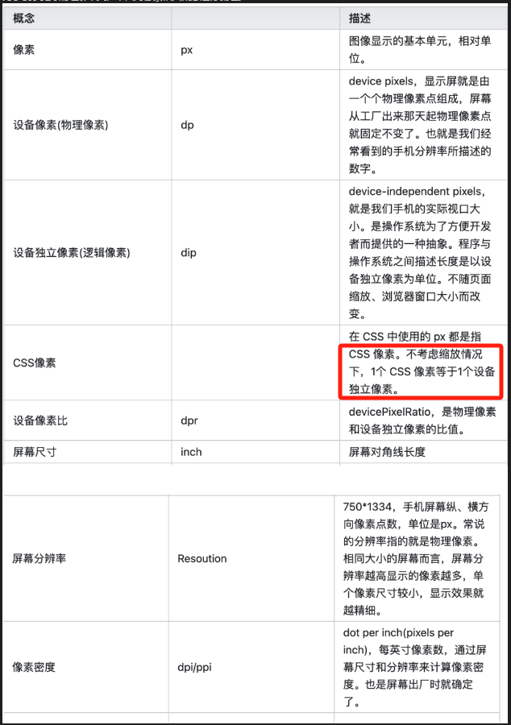

为了便于更好的理解本文，下面对像素相关概念进行梳理。  


### 什么问题

我们在工作当中,设计师时常会说，边框像素不对，在高清屏幕下移动端的1px会很粗 (要求1像素但是实际是2像素，但是们代码中写的像素就是1px)


### 产生的原因
在iphone3中，屏幕像素的密度比较低，分辨率是320*640
在iphone3上，1px=1物理像素

iphone4推出了Retina屏，将分辨率提高了一倍，变成
640*960，但屏幕的尺寸没有变化
这是1px = 2个物理像素

现在移动设备屏幕的像素密度越来越高，于是便有了 2 倍屏、3 倍屏的概念。
那么我们获取到的 CSS 像素就不是真实的物理像素点了，于是便有了设备像素比的概念（ devicePixelRatio 简称 dpr）。它用来描述屏幕物理像素与逻辑像素的比值。


### CSS 中的 1px 并不等于设备的 1px
对于前端来说，在高清屏出现之前，前端代码的 1px 即等于手机物理像素点的 1px。但有了 dpr 的概念之后，由于前端代码中的使用的是 CSS 像素，手机会根据 dpr 换算成实际的物理像素大小来渲染页面。比如 iPhone6 的设备像素比 dpr = 2 ，相当于一个 CSS 像素等于两个物理像素，即 1px 由 2个物理像素点组成。
那么问题来了，以 iPhone6 为例，其 dpr = 2、屏幕尺寸(CSS 像素) 为 375x667，一般设计稿提供 2 倍图尺寸为 750x1334 。那么设计稿中的 1px，对应屏幕尺寸其实应该写成 0.5px。再由 dpr 计算公式可知，0.5 * 2 = 1px 物理像素。
此时你应该已经发现了，设计稿要实现 1px 细线、1px 边框，为什么前端实现总是偏粗的？那是因为如果你在代码中直接写成 1px，再通过 dpr 计算之后其实是 2px 物理像素，并不符合设计稿的要求。


其实设计稿本质上要实现的是 CSS 像素的 ！
那么当 dpr=2 时，代码中直接写成 0.5px 就解决问题了吗？
      
目前主流的屏幕dpr=2或者3，拿2倍屏幕来说，设备的物理像素要实现1px，而dpr=2，所以css像素只能是0.5.一般设计稿都是按照750来设计的，它上面的1px是按照750来参照的，而我们写css样式是以设备375为参照的，所以我们写0.5px就好了，试过了之后就知道ios8+系统支持，安卓系统不支持。

### 那么如何实现 1px 的效果？
在进行一番调研之后，发现目前的实现方案都离不开以下三种。
1. 使用伪元素 + CSS3``缩放的方式
2. 使用 动态 viewport + rem 布局 的方式（即 Flexible 实现方案）
3. 新方案：使用 vw 单位适配方案（将来推荐的一种方案，但目前项目中没有实际应用，故本文不做讨论）


二、解决方案
1、border：0.5px solid red;
只支持ios
     为什么在3倍屏幕下，不是0.3333px这样？
      经过测试，在chrome模拟ipone8plug,发现小于0.46px的时候显示不出来
总结：
        优点：简单，没有副作用；
        缺点：只支持ios8+


2、使用边框图片    
   border：1px solid transparent; 
   border-image: url('./../../image.jpg') 2 repeat
总结：
优点：没有副作用
缺点：border颜色变了就得重新做图片，圆角会比较模糊

3、使用border-shadow实现
 box-shadow详解：https://blog.csdn.net/qq_47443027/article/details/116042399
border-shandow：0 -1p 1px red(上边), 1px 0 1px -1px red（右边）, 0 1px 1px -1px red（下边）, -1px 0, 1px -1px red(左边)；
前两个值x,y主要控制显示哪条边，后两个值控制阴影半径和扩展半径
总结：
优点：使用简单，圆角也可以实现
缺点：模拟的实现方法，仔细看能看出来这是阴影不是边框

4、伪元素
这个方法是使用最多的，做出来的效果也最好

1条border
```css
content: ''; 
display:block; 
position: absolute; 
width: 100%;
border-top:1px solid red; 
height:0px;
transform:scale(1, 0.5); // 水平方向保持不变，垂直方向缩小0.5
top:0; left:0;
```

可以看出将伪元素设置绝对定位，并且和父元素的左上角对齐，将width设置成100%，然后进行y方向缩小0.5倍

4条border
```
content: ''; 
display:block; 
position: absolute;
top:0; 
left:0; 
width: 200%; 
height: 200%; 
border:1px solid red;
box-sizing: border-box; 
transform:scale(1, 0.5); 
transform-origin: left top;
```

同样为伪元素设置绝对定位，并且和父元素左上角对齐，将伪元素的宽度和长度放大2倍，然后再设置一个边框，以左上角为中心，缩放到原来的0.5倍
总结：
优点：全机型兼容，实现了真正的1px，而且可以圆角
缺点：暂用了after伪元素，可能会影响清除浮动


5、设置viewport的scale值
这个解决方案利用的是viewport+ rem+js实现的，
```html
<!DOCTYPE html>    <html lang="en">
        <head>
             <meta charset="UTF-8">
             <meta http-equiv="X-UA-Compatible" content="IE=edge">
             <meta name="viewport" content="width=device-width, initial-scale=1.0">
             <title>Document</title>
        </head>
        <style>
          html { font-siza: 1px; }
          *{ padding: 0; margin: 0; }
         .top_b { border-bottom: 1px solid red; }
         .a, .b{ box-sizing:border-box; margin-top: 1rem; padding:1rem; font-size: 14px; height: 50px; }         .a { width: 100%; }
         .b { background: green; width: 100%; }
      </style>
     <body>
           <div class="top_b a">下面的底边宽度是虚拟1像素的</div>
           <div class="b">上面的边框是虚拟1像素的</div>
    </body>
    <script>
        var viewport = document.querySelector("meta[name=viewport]");
       // 下面根据设备像素设置viewport 
     if(window.devicePixelRatio == 1) {
         viewport.setAttribute('content', 'width=device-width,initial-scale=1,maximum-scale=1,minimum-scale=1,user-scalable=no') 
}
else if(window.devicePixelRatio == 2) {
 viewport.setAttribute('content', 'width=device-width,initial-scale=0.5,maximum-scale=0.5,minimum-scale=0.5,user-scalable=no') 
}
else {
 viewport.setAttribute('content', 'width=device-width,initial-scale=0.33,maximum-scale=0.33,minimum-scale=0.33,user-scalable=no')
 } 
var doce1 = document.documentElement; 
var fontsize = 32 * (doce1.clientWidth / 750 ) + 'px' 
doce1.style.fontSize = fontsize
</script>
</html>
```
总结：
优点：全机型兼容，直接写1px不能再方便了
缺点：适用于新的项目，老项目改动较大


四、总结
新项目最好使用设置viewport的scale值，这个方法兼容性好，后期写起来方便。老项目的话改起来可能比较多，用的比较多的是伪元素的方法，其他的背景图、阴影的方法毕竟还是不太灵活，而且兼容性不好。

