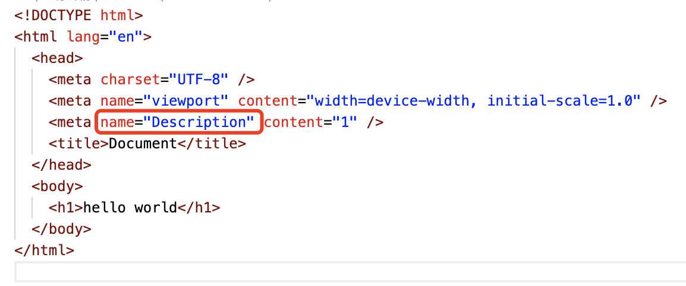
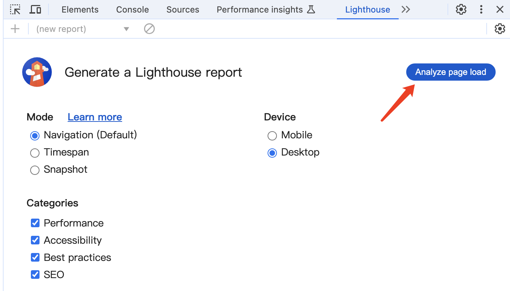
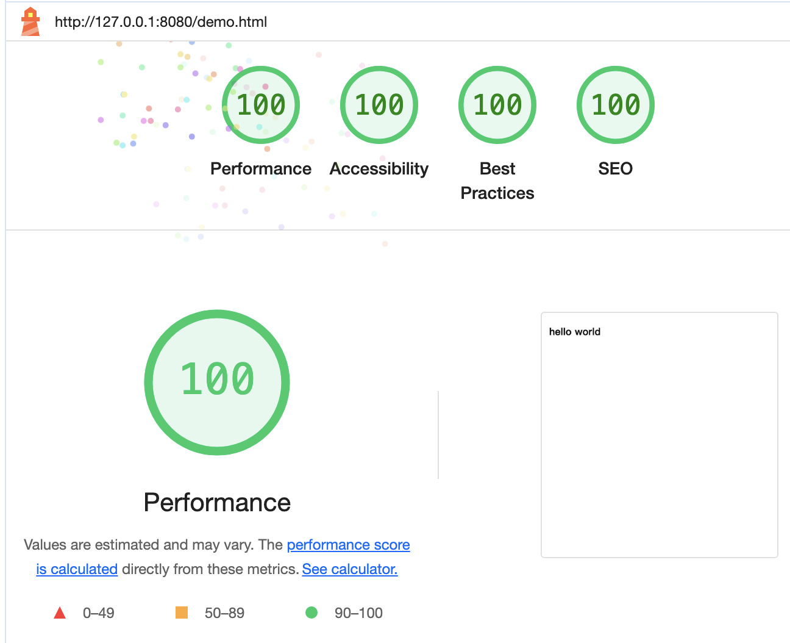
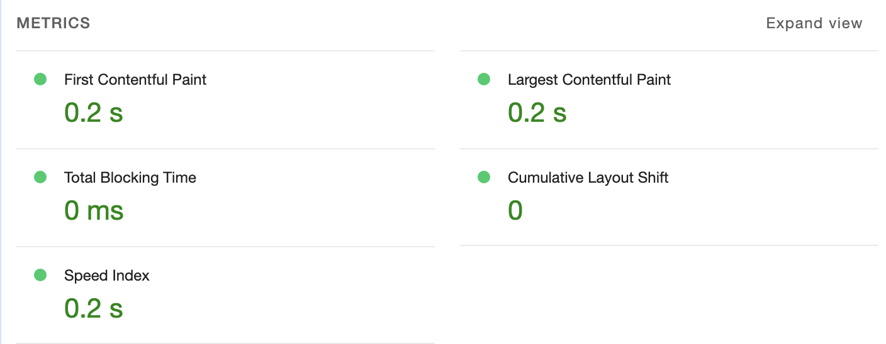
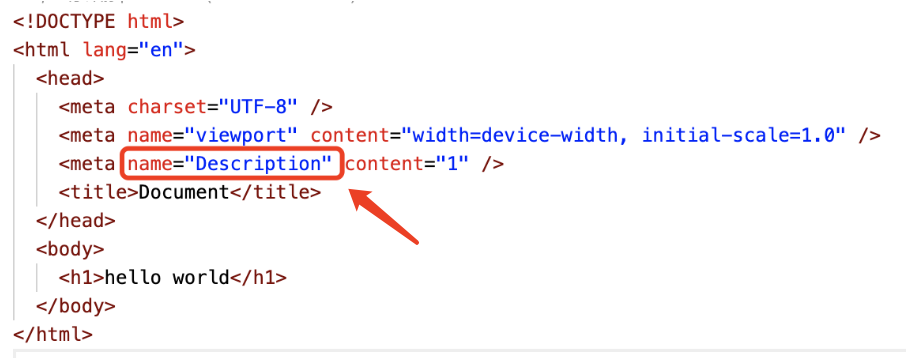

有一点代码



点击分析页面，注意只能分析http或https的






Ligithouse指标
# 第一:性能(Performance)
## 1.FCP(First contentful Paint)
FCP衡量用户导航到您的页面后浏览器呈现第一块D0M内容所花费的时间  
范围(s)等级  
0-1.8 优  
1.8-3 良  
 > 3 差  

2.SI (Speed Index)
指界面可见内容的显示速度  
范围(s) 等级  
0-3.4 优  
3.4-5.8 良   
>5.8 差  

3.LCP (Largest contentful Paint)  
指页面渲染出最大文本或图片的时间  
范围(s) 等级  
0-2.5 优
2.5-4 良
>4 差  

### 4.TTI(Time to Interactive(交互))  
指网页需要多长时间才能提供完整交互功能  
范围(s) 等级  
0-3.8 优  
3.8-7.3 良  
>7.3 差  

### 5、TBT(Total Blocking Time)
TBT度量页面被阻止响应用户输入(如鼠标单击、屏幕点击或键盘按下)的总时间。这个总和是通过在FCP和可交互时间之间添加所有长任务的阻塞部分来计算的。任何执行时间超过50毫秒的任务都是长任务。50毫秒后的时间量就是阻塞部分。  
范围(ms)等级  
0-200 优  
200-600 良  
>600 差  

#### 6、CLS(Cumulative Layout shift)
整个页面生命周期内发生的所有意外布局偏移中一连串的布局偏移分数，CLS指整个页面生命周期内发生的所有单次布局偏移分数的总和。  
范围(分数)等级  
0-0.1 优  
0.1-0.25良  
>0.25 差

## 第二:无障碍/可访问性(Accessibility)

```html
<!-- 如果img标签没有alt属性，则就不是100分 -->

```
## 第三:最佳微法(Best Practices)
会给你提出一些建议
## 第四:SEO

如果将这行注释掉，就不是一百分，为了方便搜索
## 第五:渐进式Web应用PWA(Progressive web App)
