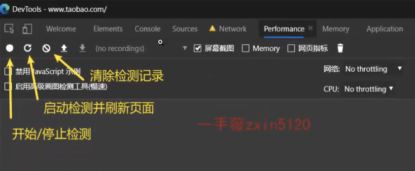
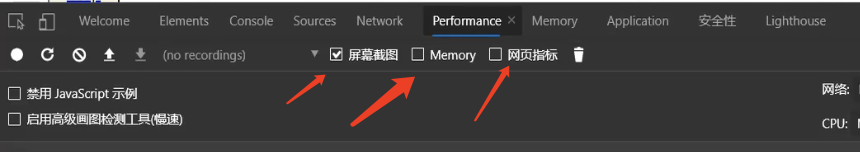
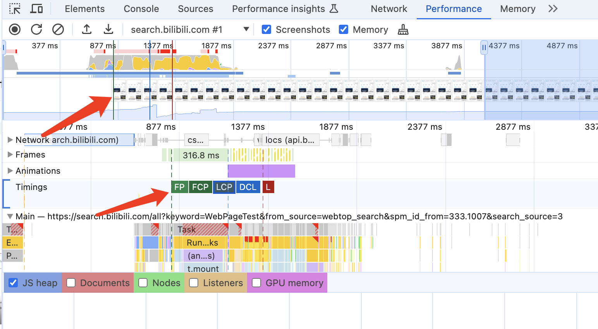
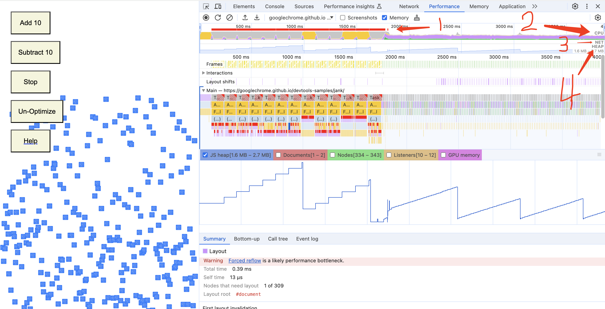
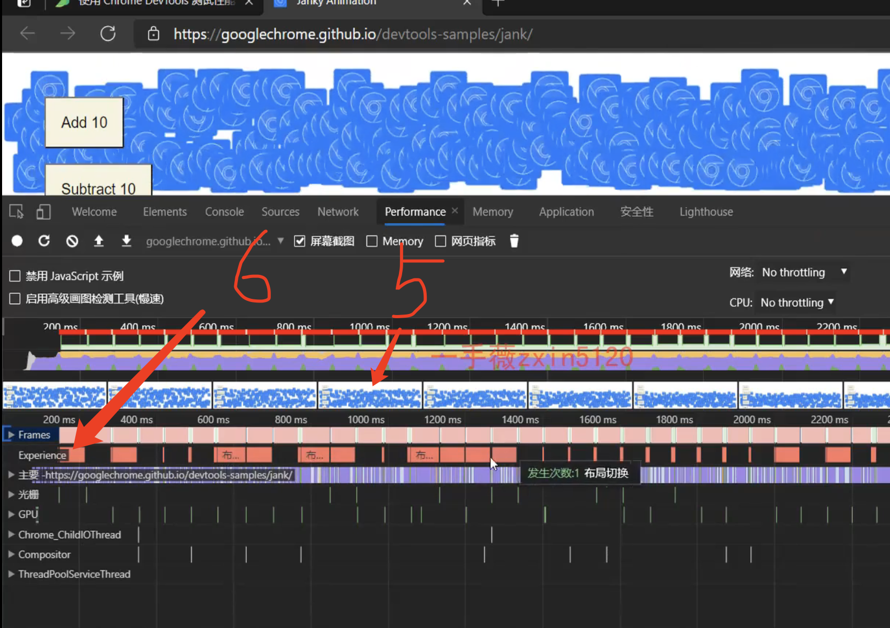
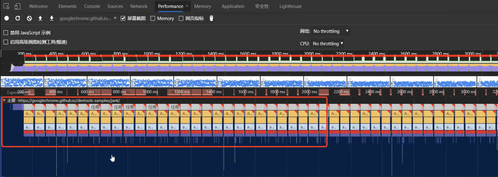
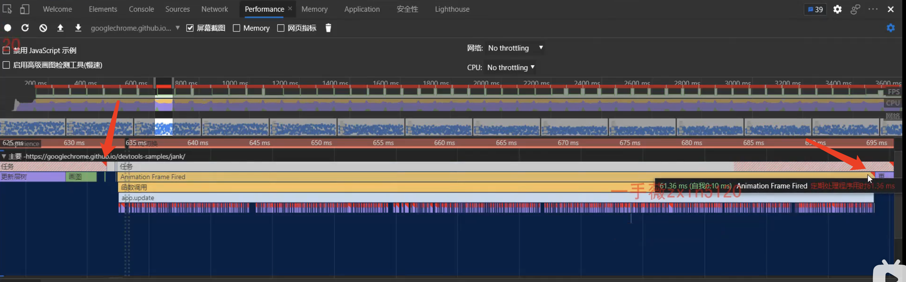
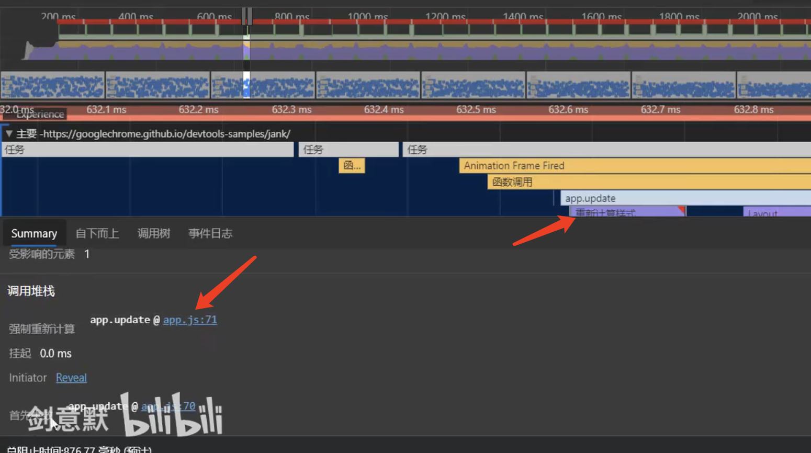

## Performance 面板

使用 Performance 面板主要对网站应用的运行时性能表现进行检测与分析，其可检测的内容不仅包括页面的每秒帧数(FPS)、CPU 的消耗情况和各种请求的时间花费，还能查看页面在前 1ms 与后 1ms 之间网络任务的执行情况等内容。

> 这里建议在Chrome 浏览器的匿名模式下使用该工具，因为在匿名模式下不会受到既有缓存或其他插件程序等因素的影响，能够给性能检测提供一个相对干净的运行环境。

Performance 面板中常用的是图中标出的三个按钮。通常当我们需要检测一段时间内的性能状况时，可单击两次“启动/停止检测”按钮来设置起止时间点，当单击第二次按钮停止检测后，相应的检测信息便出现在控制面板下方的区域。

图中的“启动检测并刷新页面”按钮用来检测页面刷新过程中的性能表现，单击它会首先清空目前已有的检测记录，然后启动检测刷新页面，当页面全部加载完成后自动停止检测。

屏幕截图：指在录制时，是否要录制屏幕
网页指标：指展示fcp，lcp等网页加载指标

打开测试示例: https://googlechrome.github.io/devtools-samples/jank/

图中前半段，是优化前，后半段是优化后，
1.表示当前的fps，红色表示有问题，说明fps刷新率已经变慢了
2.表示cpu，左半部分说明cpu已经占满了
3.网络：因为网页没有网络请求所以不显示

5.表示每一帧的截图
6.表示发生了布局切换

主要展示了当前cpu运行的火焰图
- x轴为时间轴，
- y轴为事件调用的关系，是倒置的状态，最上边是调用的开始，
比如你用了前端框架，上边几层可能是框架相关的，你的代码在最下边一层

凡是有红色三角的，说明当前任务是比较危险的状态

从下边可以看出，是强制调用样式引起的重排，并给出具体代码，看下是哪句代码造成的重拍，你去看就好了

