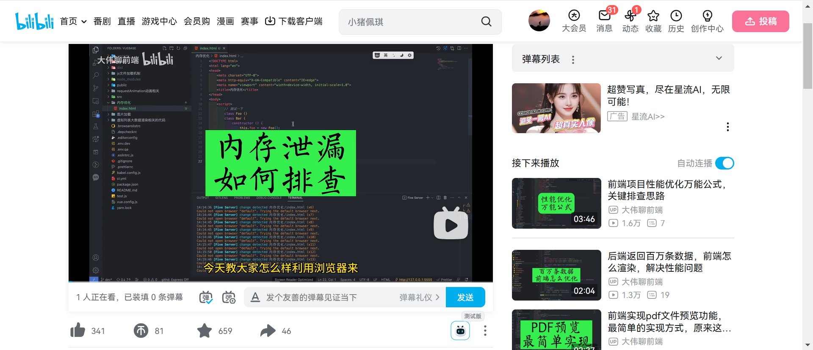
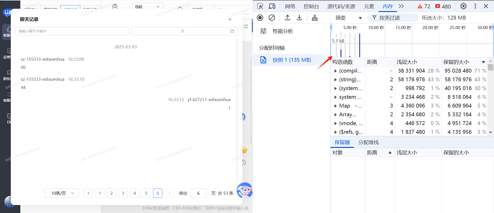
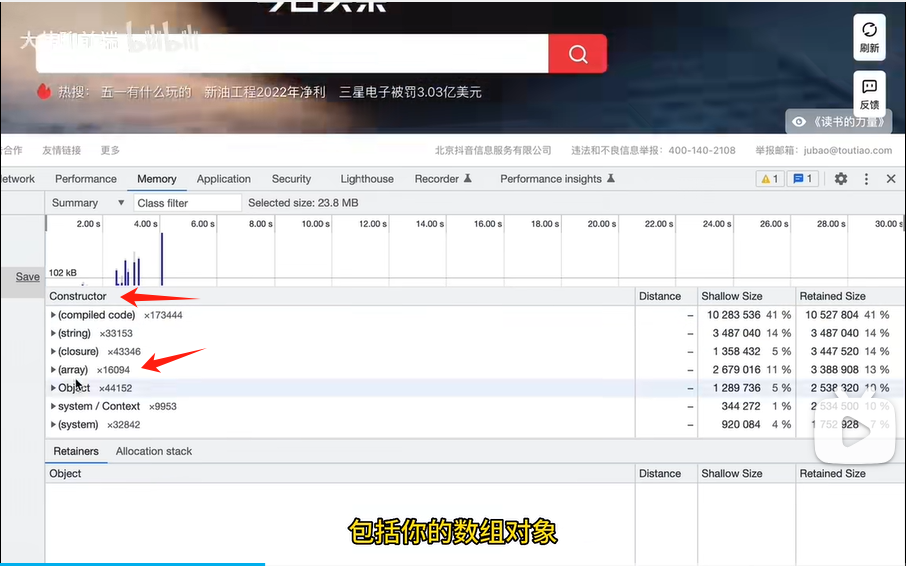
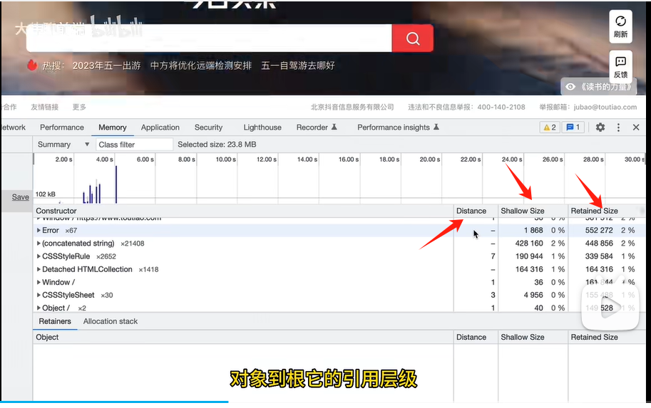

### b站视频整理

视频链接：https://www.bilibili.com/video/BV1Nc411T7tw/?spm_id_from=333.337.search-card.all.click&vd_source=31de9b6779fcb80b924201ff8967d829

选第二个，可以看内存实时的变化

通过刷新页面或者不刷新，能看到内存实时的变化，蓝色条是没有回收的，灰色是回收的内存

### 3
contructor标识构造函数，可以看你这里边有多少方法
string： 字符串
closure： 闭包

### 4

distance 标识对象到根的引用层级
shallow size: 表示对象本身占用的内存，不包含引用对象占的内存
retained size：表示对象总占用内存，包含了引用占用内存，所以这个值比上边的大

