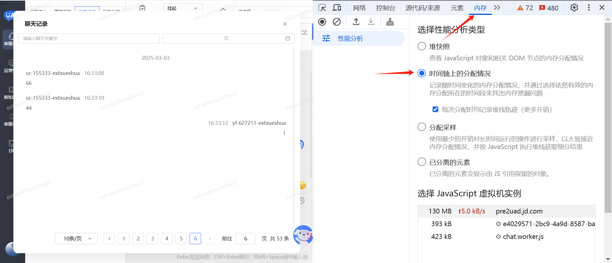
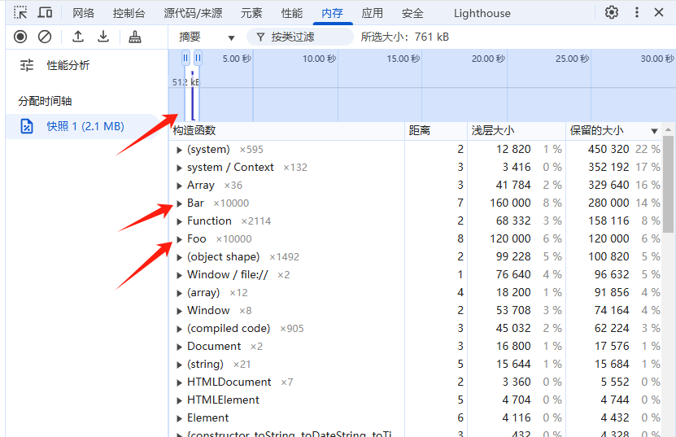
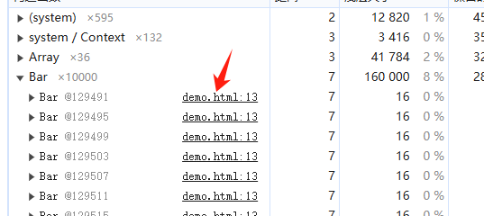

### b站视频整理

视频链接：https://www.bilibili.com/video/BV1Nc411T7tw/?spm_id_from=333.337.search-card.all.click&vd_source=31de9b6779fcb80b924201ff8967d829


选第二个，可以看内存实时的变化


通过刷新页面或者不刷新，能看到内存实时的变化，蓝色条是没有回收的，灰色是回收的内存


### 3
contructor标识构造函数，可以看你这里边有多少方法
string： 字符串
closure： 闭包


### 4

distance 标识对象到根的引用层级
shallow size: 表示对象本身占用的内存，不包含引用对象占的内存
retained size：表示对象总占用内存，包含了引用占用内存，所以这个值比上边的大


### 实例
```
// 测试一下
class Foo {}
class Bar {
constructor() {
    this.foo = new Foo();
}
}
let list = Array(10000).fill("").map(() => new Bar());
```
这段代码是创建一万个对象，点击录制，刷新页面，得到如图，点击蓝色的条，可以定位到那段时间

bar 占用160Kb，引用了Foo（120kb），加起来刚好等于280kb

通过这儿也可以定位到对应的代码
