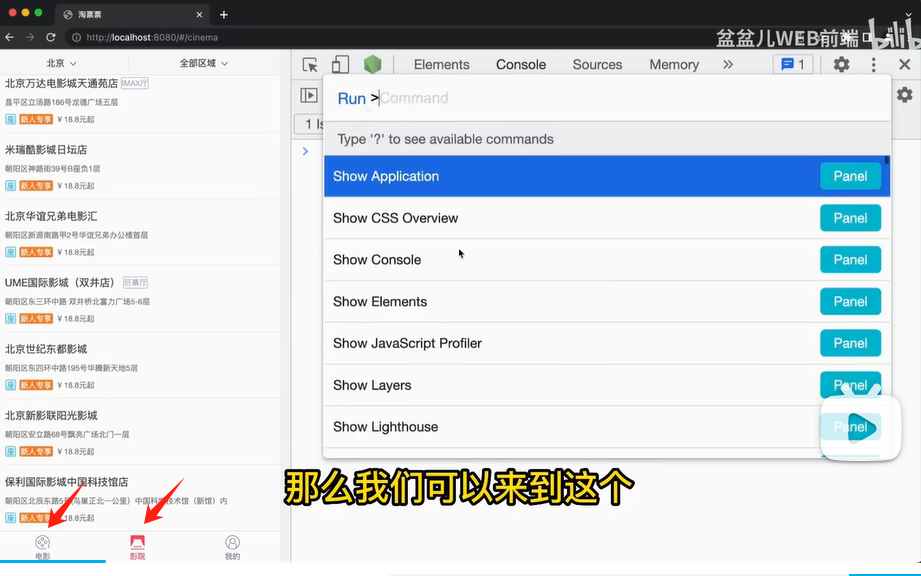
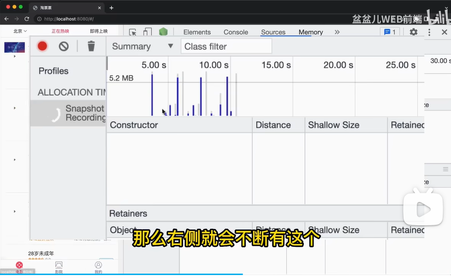
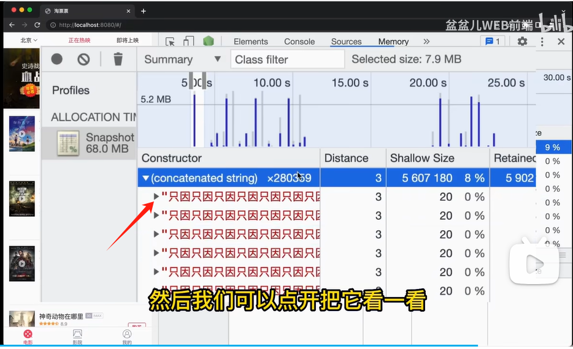

### b站视频整理

视频链接：https://www.bilibili.com/video/BV1Jv4y1U7pn/?spm_id_from=333.337.search-card.all.click&vd_source=31de9b6779fcb80b924201ff8967d829

存在的问题，这个项目来回切换tab，占用内存在不断上升

使用memory的根据时间线检查内存工具，来回点击tab时，会出现新的蓝条，并且没有减少，说明存在内存泄漏（如果切换时卸载了，数条应该变灰色，那每次都有蓝条说明每次都在产生内存）

点开就能定位到问题所在的位置
