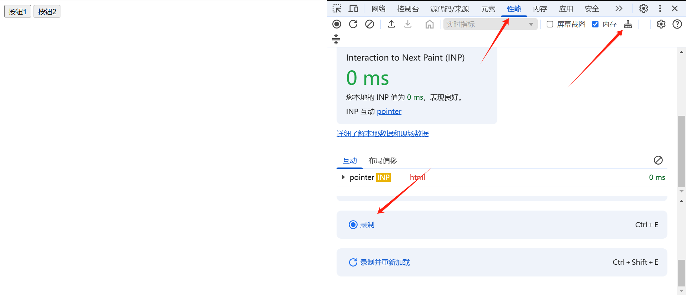
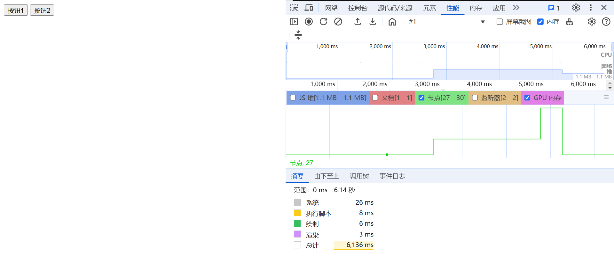
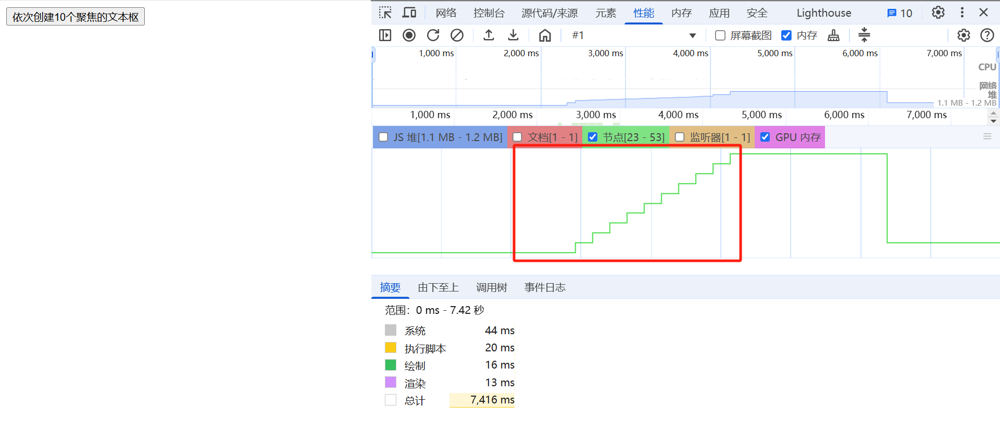

### b站视频整理

视频链接：https://www.bilibili.com/video/BV1Sm4y1M7EG/?spm_id_from=333.337.search-card.all.click&vd_source=31de9b6779fcb80b924201ff8967d829


### 现象1
点击按钮1，没有内存泄漏，点击按钮2有内存泄漏
```
<div>
    <button class="btn" onclick="createInput(false)">按钮1</button>
    <button class="btn" onclick="createInput(true)">按钮2</button>
</div>

<script>
    function createInput(isFocus) {
    const inp = document.createElement("input");
    document.body.appendChild(inp);
    isFocus && inp.focus();
    setTimeout(() => {
        inp.remove();
    }, 2000);
    }
</script>
```

正确的查看方法
- 第一步：打开控制台


- 第二步： 
点下小扫帚清除一下-》点击录制->点下小扫帚清除一下-》点击按钮1操作-》再点下小扫帚清除一下-》结束录制

绿色的就是当前节点数



### 实例2
```
<button class="btn" onclick="createInputs()">依次创建10个聚焦的文本枢
</button>


<script>
    let inp = null
    function createInput(){
        return new Promise((resolve, reject) => {
            setTimeout(() => {
                console.log('这里出发')
                inp = document.createElement("input");
                document.body.appendChild(inp);
                inp.focus();
                resolve()
            }, 100)
        })
    }
    function delay(duration = 1000) {
        return new Promise((resolve, reject) => {
            setTimeout(() => {
                inp.remove();
                resolve()
            }, 100)
        })
    }
    async function createInputs(){
        for(let i = 0; i< 10; i++){
            await createInput();
            await delay(100);
        }
    }

</script>

```


这个图怎么看：
最后的陡降是我点了一下小扫帚
最后没回收干净，
就是说，你要不就不回收，要不就回收干净，结果都不是，会剩一点，所以这10次共用了一个focus的内存占用，所以说影响不大