### b站视频整理

视频链接：https://www.bilibili.com/video/BV13y4y1H71m?spm_id_from=333.788.recommend_more_video.-1&vd_source=31de9b6779fcb80b924201ff8967d829

# 内存泄漏的几种类型
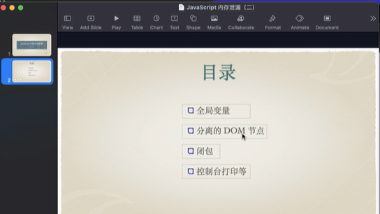

## 1.全局变量
序：
首先我们知道，js中的垃圾回收使用标记清扫法，回收不可访达的内存对象，根节点始终不回收，被称作jc root，window就是jc root。全局变量是window的属性，可以认为全局变量始终不回收。这也符合全局二字的含义(在任何时候，任何位置都可以访问)
所以：内存泄漏第一种情形是使用过多的全局变量。并用来存储大量的数据

看例子：
当点击按钮时，全局数组x中push一个LargeObj对象，这个例子只是说明全局变量不会被垃圾回收，是内存泄漏的一种可能情况，本例也可认为是正常的内存开销，只是占用了比较大而已
```
    <button onclick="grow()">Global Var</button>
    <script>
      function LargeObj() {
        this.largeArr = new Array(1000_0000);
      }
      var x = [];
      function grow() {
        var o = new LargeObj();
        x.push(o);
      }
    </script>
```
下面在chrome查看内存占用情况
***为了避免chrome插件对内存占用的干扰，需要在隐身模式下调试代码***

内存调试有两个可用面板，performance和memory。一边先在performance面板录制内存占用随时间变化的图像，对是否存在内存泄漏有一个直观的判断，然后在memory面板定位问题发生的位置
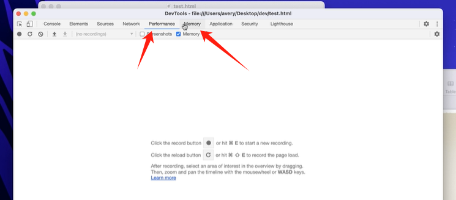

### performance
首先切换到performance，勾选memory，并点击垃圾桶图标强制垃圾回收（js运行时，垃圾回收的时机是引擎自动控制的(这里的引擎指的是浏览器引擎，注意不是js代码，所以在这里点击模仿浏览器垃圾回收也无可厚非)，代码无法触发，所以在测试前先点击一下）

刷新页面-》点击垃圾回收-》-》开始录制-》数次点击按钮-》点击垃圾回收-》结束录制
获得图像如下：
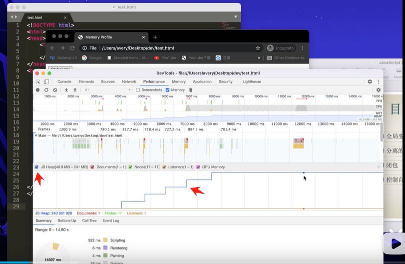  
蓝色线条是js 堆内存占用的情况，每次点击按钮，内存逐渐增加，最后的手动垃圾回收也没有造成下降，可以怀疑存在内存泄漏
图中还有dom节点，事件监听器的变化图像


### memory
来到memory定位具体位置

这个地方是js堆内存的实时占用量  
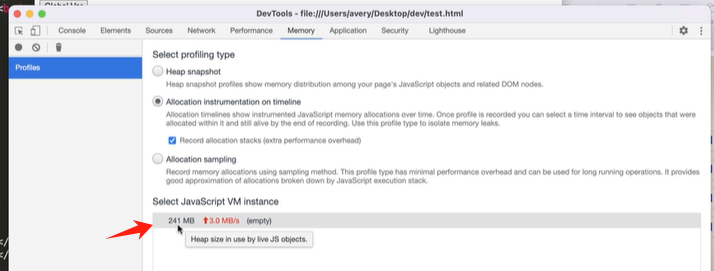

memory面板可以对堆内存拍摄快照，还可以在时间线上观察内存的分配情况，我们可以在两次堆快照间执行可疑操作。然后对比内存中对象变化的情况，

第一步：切到第一个拍摄堆快照(堆快照在拍摄前会自动执行垃圾回收)-》
可以看到内存中的对象在summary视图下，按类型（也就是构造器）分类，括号中的构造器和引擎实现的细节相关，开发者可以先忽略他们。

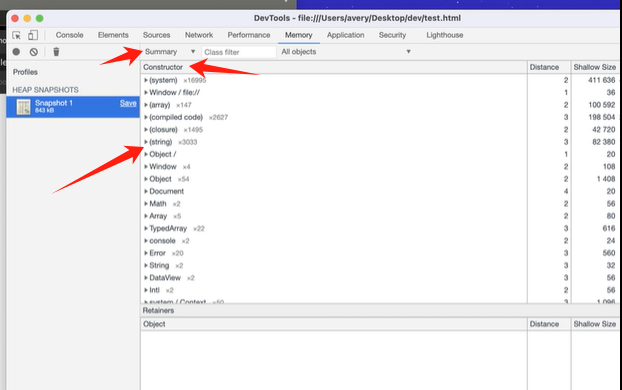
第二步：回到页面，点击下 global var按钮，再点击下快照，发现内存占用增加了40M，选择下拉框的第二个对比两次快照
我们发现两次快照之间新增的对象中，数组类型和LargeObj类型的留存大小，他们的数值和占比都很大，
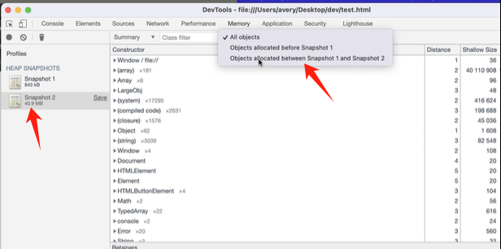

也可以选择比较视图，和快照1对比，界面将显示两次快照的内存增减情况
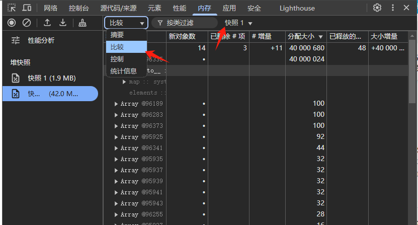

点击到largeobj对象上，可以在下方的retainers中看到该对象是数组的第0个元素，并且数组被全局变量x引用着
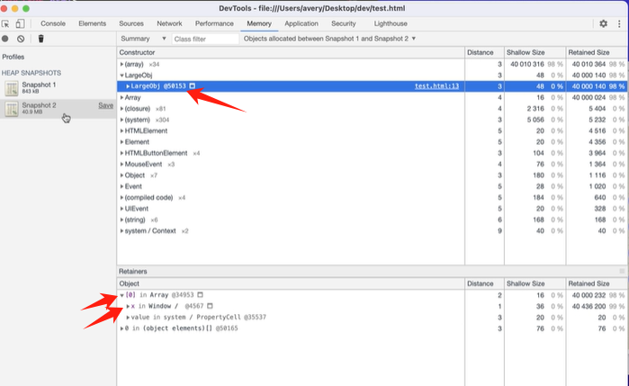


为了定位内存占用在代码中的位置，可以选中第二个
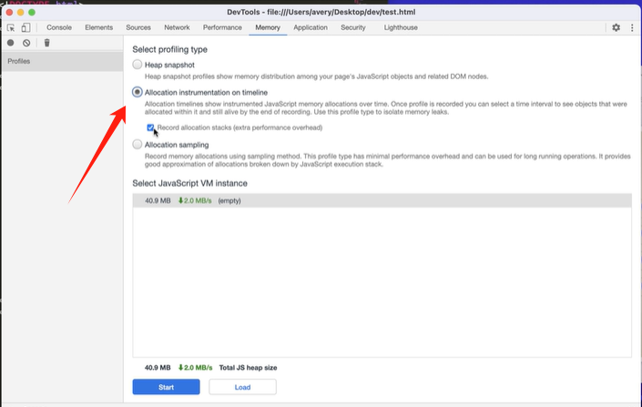

点击开始录制-》多点几次按钮-》点击垃圾回收-》结束录制
可以发现面板上出现蓝色数条表示该时刻分配的内存，如果内存后续被回收了，则会变成灰色，当停止检测后，哪些仍旧保持蓝色的数条表示截至到检测停止时，所分配的内存仍未被回收。这个功能让我们看到内存分配和回收的时机以及频率，垃圾回收太频繁也会带来问题，因为垃圾回收器执行时，js主线程是会暂停的，这可能导致交互的卡顿。
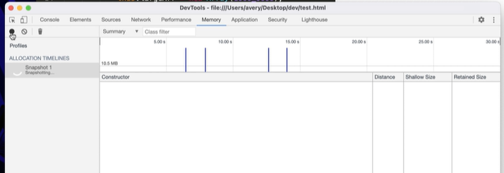


点击数条，观察这一小段时间，点击largeobj对象，打开分配堆栈，可以定位到代码所在的位置
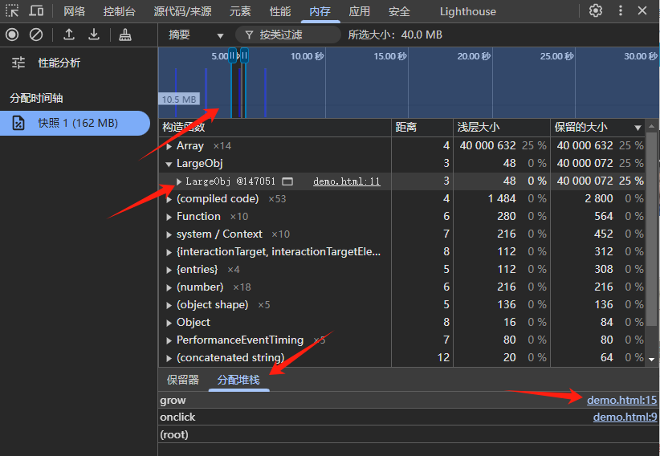


## 2.分离的DOM节点
第二种内存泄漏的情形是存在分离的dom节点，dom节点的内存被回收要满足2点，
1.节点从dom树上被移除，并且代码种没有对他的引用，内存泄漏发生在节点从dom树中删除了，但代码中留存着对他的js引用，我们称这种为分离的dom节点。

例子：
点击按钮后，列表元素被移除dom，列表从界面上消失了，但由于list变量引用还存在，所以list节点的内存无法被回收，对于这种情况可以使用堆快照排查
```
    <button id="button">移除列表</button>
    <ul id="list">
      <li>项目 1</li>
    </ul>
    <script type="text/javascript">
      var button = document.getElementById("button");
      var list = document.getElementById("list");
      button.addEventListener("click", function () {
        list.remove();
      });
    </script>
```
在按钮点击前后拍摄两次堆快照，堆快照可以直接告诉我们是否存在分离的dom节点，只需要在顶部的输入框中输入detached，如果过滤出东西，说明存在，如果定位到snapshot1中则搜不到

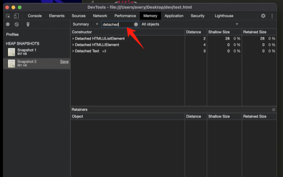

上边改进的方法是，把list赋值放到点击事件的回调中，这样当函数返回后，局部变量会被销毁

分离的dom节点造成的内存泄漏可能出人意料，拿table元素来说，如果代码中存在对某个单元格dd的引用，则会导致整个table元素无法被回收。因为每个dom节点都存在对其父元素的引用。通过dd最终可访达其上层的table元素。


```
    <button id="button">移除列表</button>
    <ul id="list">
      <li>项目 1</li>
    </ul>
    <script type="text/javascript">
      var button = document.getElementById("button");
      button.addEventListener("click", function () {
        var list = document.getElementById("list"); // 将这句代码放到方法里边
        list.remove();
      });
    </script>
```

## 闭包
闭包也可以导致内存泄漏。因为函数实例上的隐式指针会留存实例创建环境下的作用域对象。
例子：
每点击一次按钮，funcs这个全局数组就会收到一个新的函数实例，每个函数实例中都留存着各自作用域中的超大数组对象
注意并不是说这个代码有什么问题，只是说闭包会带来内存占用。不合理的内存占用才被定义为内存泄漏。

```
    <button onclick="closure()">Closure</button>
    <script type="text/javascript">
      var funcs = [];
      function outer() {
        var someText = new Array(1000_0000);
        return function inner() {
          return someText;
        };
      }
      function closure() {
        funcs.push(outer());
      }
```
点击memory tab-》选择第二个，在时间轴上看分配情况-》开始录制-》多点击几次-》垃圾回收一下-》结束录制

发现构造器中出现 system/context字样，这表示存在函数导致的闭包留存，展开箭头点击第一个实例。他其实就是我们说的作用域对象。在retainers中看到，他是inner函数留存的上下文对象。
inner后边的括号表示inner是一个函数。
下一行向右缩进，表示inner这个函数实例在数组中下标为1的位置上。
而这个数据被全局变量funcs引用
这里有个小建议：代码中尽量不要用匿名函数。这样调试工具中才会出现函数名。如果是匿名函数只会出现一个括号。给调试带来不便

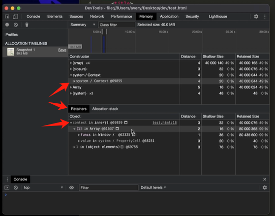


另外，setInterval的回调函数以及其他的dom事件监听器函数，也是利用闭包机制得以访问外部作用域中的变量。在不用时记得clearInterval和解除事件绑定，

关于setInterval说个题外话，比如如下代码，当setInterval执行完后，每隔2s注册的timer函数就会被调用。其函数体被执行，我本人有种错觉，就是每次进入函数体时，会觉得是在不同的函数实例中执行，那这个错觉的来源是代码执行时碰到字面值对象，函数表达式会创建新的实例，而这里timer又正好是函数表达式。但这个例子实际上函数实例是在执行setInterval语句时就绑定好了，之后只是借声明的函数体执行了一下而已，回调函数触发时并没有产生新的函数实例
```
setInterval(function timer() {
    return "hello";
}, 2000);
```


### 控制台打印
第四种导致内存泄漏的情形是使用console.log等语句，因为控制台要始终保持他们的引用保持随时查看，所以他们的内存无法被回收。建议生产环境中去除控制台打印语句。
