Debug时可以ctrl+P输入文件名快速找到要打断点的文件，找不到是因为打包工具诸如webpack、rollup的sourcemap设置有问题。也可以ctrl+shift+F输入变量名、方法名来搜索

### 打开命令菜单
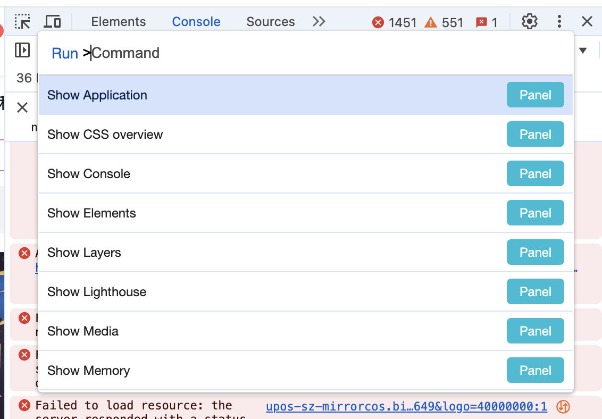
win: ctrl + shift + P
mac: command + shift + P

### command+p 搜索某个文件
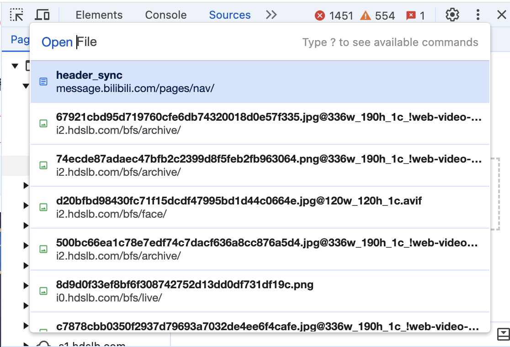

### XPath是怎样的查找方式？
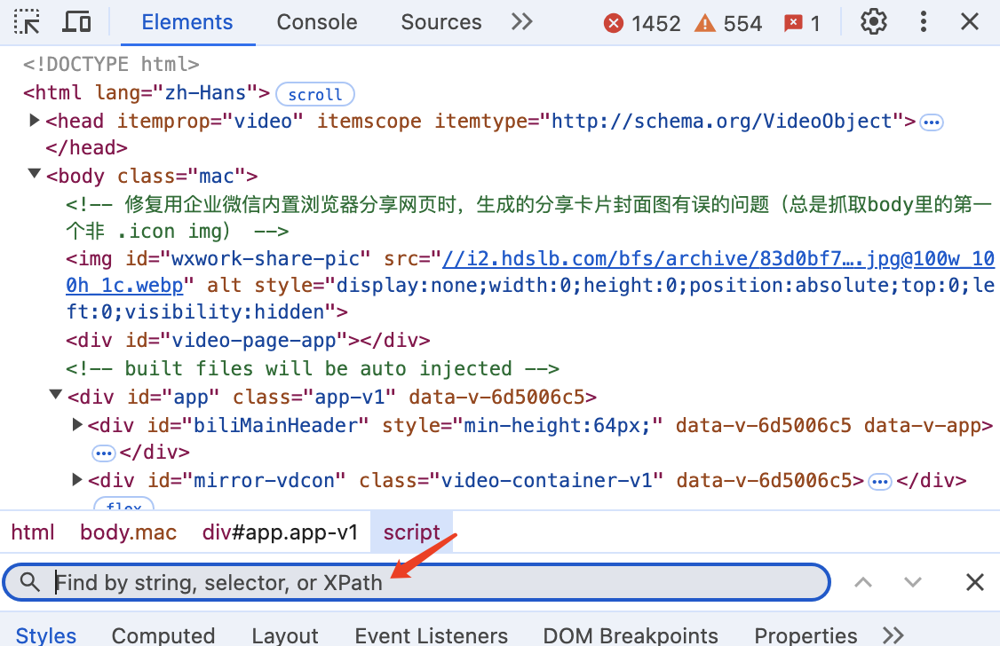
```
//section/p
```
// 表示全局查找 section下的p元素

### 通过inspect，可以快速定位到某个元素
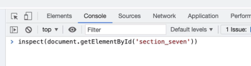

### event listeners
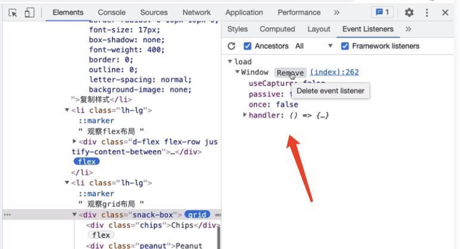
表示在window上绑定了load15:30:48，旁边的remove按钮可以将事件移出

### dom breakpoints

### properties，所有节点的属性，以原型链的方式展示
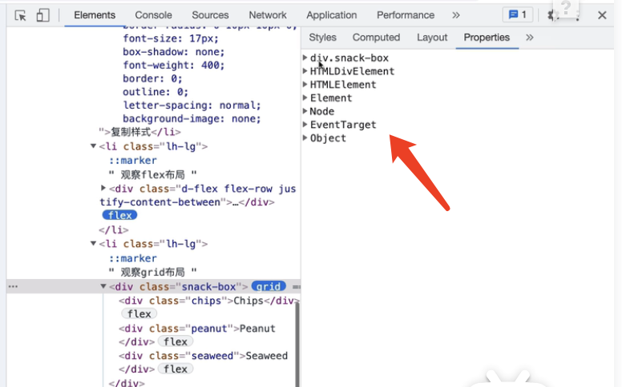

### console面板
$_返回上一条语句的执行结果
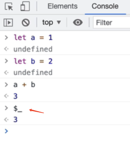


$0 上一个选择的DOM节点($1,$2....)
$1 上上个选择的元素，依此类推
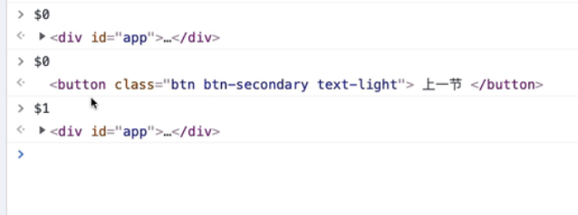

### console.group 输出一组日志
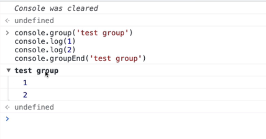

### console.time 输出一段代码的执行时间
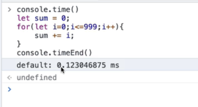

### console.table
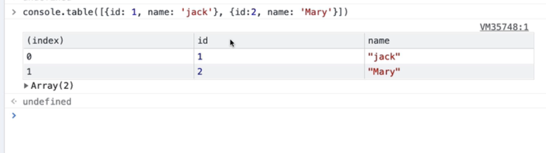
console.log (error warn table clear group time assert trace)Log级别筛选

### 小眼睛可以观测变量
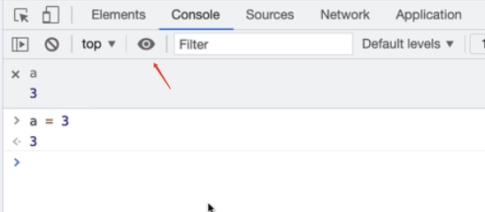

### debug时能通过watch监听某个值
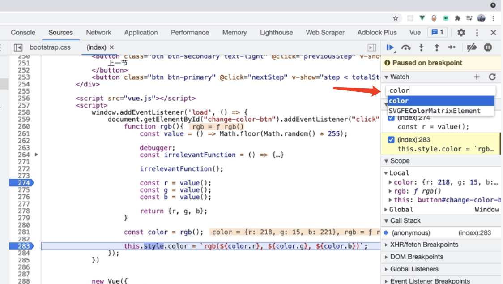

### dom breakpoints， breakpoints表示断点
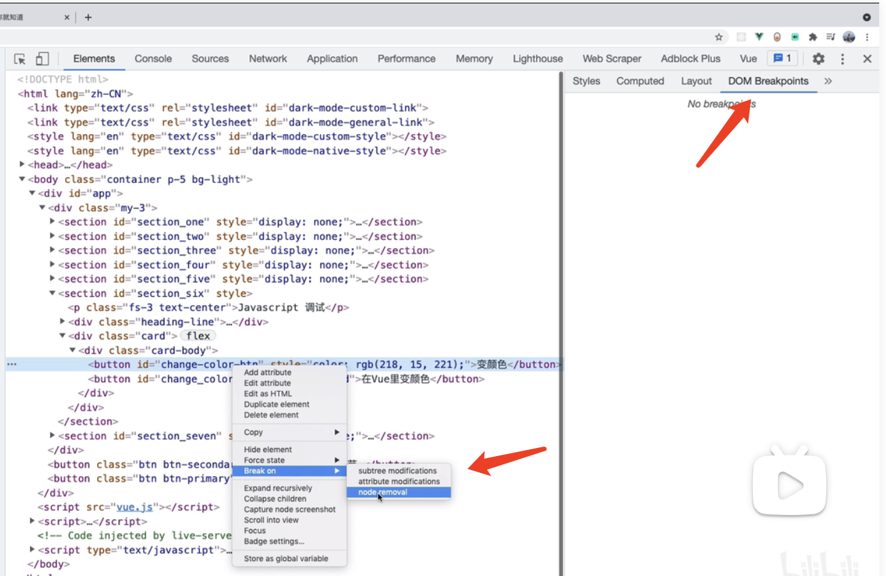
有3个选项，
subtree modifications，该节点下的子节点被更改的话，暂停
attribute modifications 该节点的属性被更改暂停
node removal  该节点的属性被删除暂停


### Event Listener Breakpoints
勾选点击事件，当页面有点击时，就会触发
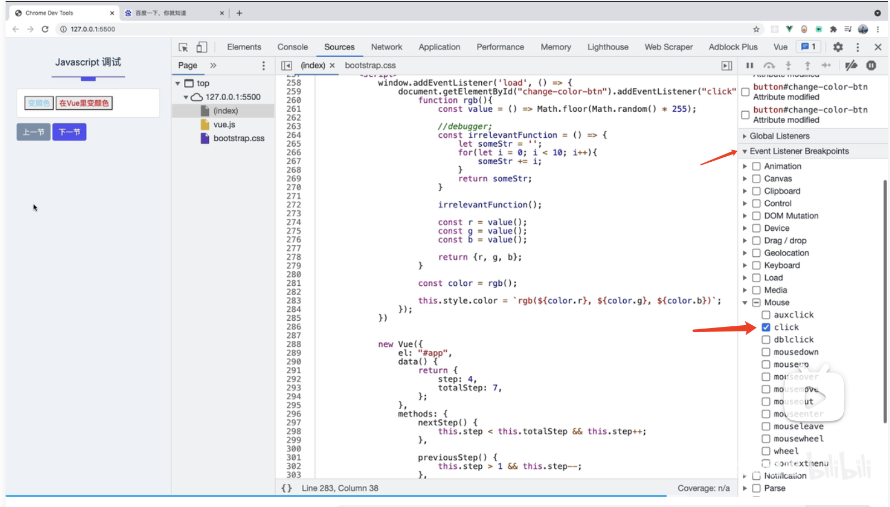

但有时我们代码是写在框架里的，我们不需要去调试vue页面   
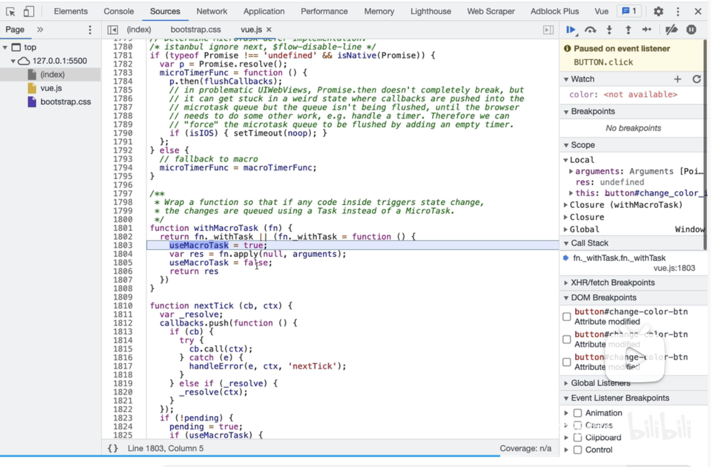

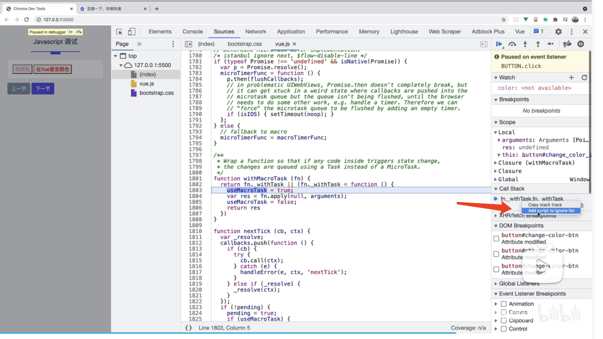
这时，add script to ignore list，这样就不会在vue中中断代码执行了

