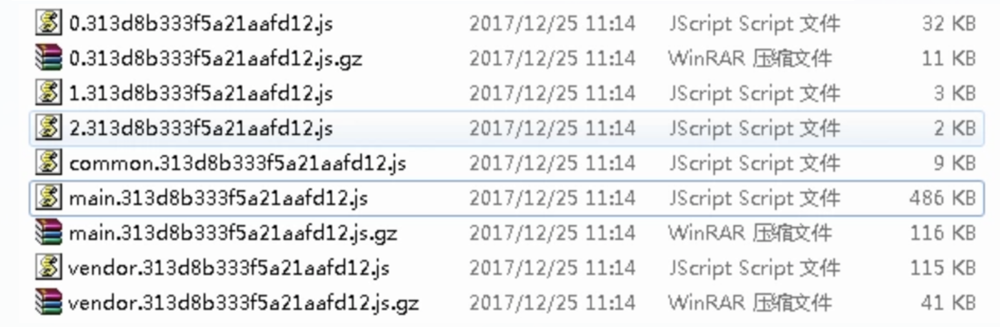
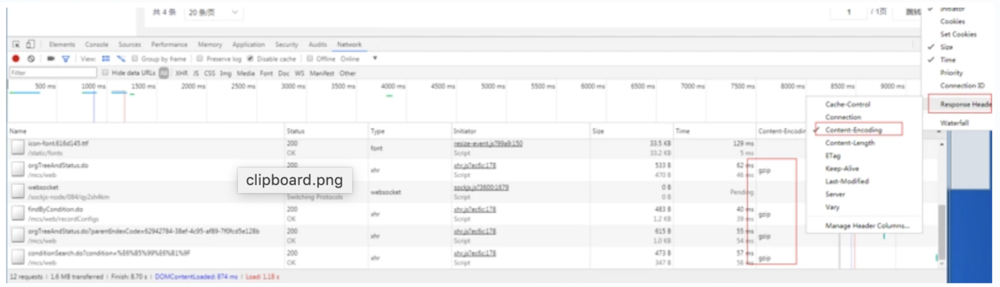

背景
如果你是个前端开发人员，你肯定知道线上环境要把js，css，图片等压缩，尽量减少文件的大小，提升响应速度，特别是对移动端，这个非常重要。

压缩
压缩方式
前端压缩的方式很多，依赖java的有ant工具，前端自己打包压缩的有grunt，gulp，webpack，这些压缩也很重要，基本上能压缩50%以上，下面我们对压缩文件来个对比，如图所示，这是未压缩的

这是压缩后的

高能预警！！！gzip能在压缩的基础上再进行压缩50%以上！！！

gzip压缩原理
但是不是每个浏览器都支持gzip的，如果知道客户端是否支持gzip呢，请求头中有个Accept-Encoding来标识对压缩的支持。客户端http请求头声明浏览器支持的压缩方式，服务端配置启用压缩，压缩的文件类型，压缩方式。当客户端请求到服务端的时候，服务器解析请求头，如果客户端支持gzip压缩，响应时对请求的资源进行压缩并返回给客户端，浏览器按照自己的方式解析，在http响应头，我们可以看到content-encoding:gzip，这是指服务端使用了gzip的压缩方式。

那么怎么看有没有用gzip压缩的文件呢，打开f12，查看network，按照下面的方式过滤

content-encoding是gzip的话就说明返回的是gzip

如何启用gzip
前面说过了，启用gzip需要客户端和服务端的支持，如果客户端支持gzip的解析，那么只要服务端能够返回gzip的文件就可以启用gzip了，现在来说一下几种不同的环境下的服务端如何配置

