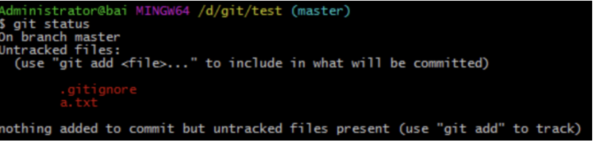
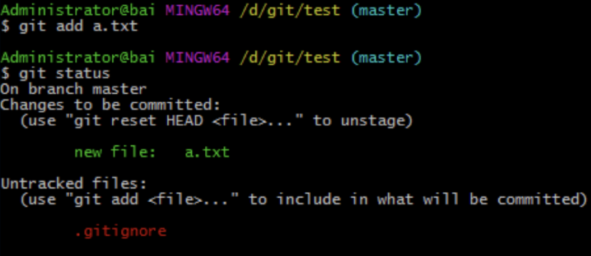
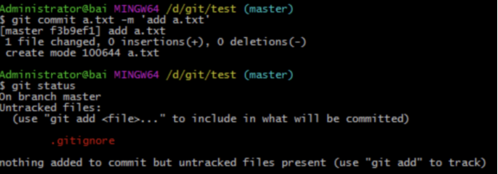
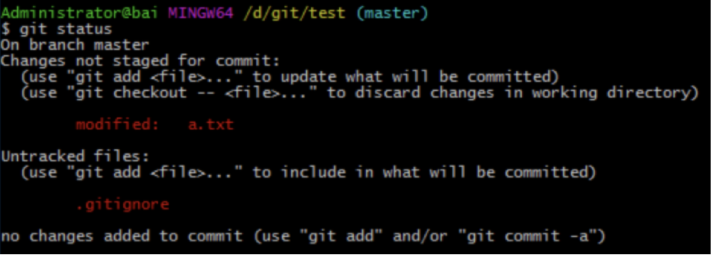
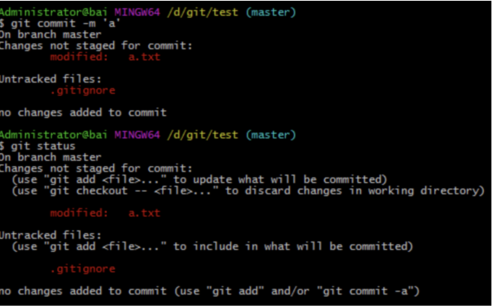
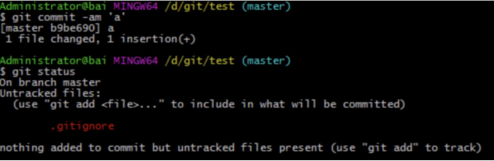

先下结论 。 git  commit -am  等同于git add . 加上 git commit  -m

前面的话
　　使用git commit -am是不是就可以完全不使用git add命令呢？不是
理论
　　要了解git commit -m与git commit -am的区别，首先要明白它们的定义
　　字面解释的话，git commit -m用于提交暂存区的文件，git commit -am用于提交跟踪过的文件
　　[注意]git commit -am可以写成git commit -a -m，但不能写成git commit -m -a
　　定义中出现了暂存区、跟踪过的文件等术语，如果要理解它们，就需要了解Git的文件状态变化周期

工作目录下面的所有文件都不外乎这两种状态：已跟踪(tracked)或未跟踪(untracked)。已跟踪的文件是指本来就被纳入版本控制管理的文件，在上次快照中有它们的记录，工作一段时间后，它们的状态可能是未更新(unmodified)，已修改(modified)或者已放入暂存区(staged)
实例
　　下面以一个实例来进行说明
1、在项目文件夹中新增一个文件如'a.txt'时，该文件处于未跟踪状态(untracked)。未跟踪状态的文件是无法提交的

2、接下来，使用git add a.txt，使其变成已跟踪状态(tracked)

3、这时，如果使用git commit -m 'add a.txt'就可以顺利提交了

4、但是，git commit -m 和 git commit -am的区别在哪里？在于a.txt文件修改之后的处理
　　下面，向a.txt添加内容'a'。可以看出，文件a.txt处于已跟踪(tracked)，但未暂存状态(unstaged)

5、这时，如果使用git commit -m是无法提交最新版本的a.txt的，提交的只是最开始空内容的旧版本a.txt

6、而如果使用git commit -am，则可以省略git add a.txt这一步，因为git commit -am可以提交跟踪过的文件，而a.txt一开始已经被跟踪过了

总结
　　这两个命令的区别的关键就是git add命令
　　git add命令是个多功能命令，根据目标文件的状态不同，此命令的效果也不同：可以用它开始跟踪新文件，或者把已跟踪的文件放到暂存区，还能用于合并时把有冲突的文件标记为已解决状态等
　　我们需要用git add命令来跟踪新文件，但如果使用git commit -am可以省略使用git add命令将已跟踪文件放到暂存区的功能
