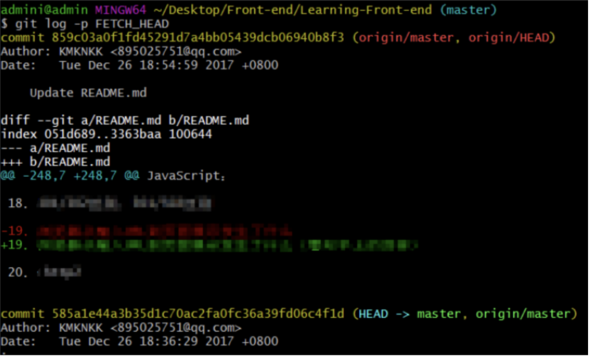

git fetch是将远程主机的最新内容拉到本地，用户在检查了以后决定是否合并到工作本机分支中。
而git pull 则是将远程主机的最新内容拉下来后直接合并，即：git pull = git fetch + git merge，这样可能会产生冲突，需要手动解决。

3、git fetch 用法
git fetch <远程主机名> //这个命令将某个远程主机的更新全部取回本地

如果只想取回特定分支的更新，可以指定分支名：
git fetch <远程主机名> <分支名> //注意之间有空格

最常见的命令如取回origin 主机的master 分支：
git fetch origin master

取回更新后，会返回一个FETCH_HEAD ，指的是某个branch在服务器上的最新状态，我们可以在本地通过它查看刚取回的更新信息：
git log -p FETCH_HEAD

4、git pull 用法
前面提到，git pull 的过程可以理解为：
git fetch origin master //从远程主机的master分支拉取最新内容 
git merge FETCH_HEAD    //将拉取下来的最新内容合并到当前所在的分支中

即将远程主机的某个分支的更新取回，并与本地指定的分支合并，完整格式可表示为：
git pull <远程主机名> <远程分支名>:<本地分支名>
