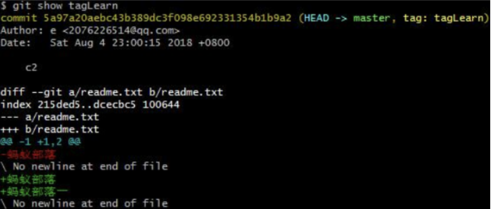
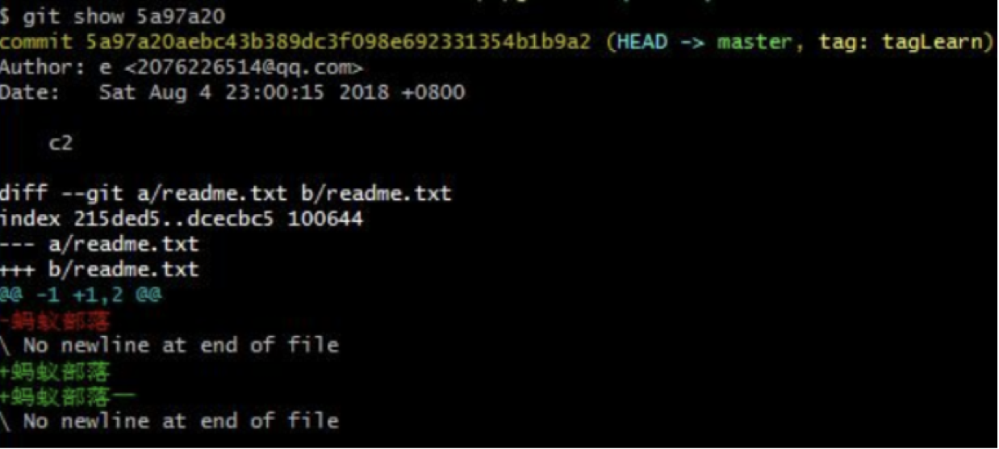

三.查看tag标签：
git show tagLearn

上面是一个轻量级标签，输出信息展示了它所指向的commit提交和所指向提交与上一次提交之间的差异。

四.查看commit对象：
git show 5a97a20

显示commit对象的相关信息（提交者，提交时间和commit对象sha-1值等）和上一个提交对象的差异。

hello world
sdfsf:q
下士大夫士大夫
123

下士大夫士大夫
123
1
2
3

分析一下git show后展示的具体日志信息
$ git show 6ecf 
commit 6ecfd1c0208c7b23ea715d93e545fde86c06af8e (HEAD -> dev2.0)
Author: xueshuaichao <2353872844@qq.com>
Date:   Wed Sep 18 11:21:46 2019 +0800

    07   // 这个是我commit的提交日志。

diff --git a/index.txt b/index.txt  // 比较两个文件之间的差异，
index 3ce40c2..ecf0879 100644       // 3ce40c2和ecf0879 表示前后两个文件的sha-1值，通过git show sha-1 可以查看该文件的具体内容。
--- a/index.txt
+++ b/index.txt
@@ -5,4 +5,6 @@
 3
 4
 5
-6
\ No newline at end of file // 上边表示删掉的内容，后边表示新加的内容，该句话表示在上个文件最后没有空行
+6
+7
+8
