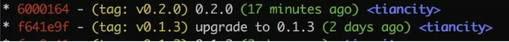
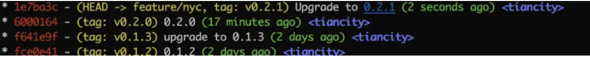

背景
最近，小伙伴吐槽同事们发版不喜欢打tag，导致上线出问题后不知道回退到哪个版本。于是，重新学习和整理了一下 Git tag 的使用。同时，将 npm version 的使用心得整理到了一起。
为什么要加tag
在我们把代码和版本提交到本地仓库的时候，我们的项目版本就会被系统默认生成的40位的哈希值给打一个版本。但是，这样版本的可读性很低。所以，我们要给哈希值版本号额外添加一个标签tag，来代替哈希值来进行各种版本上的操作。
作用
Git tag通常用于标记版本发布的某一个点。例如，当我们有大型项目要发布到正式环境，我们会给这个commit打上一个版本tag，来标识它的版本信息。
常用命令介绍
下面主要介绍 tag 的常用命令，例如，添加、删除、共享标签、查看标签等。
添加 tag
Git tag 中一共有两类标签，一类叫做轻量标签（Lightweight Tags），另一类叫做附注标签（Annotated Tags）。Git 的最佳实践推荐使用附注标签，因为当使用此类标签时，会将tag作为对象完整地存储到git数据库中，它有自身的校验和信息，包含着标签的名字，电子邮件地址和日期，以及标签说明。
个人实践中，本地环境下个人使用使用轻量标签，但需要将标签分享给其他人时使用附注标签。
添加 轻量标签
git tag <标签名> 
// git tag 0.1.0 

// 加上 -f 覆盖原有的
tag  git tag -f v1.0 

添加附注 tag
git tag -a <tag名> -m <注释文字> 
删除本地标签
git tag -d <标签名> 
查看标签列表
git tag 

// tag 列表 
v0.1.0 // 看自动加v了。 
v0.1.1 
v0.1.2 
v0.1.3 (END) 
推送 tag 到远端
git push origin <标签名> 
一次推送本地所有 tags，使用 --tags选项：
git push origin --tags 
tag版本回滚
我们的项目版本有时候会需要我们回到老的版本，那么我们就可以使用tag来切换版本。
git reset --hard 0.02(版本的tag值) 
第三把本地修改后的代码和版本提交到远程仓库：
git push -f origin master 
删除远端 tag
git tag :refs/tags/<tag 名字> 
查看指定 tag
git show <tag标签名> 
npm version 使用
在 NodeJS 项目中，我们经常需要变更 package.json中的版本信息。正常操作是，手动修改 package.json文件的版本信息，然后再commit。每次这样做，操作太繁琐。实际上，我们可以使用 npm version <newversion>命令

npm version [<newversion> | major | minor | patch | premajor | preminor | prepatch | prerelease | from-git]
major：主版本号
minor：次版本号
patch：补丁号
premajor：预备主版本
prepatch：预备次版本
prerelease：预发布版本

假设我们当前版本号为 "0.1.3"，当需要更改次版本号时，使用命令 npm version minor 进行变更。
此时，该命令会进行两个操作：
• 更改 package.json 中version，将版本信息有 "0.1.3"更改为 "0.2.0"
• 保存修改并生产一个新的commit

若需要指定commit 的信息，可以使用 -m 命令。
npm version patch -m "Upgrade to %s" # %s 会自动替换成版本号 

小技巧
如何快速查看当前版本信息？

npm version
{ 'ts-hi': '0.2.1',
  npm: '5.6.0',
  ares: '1.10.1-DEV',
  cldr: '32.0',
  http_parser: '2.8.0',
  icu: '60.1',
  modules: '57',
  napi: '3',
  nghttp2: '1.32.0',
  node: '8.11.4',
  openssl: '1.0.2p',
  tz: '2017c',
  unicode: '10.0',
  uv: '1.19.1',
  v8: '6.2.414.54',
  zlib: '1.2.11' }
如何查询 npm version 命令的使用方法
npm version ? 
需要注意的是，使用 npm version <newversion> 命令，需要当前工作区为clean状态，否则会执行失败。
总结
本文主要介绍了 git tag和 npm version命令的使用。在实际工作中，还是要养成经常打tag的习惯。有助于排查问题和回退版本。特别是，多人协作和SDK开发场景，当用重要功能或API更新时，及时使用tag标明版本信息。
