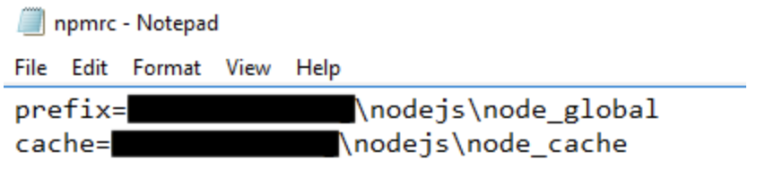

使用 n 或者 nvm 管理 Node 版本
<!-- 安装
下载NODE
删除某个版本
切换版本
以指定的版本来执行脚本
设置 Node.js 的 npm 安装 package 的全局路径（非必须） -->
管理 Node 版本的工具有 n 和 nvm，其中 n 不支持Windows，Windows 用户可以使用 nvm。

n 地址： https://github.com/tj/n
nvm 地址：https://github.com/coreybutler/nvm-windows/

 ### 安装
n 可以使用 npm 包安装
```javascript
$ npm install -g n
```

nvm 可以使用下面链接安装:
https://github.com/coreybutler/nvm-windows/releases

 ### 下载NODE
```javascript
$ n <version>   // 下载某一版本号  e.g：n 10.16.0
$ n latest      // 安装最新版本
$ n stable      // 安装最新稳定版
$ n lts         // 安装最新长期维护版(lts)
```

```javascript
$ nvm install <version>  // 下载某一版本号  e.g：nvm install 10.16.0
$ nvm install latest     // 安装最新版本
$ nvm install lts        // 安装最新长期维护版(lts)
```


 ### 删除某个版本
```javascript
$ n rm <version>  // 删除某个版本  e.g：n rm 10.16.0
$ nvm uninstall <version>
```

 ### 切换版本
```javascript
$ n   // 输入命令后直接使用上下箭头选择

  6.9.4
ο 7.4.0
  4.4.4
```

```javascript
$ nvm list  // 列出当前安装的所有版本
$ nvm use <version>  // 使用某个版本
```

以指定的版本来执行脚本
```javascript
$ n use 7.4.0 index.js
```

 ### 设置 Node.js 的 npm 安装 package 的全局路径（非必须）
npm 安装工具默认会安装到C盘。因为 npmrc 文件中默认的设置为：prefix=${APPDATA}\npm 。安装在C盘中，有时可能会因为系统权限的问题，导致不能正常成功的安装某些工具，那么我们就可以先将 npm 安装的全局路径自定设置一下。

在 nodejs 的安装目录下（即你的 nodejs 安装后的根目录）新建两个目录：node_global ，node_cache，然后找到 nodejs 目录下的 node_modules/npm 目录下名为 npmrc 或者 .npmrc 文件（为了安全，我们可以先将该文件复制一个副本出来进行备份），使用文本编辑器打开，修改并新增如下：prefix 和 cache 分别对应之前新建的目录 node_global 和 node_cahche 。


通过设置后，后续在安装工具的时候，比如安装 TypeScript ，最终会安装到 node_global 中。

如果你有多个版本的 node 可以修改个人文件夹下的npmrc 或者 .npmrc 文件。这样不管切换到哪个版本都会安装到同一个目录下。
