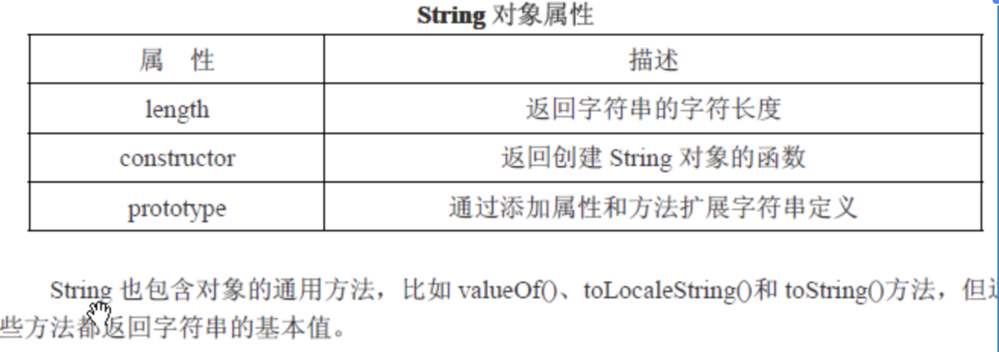
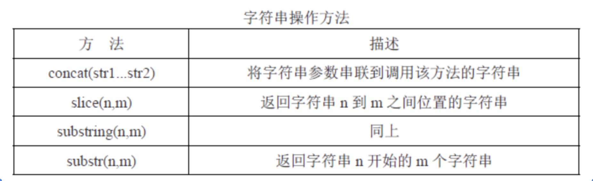

基本类型：Undefined,Null,Boolean,Number,String
基本包装类型：Boolean,Number,String
```js
var str = 'hello'; //string 基本类型
var s2 = str.charAt(0);
alert(s2); // h
```

上面的string是一个基本类型，但是它却能召唤出一个 charAt() 的方法，主要是因为在基本类型中，有三个比较特殊的存在就是：String Number Boolean，这三个基本类型都有自己对应的包装对象。包装对象，其实就是对象，有相应的属性和方法。调用方法的过程，是在后台偷偷发生的。
```js
//我们平常写程序的过程：
var str = 'hello'; //string 基本类型
var s2 = str.charAt(0); //在执行到这一句的时候 后台会自动完成以下动作 ：
（ 
 var _str = new String('hello'); // 1 找到对应的包装对象类型，然后通过包装对象创建出一个和基本类型值相同的对象
 var s2 = _str.chaAt(0); // 2 然后这个对象就可以调用包装对象下的方法，并且返回结给s2.
 _str = null;  //    3 之后这个临时创建的对象就被销毁了， str =null; 
 ） 
alert(s2);//h 
alert(str);//hello
```

由此我们可以知道，引用类型和基本包装对象的区别在于：生存期
引用类型所创建的对象，在执行的期间一直在内存中，而基本包装对象只是存在了一瞬间。
所以我们无法直接给基本类型添加方法：因为临时创建的对象会被销毁

那么我们怎么才能给基本类型添加方法或者属性呢？答案是在基本包装对象的原型下面添加，每个对象都有原型。
```js
//给字符串添加方法  要写到对应的包装对象的原型下才行
var str = 'hello';
String.prototype.last= fuction(){ 
    return this.charAt(this.length);
}; 
str.last(); // 5 执行到这一句，后台依然会偷偷的干这些事
｛ 
    var _str = new String('hello');// 找到基本包装对象，new一个和字符串值相同的对象，
    _str.last();  // 通过这个对象找到了包装对象下的方法并调用 
    _str =null; //  这个对象被销毁
｝
```

字符串内部常用的方法和属性




演示一些常用的方法：
JS中的字符串截取函数：slice()、substring()、substr()函数。
```js
var str ='Mr.Wang';
alert(str.charAt(3));//W
alert(str[3]);//W

//截取字符串方法：slice()、substring()、substr()
var str ='Mr.Wang';

alert(str.slice(2,4));//.W   索引从 2开始 到 4结束 截取字符串
alert(str.substring(2,4));//.W  效果同上
alert(str.substr(2,4)); //.Wan   从2开始 截取长度为 4 的字符串
```

### Number 对象的方法
```js
var box = 1000.789;
alert(box.toString()); //转换为字符串，传参可以转换进制
alert(box.toLocaleString()); //本地形式，1,000.789
alert(box.toFixed(2)); //小数点保留，1000.78
alert(box.toExponential()); //指数形式，传参会保留小数点
alert(box.toPrecision(3)); //指数或点形式，传参保留小数点
```

### Boolean 类型
Boolean 类型没有特定的属性或者方法。