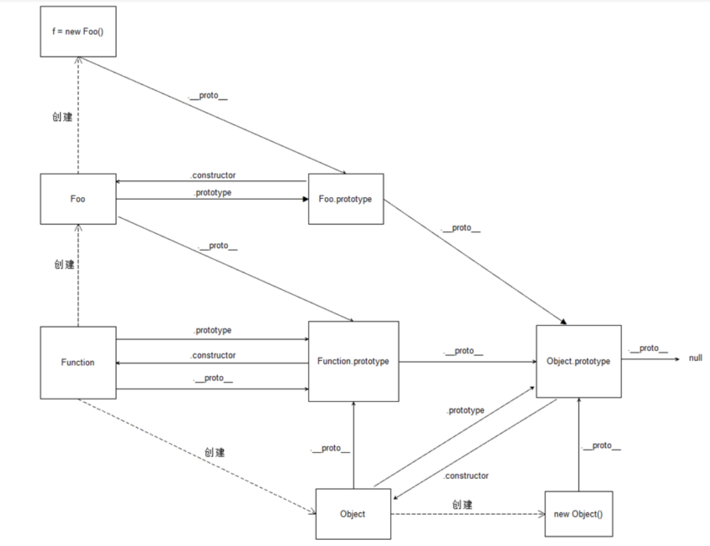

### 原型是什么
原型(对象)就是：构造函数的prototype属性的值
```js
function Person(){}
console.log(Person.prototype);
console.log(Person.prototype.prototype);  不能加，因为只有函数才能加prototype属性
```

### 使用面向对象编程的基本原则
1.属性都放到构造函数中
2.方法或公共的属性放到原型中
    

### constructor属性的简单介绍
```js
function Person(){}
console.log(Person.prototype.constructor===Person);
```
    
面向对象的三大特征
- 封装
将类的状态信息隐藏在内部，不允许外部程序直接访问操作。
那么封装有什么好处呢？
封装对实现细节进行隐藏，使用者需要通过规定的访问来访问数据，这样避免了使用者进行不合理的赋值操作

- 继承
继承是从父类中得到一些需要继承的信息。
继承有什么好处？
继承使得系统在变化中有了延续性，同时继承也是封装过程中可变的因素。另外通过继承还可以缩小代码量。

- 多态
多态是指允许不同的子类类型的对同意消息做出不同的行为。举一个例子：老师是父类，语文老师和数学老师都是他的子类，都是老师，当听到上课铃声想起，语文老师去上的语文课，而数学老师上的数学课。
多态的好处？
多态可以大量减少代码量，提高代码的维护性和扩展性  

    

### 继承的几种方法(ID:1730351883844)
什么是继承：子类具有父类的属性和方法。
实现方式有原型链继承、构造函数继承、组合继承、寄生式继承、寄生组合式继承

详见专题中的几种继承方法

1.原型继承（把父类的实例作为子类的原型）
- 缺点：
  1. 父类的引用数据类型（对象，数组）会被子类共享，会相互影响
  2. 子类实例不能给父类构造函数传参（因为父类只new一次，子类可生成多个，不能个性化处理）
```javascript
function Person() {
  this.name = "小明";
  this.eats = ["苹果"];
  this.getName = function () {
    console.log(this.name);
  };
}
Person.prototype.get = () => {
  console.log("person.prototype上的方法");
};

function Student() {}
Student.prototype = new Person();
const stu1 = new Student();
stu1.name = "小花";
stu1.eats.push("香蕉");
console.log(stu1.name);
console.log(stu1.eats);
stu1.getName();
stu1.get();

console.log("--------------");

const stu2 = new Student();
console.log(stu2.name);
console.log(stu2.eats);
stu2.getName();
stu2.get();
```

2.构造函数继承
- 优点：父类的引用类型数据不会被子类共享，不会相互影响
- 缺点：子类不能访问父类的原型属性(Person.prototype)
```javascript
function Person() {
  this.name = "小明";
  this.eats = ["苹果"];
  this.getName = function () {
    console.log(this.name);
  };
}

Person.prototype.get = () => {
  console.log("person.prototype上的方法");
};
function Student() {
  Person.call(this);
}
// Student.prototype = new Person();
// 没有这行代码，下边的组合继承才有
const stu1 = new Student();
stu1.name = "小花";
stu1.eats.push("香蕉");
console.log(stu1.name);
console.log(stu1.eats);
stu1.getName();
// stu1.get();
console.log("--------------------");

const stu2 = new Student();
console.log(stu2.name);
console.log(stu2.eats);
stu2.getName();
// stu2.get();
```


3.组合继承
// 在子函数中运行父函数，但是要利用call把this改变一下，
// 再在子函数的prototype里面new Father() ,使Father的原型中的方法也得到继承，最后改变Son的原型中的constructor

- 优点：
  1. 父类可以复用
  2. 父类构造函数中的引用数据不会被共享
- 缺点：会调用两次父类的构造函数，会有两份一样的属性和方法，影响性能

4.寄生组合继承
目前最优的继承方案

5.es6 class类继承extends  
（寄生组合继承的语法糖），子类只要继承父类，可以不写 constructor，一旦写了，则在 constructor 中的第一句话，必须是 super。
```javascript
class Son3 extends Father { // Son.prototype.__proto__ = Father.prototype
  constructor(y) {
    super(200)  // super(200) => Father.call(this,200)
    this.y = y
  }
}
```
完美

  


### 原型链
- 示例对象p的原型链
```js
function Person(){};
var p = new Person();
p -> Person.prototype -> Object.prototype -> null
```
1.对象
```js
function Object(){};
var obj=new Object();
原型链
obj-->Object.prototype-->null
```
2.数组
    
原型链
arr->Array.prototype-->Object.prototype-->null;


