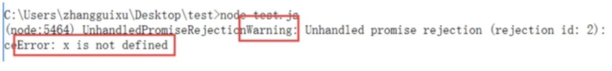

3. Promise进阶
3.1 resolve/reject的参数
reject函数的参数一般来说是Error对象的实例，而resolve函数的参数除了正常的值外，还可能是另一个Promise实例，表示异步操作的结果有可能是一个值，也有可能是另一个异步操作。
var p1 = new Promise( function(resolve, reject) {
    // ...
});

var p2 = new Promise( function(resolve, reject) {
    // ...
    resolve(p1);
});
代码分析：p1和p2都是Promise的实例，p2中的resolve方法将p1作为参数，即一个异步操作的结果是返回另一个异步操作。
注意，这时p1的状态就会传递给p2，也就是说，p1的状态决定了p2的状态，他们之间的关系是

举个例子
console.time('Promise example start')
var p1 = new Promise( (resolve, reject) => {
    setTimeout(() => resolve('hi'), 3000);
});

var p2 = new Promise( (resolve, reject) => {
    setTimeout(() => resolve(p1), 10);
});

p2.then( ret => {
    console.log(ret);
    console.timeEnd('Promise example end')
});

我们在node环境下运行以上代码，执行结果为：

从执行时间可以看到，p2会等待p1的执行结果，然后再执行，从输出hi可以看到p1完成状态转变之后，传递给resolve(或者reject)的结果会传递给p2中的resolve。

3.2 then()
我们可以了解到then()方法是Promise实例的方法，即Promise.prototype上的，它的作用是为Promise实例添加状态改变时的回调函数，这个方法的第一个参数是resolved状态的回调函数，第二个参数（可选）是rejected状态的回调函数。

那么then()方法的返回值是什么？then方法会返回一个新的Promise实例（注意，不是原来那个Promise，原来那个Promise已经承诺过，此时继续then就需要新的承诺~~），这样的设计的好处就是可以使用链式写法。
还有一个点，就是链式中的then方法（第二个开始），它们的resolve中的参数是什么？答案就是前一个then()中resolve的return语句的返回值。
var p1 = new Promise( (resolve, reject) => {
    setTimeout(() => resolve('p1'), 10);
});

p1.then( ret => {
    console.log(ret);
    return 'then1';
}).then( ret => {
    console.log(ret);
    return 'then2';
}).then( ret => {
    console.log(ret);
});

在node环境下执行，执行结果为：

3.3 catch()错误处理
catch()方法是Promise实例的方法，即Promise.prototype上的属性，它其实是.then(null, rejection)的简写，用于指定发生错误时的回调。
这个方法其实很简单，在这里并不想讨论它的使用，而是想讨论的是Promise中的错误的捕抓和处理。

3.3.1 Error对象的传递性
Promise对象的Error对象具有冒泡性质，会一直向后传递，直到被捕获为止。也就是说，错误总是会被下一个catch语句捕获，示例代码如下：
var p = new Promise( (resolve, reject) => {
    setTimeout(() => resolve('p1'), 10);
});

p.then( ret => {
    console.log(ret);
    throw new Error('then1');
    return 'then1';
}).then( ret => {
    console.log(ret);
    throw new Error('then2');
    return 'then2';
}).catch( err => {
    // 可以捕抓到前面的出现的错误。
    console.log(err.toString());
});

在第一个then中抛出了一个错误，在最后一个Promise对象中可以catch到这个错误。
因为有这种方便的错误处理机制，所以一般来说不要在then方法里面定义reject状态的回调函数， 而是使用catch方法

3.3.2 vs try/catch
跟传统的try/catch不同的是，如果没有使用catch方法指定错误处理回调函数，则Promise对象抛出的错误不会传递到外层代码（在chrome会报错）

Node.js有一个unhandledRejection事件，专门监听未捕获的reject错误。
var p = new Promise((resolve, reject) => {
    resolve(x + 2);
});
p.then( () => {
    console.log('nothing');
});

3.3.3 catch()的返回值
没错，既然catch()是.then(null, rejection)的别名，那么catch()就会返回一个Promise对象，因此在后面还可以接着调用then方法，示例代码如下：
var p = new Promise((resolve, reject) => {
    resolve(x + 2);
});
p.then( () => {
    console.log('nothing');
}).catch( err => {
    console.log(err.toString());
    return 'catch';
}).then( ret => {
    console.log(ret);
});

当出错时，catch会先处理之前的错误，然后通过return语句，将值继续传递给后一个then方法中。
如果没有报错，则跳过catch，示例如下：

var p = new Promise((resolve, reject) => {
    resolve('p');
});
p.then( ret => {
    console.log(ret);
    return 'then1';
}).catch( err => {
    console.log(err.toString());
    return 'catch';
}).then( ret => {
    console.log(ret);
});

