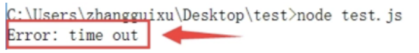
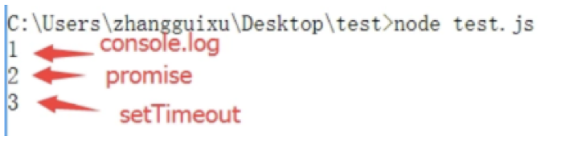

4. Promise对象方法

4.1 Promise.all()
Promise.all()方法用于将多个Promise实例，包装成一个新的Promise实例，例如
var p = Promise.all([p1, p2, p3]);

新的Promise实例p的状态由p1, p2, p3决定：
当p1, p2, p3的状态都为完成态时，p为完成态。
p1, p2, p3中任一一个状态为失败态，则p为失败态。
```js
var p = Promise.all([
    new Promise(resolve => {
        setTimeout(() => resolve('p1'), 500);
    }),
    new Promise(resolve => {
        setTimeout(() => resolve('p2'), 1000);
    }),
]);
p.then( ret => console.log(ret))  // ["p1", "p2"]
    .catch( err => console.log(err.toString()));
```
4.2 Promise.race()
Promise.race方法同样是将多个Promise实例，包装成一个新的Promise实例。
var p = Promise.race([p1, p2, p3]);
不同的是，只要p1, p2, p3中任意一个实例率先改变状态，则p的状态就跟着改变，而且状态由率先改变的实例决定。
```js
var p = Promise.race([
    new Promise(resolve => {
        setTimeout(() => resolve('p1'), 10000);
    }),
    new Promise((resolve, reject) => {
        setTimeout(() => reject(new Error('time out')), 10);
    })
]);
p.then( ret => console.log(ret))
    .catch( err => console.log(err.toString()));
```


4.3 Promise.resolve()
Promise.resolve()可以将现有的对象转为Promise对象。
var p = Promise.resolve('p');

// 相当于
var p = new Promise(resolve => resolve('p'));
比较有意思的是Promise.resolve()会根据参数类型进行相应的处理，分几种情况讨论。

4.3.1 Promise实例
参数是一个Promise实例，那么Promise.resolve将不做任何处理，直接返回这个实例。

4.3.2 thenable对象
参数是一个thenable对象，也就是说对象是具有then方法的对象，但不是一个Promise实例（就跟类数组和数组的关系一样），例如
let thenable = {
    then : function (resolve, reject) {
        resolve(42);
    }
};

let p = Promise.resolve(thenable);
p.then( ret => console.log(ret)); // 42
Promise.resolve方法会将这个对象转为Promise对象，然后立即执行thenable对象中的then方法，因为例子中的thenable对象的then方法中执行了resolve，因此会输出结果42。

4.3.3 其他参数
如果参数是一个原始值，或者不具有then方法的对象，则Promise.resolve方法返回一个新的Promise对象，状态为resolve，然后直接将该参数传递给resolve方法。
var p = Promise.resolve("p");
p.then( ret => console.log(ret)); // p

4.3.4 不带任何参数
Promise.resolve方法不带参数时，会直接返回一个resolve状态的Promise对象。
需要注意的立即resolve的Promise对象，是在本轮事件循环的结束时，而不是下一轮事件循环的开始执行。示例代码：
setTimeout(() => console.log('3'), 0);
var p = Promise.resolve();
p.then(() => console.log('2'));
console.log('1');

输出结果为：


4.4 Promise.reject()
Promise.reject()返回一个新的Promise实例，该实例的状态为rejected，对于传入的参数的处理跟Promise.resolve类似，就是状态都为rejected。
