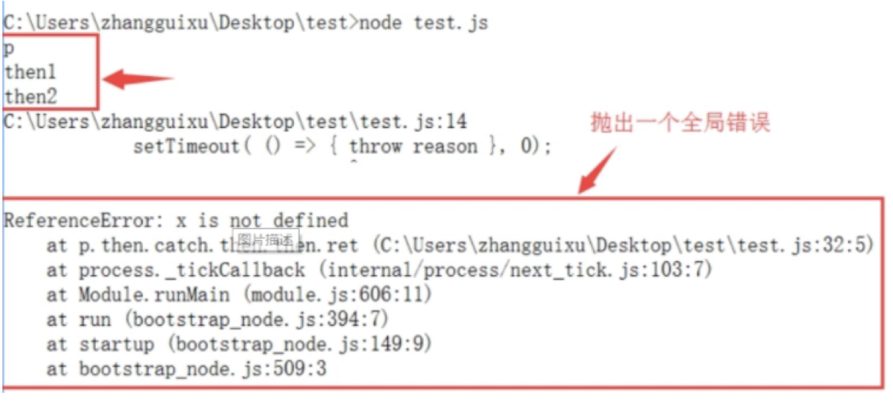

5. 两个实用的方法

5.1 done()
Promise对象的回调链，不管以then方法或者catch方法结尾，要是最后一个方法抛出错误，都有可能无法捕捉到，因为Promise内部的错误不会冒泡到全局，因此，我们可以提供一个done方法，总是处理回调链的尾端，保证抛出任何可能出现的错误。

代码实现：
```js
Promise.prototype.done = function (resolve, reject) {
    this.then(resolve, reject)
        .catch( function (reason) {
            // 抛出一个全局错误
            setTimeout( () => { throw reason }, 0);
        });
}
```
// 使用示例
```js
var p = new Promise( (resolve, reject) => {
    resolve('p');
});
p.then(ret => {
    console.log(ret);
    return 'then1';
}).catch( err => {
    console.log(err.toString());
}).then( ret => {
    console.log(ret);
    return 'then2';
}).then( ret => {
    console.log(ret);
    x + 2;
}).done();
```



这里为什么可以在全局抛出一个错误？原因就是setTimeout中的回调函数是在全局作用域中执行的，因此抛出的错误就是在全局作用域上。

5.2 finally()
finally方法用于指定不管Promise对象最后的状态如何，都会执行的操作，它与done方法最大的区别就是，它接受一个普通函数作为参数，该函数不管怎么样都必须执行。
```js
Promise.prototype.finally = function (callback) {
    let P = this.constructor;
    return this.then(
        ret => P.resolve(callback()).then( () => ret),
        err => P.resolve(callback()).then( () => {throw reason })
    );
};
```

5. Promise的优劣势
从上面几个小节综合来看，可以看到Promise其实就是做了一件事情，那就是对异步操作进行了封装，然后可以将异步操作以同步的流程表达出来，避免了层层嵌套的回调函数，同时提供统一的接口，使得控制异步操作更加容易。
但是，Promise也有一些缺点：
无法取消Promise，一旦新建它就会立即执行，无法中途取消。
如果不设置回调函数，Promise内部的错误不会反应到外部。
当处于未完成态时，无法得知目前进展到哪一个阶段。

6. Promise与generator的结合
使用Generator函数来管理流程，遇到异步操作的时候，通常返回一个Promise对象。
```js
function getFoo() {
    return new Promise( resolve => resolve('foo'));
}

var g = function * () {
    try {
        var foo = yield getFoo();
        console.log(foo);
    } catch(e){}
}

function run(generator) {
    var it = generator();

    function go(result) {
        if(result.done) return result.value;

        // 默认value是一个Promise，其实这里应该做判断的
        if(!(result.value instanceof Promise)){
            throw Error('yield must follow an instanceof Promise');
        }
        return result.value.then(
            ret => go(it.next(ret))
        ).catch(err => go(it.throw(err)));
    }

    go(it.next());
}

run(g);
```
上面代码的Generator函数g之中，有一个异步操作getFoo，它返回的就是一个Promise对象。函数run用来处理这个Promise对象，并调用下一个next方法。
