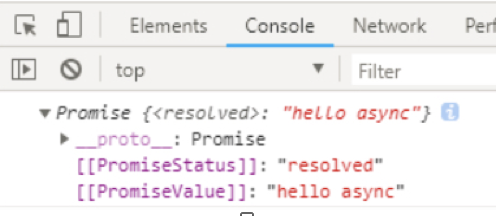
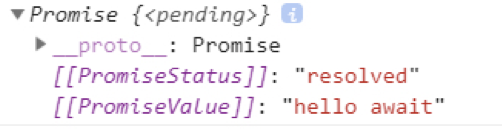

async、await 如何执行-----------------------------------？
async 告诉程序这是一个异步操作，await 是一个操作符，即 await 后面是一个表达式。
async 的返回值
```js
// async
async function testAsync() {
  return "hello async";
}
const data = testAsync();
console.log(data);  // 返回一个Promise对象。
```

当调用一个 async 函数时，会返回一个 Promise 对象。根据mdn的解释
当这个 async 函数返回一个值时，Promise 的 resolve 方法会负责传递这个值；
当 async 函数抛出异常时，Promise 的 reject 方法也会传递这个异常值。async 函数中可能会有 await 表达式，await表达式会使 async 函数暂停执行，直到表达式中的 Promise 解析完成后继续执行 async中await 后面的代码并返回解决结果。
注意， await 关键字仅仅在 async function中有效
既然返回的是Promise 对象，所以在最外层不能用 await 获取其返回值的情况下，那么肯定可以用原来的方式：then() 链来处理这个 Promise 对象 如
```js
// async
async function testAsync() {
  return "hello async";
}
let data = testAsync().then( (data) => {
  console.log(data) // hello async      
  return data
});
console.log(data);
```
如果 async 函数没有返回值，又怎么样呢？很容易想到，它会返回 Promise.resolve(undefined)。
联想一下 Promise 的特点无等待，所以在没有 await 的情况下执行 async 函数，它会立即执行，返回一个 Promise 对象，并且，绝不会阻塞后面的语句。
await 操作符
MDN 是这样描述 await 的：
await 表达式会暂停当前 async function 的执行，等待 Promise 处理完成。 若 Promise 正常处理(fulfilled)，其回调的resolve函数参数作为 await 表达式的值， 继续执行async function。若 Promise 处理异常(rejected)，await 表达式会把 Promise 的异常原因抛出。另外，如果 await 操作符后的表达式的值不是一个 Promise， 则返回该值本身。 

 阮一峰老师的解释我觉得更容易理解：
async 函数返回一个 Promise 对象，当函数执行的时候，一旦遇到 await 就会先返回， 等到触发的异步操作完成，再接着执行函数体内后面的语句。 
按照mdn解释 await会暂停当前async 函数执行，并且await 后面是一个表达式，即这个await 等待的是一个表达式（这个表达式返回promise 对象或者一个具体的值）：
• 假如这个表达式如果返回的是一个Promise 对象， 那么它的返回值，实际上就是 Promise 的回调函数 resolve 的参数，如果这个Promise rejected 了，await 表达式会把 Promise 的异常抛出。
• 假如这个表达式如果返回的是一个常量，那么会把这个常量转为Promise.resolve(xx)，同理如果没有返回值也是Promise.resolve(underfind)
```js
async function testAwait() {
  const data = await "hello await";
  console.log(data); //输出 “hello await”
  return data;
}
const data = testAwait();
console.log(data); // 注意：这里返回的是promise对象，而且是pending状态的，如下图：
data.then((res) => {
  console.log(res); // 输出 “hello await”
});
```

这里是pending，而上边的是resolved，原因在于上边没有await，直接返回。


返回promose 对象，成功状态
```js
function say() {
  return new Promise(function (resolve, reject) {
    setTimeout(function () {
      let age = 26;
      resolve(`hello, joel。今年我 ${age} 岁`);
    }, 1000);
  });
}
async function demo() {
  const v = await say();
  // 输出：hello, joel。今年我 26 岁  等待这个say 的异步，
  // 如果成功把回调 resole 函数的参数作为结果
  console.log(v);
}
demo();
```
返回promise 对象，失败状态
```js
function say() {
  return new Promise(function (resolve, reject) {
    setTimeout(function () {
      let age = 26;
      reject(`hello, joel，发生了异常。今年我 ${age} 岁`);
    }, 1000);
  });
}
async function demo() {
  try {
    const v = await say();
    console.log(v); //这里没有任何返回
  } catch (e) {
    console.log(e);
    // 输出：hello, joel，发生了异常。今年我 26 岁  等待这个say 的异步，如果成功把回调 resole 函数的参数作为结果
  }
}
demo();
```
async/await 相比原来的Promise的优势在于处理 then 链，不必把回调嵌套在then中，只要await 即可，如
```js
function sing() {
  return new Promise(function (resolve, reject) {
    setTimeout(function () {
      resolve(`来一首好听的歌吧~~~`);
    }, 1000);
  });
}
async function demo() {
  try {
    const v = await say();
    const s = await sing();
    console.log(v); // 输出：hello, joel。今年我 26 岁
    console.log(s); // 来一首好听的歌吧~~~
  } catch (e) {
    console.log(e);
  }
}
demo();
```
如果使用原来的Promise 就是把回调放在then()中。
总结
1. async 告诉程序这是一个异步，awiat 会暂停执行async中的代码，等待await 表达式后面的结果，跳过async 函数，继续执行后面代码
2. async 函数会返回一个Promise 对象，那么当 async 函数返回一个值时，Promise 的 resolve 方法会负责传递这个值；当 async 函数抛出异常时，Promise 的 reject 方法也会传递这个异常值
3. await  操作符用于等待一个Promise 对象，并且返回 Promise 对象的处理结果（成功把resolve 函数参数作为await 表达式的值），如果等待的不是 Promise 对象，则用 Promise.resolve(xx) 转化
所以await等待的方法必须返回一个promise对象，
如果是如下，则不会等
```js
function fn() {
  const a = setTimeout(() => {
    return '123'
  }, 1000)
  return a
}
async function f1() {
  console.log(1);
  var d = await fn();
  console.log(d);
  console.log(3)
}
f1()
```
必须要promise才行，如下
```js
function say() {
  return new Promise(function (resolve, reject) {
    setTimeout(function () {
      let age = 26;
      resolve(`hello, joel。今年我 ${age} 岁`);
    }, 1000);
  });
}
async function demo() {
  const v = await say();
  // 输出：hello, joel。今年我 26 岁  等待这个say 的异步，
  // 如果成功把回调 resole 函数的参数作为结果
  console.log(v);
}
demo();
```


