它们是用来做代码格式化的，顺序是先有npm包，再有vscode插件

先从eslint讲起，eslint不仅作代码规范，还有检查变量声明了是否调用，是否有console.log语句等。

废话不多说，直接上手来演示一下。
（如果有安装格式化工具的同学，先把工具禁用了，否则会影响演示效果,eslint prettier插件）
### eslint的npm包
简单的用法，先npm init -y，初始化包。再建一个index.js文件，写点东西。
```js
//index.js文件

var a = 1
      let str = "ss"
   console.log('111');
```
然后全局安装eslintnpm i eslint -g（如果之前全局安装过了就不用了），再npx eslint --init，接着会出现几个选择，因为是测试，所以随便选，一直回车就行了。

选完之后会自动下载eslint包，并在项目的根目录自动创建.eslintrc.js文件。
此时准备工作已经做好了，我们可以开始演示了。先执行eslint index.js
这时，终端会报错，说定义了几个变量，但没有使用它们。这就是最基本的用法。
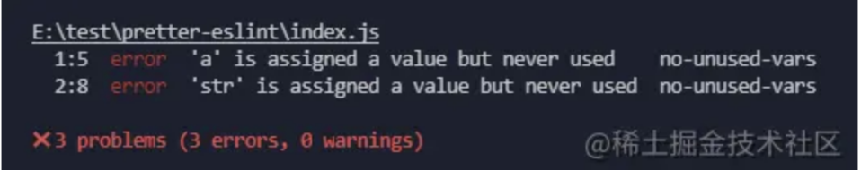

但我上面书写的格式风格都不同，eslint并没有检测出来。所以我们要去配置.eslintrc.js文件
因为里面已经生成好了，所以这里只放出rules部分
0是忽略，1是警告，2是报错
```js
//.eslintrc.js

    "rules": {
        "quotes": 2,
        "semi": 1,
        "no-console": 1,
        "space-before-function-paren": 0
    }
```
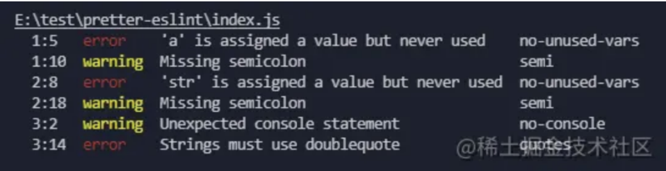
格式的问题也被检测出来了。
那么我要怎么修复它们呢？执行eslint index.js --fix
--fix 只能帮我们修改一些简单的错误，比如双引号，分号，代码错误还需要我手动修改
这样js文件里面的内容的格式就被修复好了，比如结尾要不要分号，用单引号还是双引号。
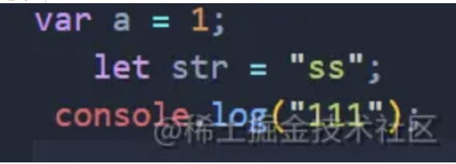

### eslint的vscode插件
我们每次做项目的时候，都要先eslint . --fix统一格式，再push提交代码。或者是把指令添加到package.json文件中，执行npm run lint，再push。这样就很麻烦，并且也不够直观，因为错误问题只有在你执行了指令之后才能看到。
那么我想在我一边写代码的时候就能直接看到错误，然后就能直接随手改正错误，这要怎么做呢？ 这时eslint的vscode插件诞生了。
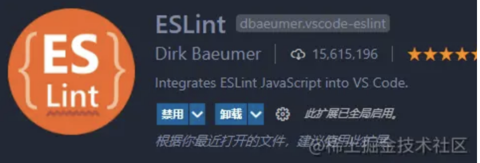

安装完后，就能看到带波浪线的报错效果了。
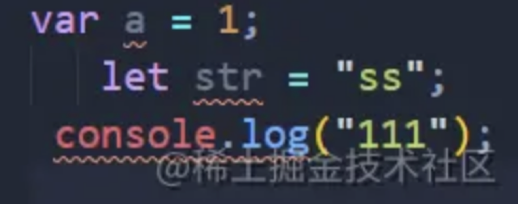

接着去配置自动保存，到vscode的setting.json下增加以下语句：
```js
//setting.json文件

    "editor.formatOnType": true,
    "editor.formatOnSave": true,
// 在快速修复菜单中显示打开的 lint 规则文档网页
    "eslint.codeAction.showDocumentation": {
        "enable": true
    },
        // 保存时修复来自所有插件的所有可自动修复的ESlint错误（重点其实只有这一个）
    "editor.codeActionsOnSave": {
        "source.fixAll.eslint": true,
    },
    "eslint.validate": ["javascript", "javascriptreact", "html", "vue"],
```
这样每次保存文件的时候，就能看到错误信息了，并且自动改正了。（这里只是演示，后期因为和prettier的效果冲突了，要删除）

### 既然有vscode插件，那么还装eslint的npm包吗？
要装。虽然vscode插件也可以单独配置格式，但是如果项目中有.eslintrc.js文件，那么eslint插件会优先执行.eslintrc.js文件的配置。
并且不是每个人都会装eslint的vscode插件。此时eslint的npm包就作为一个保障，并且里面的.eslintrc.js配置就作为标准配置。
装vscode插件只是为了方便自己开发而已。

### prettier的npm包
既然eslint能做格式化，那为什么还要prettier呢？
聪明的小伙伴肯定发现了，执行了eslint index.js --fix之后，js文件只是增加了分号，双引号。但是代码的格式该怎么乱还是怎么乱，即不美观，也不工整。并且eslint只能作用于js文件，像html，css，json，vue文件，eslint都处理不了他们的代码格式的问题。此时prettier认为代码的格式也很重要，于是prettier诞生了。

eslint在错误的语法旁边会有提示，而prettier没有报红或报黄提示

下载prettiernpm i prettier -D，然后执行npx prettier --write index.js，我们可以发现刚才不工整的代码，全部都变得工工整整了。
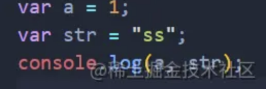

并且我们新建一个index.css文件，格式要多丑有多丑。
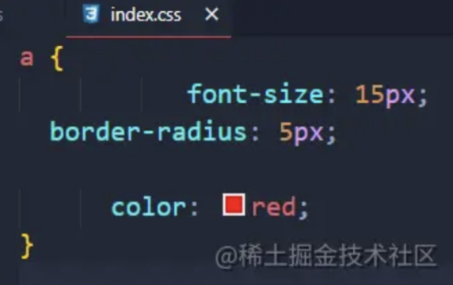

执行完npx prettier --write index.css，css文件也变得工整了，解决了eslint解决不了的问题。
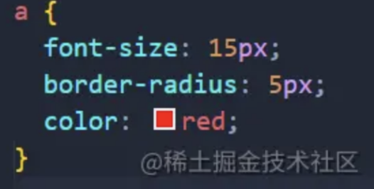

接着可以自定义代码格式配置，在项目的根目录创建.prettierrc.js文件。（如果是.prettierrc文件，则是json类型，要按json格式来配置）
```js
//.prettierrc.js文件

module.exports = {
    semi: false,
    singleQuote: true,
}
```
再执行npx prettier --write index.js，我们可以发现格式改成了单引号，并且结尾没有了分号。
（这里的波浪线是刚才eslint插件的效果，因为prettier的配置与eslint的配置冲突了。但是一Ctrl+S保存，又会改成eslint的配置格式。所以eslint和prettier的配置要统一，不能冲突。）
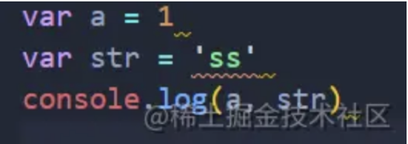

### prettier的vscode插件
还是和eslint一样的老问题，我需要每次执行npx prettier --write .才会修改格式。我想要在我写代码的时候，一Ctrl+S保存就能自动格式化代码，需要怎么做？这时prettier的vscode插件诞生了。


安装完后再配置一下prettier自动保存：
```js
//setting.json文件

    "[javascript]": {
        "editor.defaultFormatter": "esbenp.prettier-vscode"
    },
    "[html]": {
        "editor.defaultFormatter": "esbenp.prettier-vscode"
    }，
```
然后就会出现一个非常奇怪的现象：
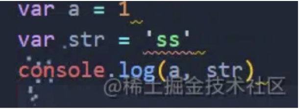

一Ctrl+S保存，先是自动加上分号和双引号，然后又没了。这还是因为eslint插件自动保存的效果和prettier插件自动保存的效果冲突了。
一保存，先是执行了eslint的配置，然后再执行prettier的配置。完蛋，不管前面的eslint设置得多好，只要和prettier的设置冲突了，就直接被prettier覆盖了。

### 解决办法：
要么把eslint插件的自动保存配置删除了，只要prettier的自动保存。因为eslint代码保存自动格式化这块的配置和prettier重叠了，直接让prettier来自动保存就行了。不过eslint和prettier的配置也要保持一致。
不想关闭eslint的自动保存也行，只要.eslintrc.js的配置和.prettierrc.js的配置严格一致就行了。
### 配置
关于.eslintrc.js和.prettierrc.js的配置，按照团队的需求自定义，或者在网上找一份配置就行了。因为大家的配置都不一样，我也不展示了。
稍微提一下，eslint默认是要双引号，加分号的。而prettier默认是单引号，不加分号的。所以这两个默认配置会冲突。我个人也是喜欢单引号和不加分号，所以我一般会把eslint的这两个配置关了，这样eslint的自动保存也会和prettier的自动保存一致。
并且eslint不加上node的话，关于module.exports的，老是显示报错，但实际上写得没有问题，只是eslint的问题。
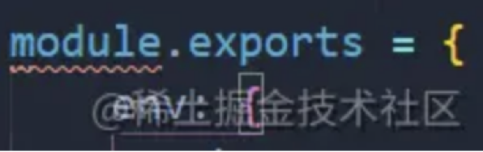

```js
//.eslintrc.js
  
 module.exports = {
    env:{
        browser:true,
        es2021:true,
        node:true
    },
    rules:{
        quotes:0,
        semi:0
    },
    ...,
}
```
### 总结
eslint是做js的代码格式化的，但是扩展性很强，包括变量是否使用，是否要console.log。而prettier是做所有代码的格式化，并且只专注于格式化，范围更广。
vscode的插件可以单独配置，单独起作用。但是如果项目根目录中有.eslintrc.js和.prettierrc.js文件，则以.eslintrc.js和.prettierrc.js的配置为标准，执行它们的配置。
prettier的效果在eslint的效果之后，如果配置冲突了，则prettier会覆盖eslint的配置。

### eslint-plugin-prettier
eslint和prettier重合的规则有很多，如果需要每个都配置一样的话，就会很繁琐，所有eslint出了一个eslint-plugin-prettier的东西，是把prettier当作eslint的一个插件，重合的部分按照prettier的规则来。

### 配置
eslint有extends和plugins两个配置。plugins要引入对应的插件模块，然后配置相对应的规则rules才会生效。而extends是已经配置好的规则，后面的extends会覆盖前面的extends。
```js
npm i eslint @vue/eslint-config-prettier eslint-config-prettier eslint-plugin-prettier eslint-plugin-vue prettier -D
```
下载好对应的包后，在eslint里面配置
```js
//.eslintrc.js

module.exports = {
    env: {
        browser: true,
        es2021: true,
        node: true,
    },
    extends: ["@vue/prettier", "plugin:vue/vue3-essential", "eslint:recommended"],
    parserOptions: {
        ecmaVersion: 13,
        sourceType: "module",
    },
    plugins: ["vue"],
    rules: {
        "prettier/prettier": "warn",
    },
}
```
然后在.prettierrc.js文件里面就可以写自己喜欢的代码风格了
```js
//.prettierrc.js

module.exports = {
        printWidth: 120,
        tabWidth: 4,
        useTabs: false,
        singleQuote: false,
        semi: false,
        trailingComma: "es5",
        bracketSpacing: true,
        jsxBracketSameLine: false,
        arrowParens: "avoid",
        endOfLine: "auto",
}
```
这样eslint就会按照prettier的规则来进行代码报错。
每次修改完规则后，都需要重启vscode才会生效。
***这就是最终的配置了，开发的时候配置这两个文件就行了。***
### 问题来了
package.json中的依赖有eslint和prettier，那么做项目npm i的时候，每个人都是会自动下载安装eslint和prettier的，这是必须的。但vscode插件可不一定，也就是说vscode插件不是必须的，可装可不装，只是方便我们自己开发而已。
那么假设一个人不喜欢这些vscode插件扩展，就喜欢简简单单的开发，那么我们又要统一代码规范，要怎么配置使项目一跑起来就能自动运行eslint和prettier达到不依靠vscode插件自动格式化的效果呢？

### 整体配置
最后再放一下我的eslintr配置把：eslint配置


```js
module.exports={
    root: true,
    env: {
        browser: true,
        node: true,
        es6: true,
    },
    extends: ['plugin:vue/vue3-essential','eslint:recommended','@vue/prettier'],
    parserOptions: {
        ecmaVersion: 2020,
        sourceType: 'module',
    },
    rules: {
        'prettier/prettier': 'error',
    },
    globals: {
        defineProps: 'readonly',
        defineEmits: 'readonly',
        defineComponent: 'readonly',
        defineExpose: 'readonly',
        ElMessage: 'readonly',
        ElNotification: 'readonly',
        ElMessageBox: 'readonly',
    },
}
```
