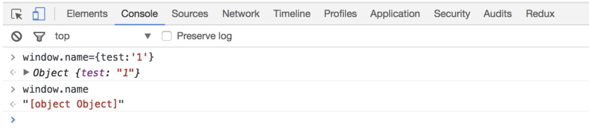

什么是跨域？
浏览器从一个域名的网页去请求另一个域名的资源时，域名、端口、协议任一不同，都是跨域
如何解决跨域问题？
跨域实践： Fiddle 处理前端本地开发跨域问题
1、jsonp跨域
JSONP（JSON with Padding：填充式JSON)，应用JSON的一种新方法，
JSON、JSONP的区别：
1、JSON返回的是一串数据、JSONP返回的是脚本代码(包含一个函数调用)
2、JSONP 只支持get请求、不支持post请求
(类似往页面添加一个script标签，通过src属性去触发对指定地址的请求,故只能是Get请求)
2、nginx反向代理：
www.baidu.com/index.html 需要调用 www.sina.com/server.php ，可以写一个接口www.baidu.com/server.php，由这个接口在后端去调用www.sina.com/server.php并拿到返回值，然后再返回给index.html

3、PHP端修改header
header(‘Access-Control-Allow-Origin:*’);//允许所有来源访问
header(‘Access-Control-Allow-Method:POST,GET’);//允许访问的方式

４、document.domain
跨域分为两种，一种xhr不能访问不同源的文档，另一种是不同window之间不能进行交互操作;
document.domain主要是解决第二种情况，且只能适用于主域相同子域不同的情况；
document.domain的设置是有限制的，我们只能把document.domain设置成自身或更高一级的父域，且主域必须相同。例如：a.b.example.com中某个文档的document.domain可以设成a.b.example.com、b.example.com 、example.com中的任意一个，但是不可以设成c.a.b.example.com，因为这是当前域的子域，也不可以设成baidu.com，因为主域已经不相同了。
兼容性：所有浏览器都支持；
优点：
可以实现不同window之间的相互访问和操作；
缺点：
只适用于父子window之间的通信，不能用于xhr；
只能在主域相同且子域不同的情况下使用；
使用方式：
不同的框架之间是可以获取window对象的，但却无法获取相应的属性和方法。比如，有一个页面，它的地址是http://www.example.com/a.html ， 在这个页面里面有一个iframe，它的src是http://example.com/b.html, 很显然，这个页面与它里面的iframe框架是不同域的，所以我们是无法通过在页面中书写js代码来获取iframe中的东西的：

<script type="text/javascript">
    function test(){
        var iframe = document.getElementById(' ifame');
        var win = document.contentWindow;//可以获取到iframe里的window对象，但该window对象的属性和方法几乎是不可用的
        var doc = win.document;//这里获取不到iframe里的document对象
        var name = win.name;//这里同样获取不到window对象的name属性
    }
</script>
<iframe id = "iframe" src="http://example.com/b.html" onload = "test()"></iframe>
这个时候，document.domain就可以派上用场了，我们只要把http://www.example.com/a.html 和 http://example.com/b.html这两个页面的document.domain都设成相同的域名就可以了。
1.在页面 http://www.example.com/a.html 中设置document.domain:

<iframe id = "iframe" src="http://example.com/b.html" onload = "test()"></iframe>
<script type="text/javascript">
    document.domain = 'example.com';//设置成主域
    function test(){
        alert(document.getElementById(' iframe').contentWindow);//contentWindow 可取得子窗口的 window 对象
    }
</script>
 
2.在页面 http://example.com/b.html 中也设置document.domain:

<script type="text/javascript">
    document.domain = 'example.com';//在iframe载入这个页面也设置document.domain，使之与主页面的document.domain相同
</script>

５、window.name
关键点：window.name在页面的生命周期里共享一个window.name;
兼容性：所有浏览器都支持；
优点：
最简单的利用了浏览器的特性来做到不同域之间的数据传递；
不需要前端和后端的特殊配制；
缺点：
大小限制：window.name最大size是2M左右，不同浏览器中会有不同约定；
安全性：当前页面所有window都可以修改，很不安全；
数据类型：传递数据只能限于字符串，如果是对象或者其他会自动被转化为字符串，如下；

使用方式：修改window.name的值即可；
６、postMessage
关键点：
postMessage是h5引入的一个新概念，现在也在进一步的推广和发展中，他进行了一系列的封装，我们可以通过window.postMessage的方式进行使用，并可以监听其发送的消息；
兼容性：移动端可以放心用，但是pc端需要做降级处理
优点
不需要后端介入就可以做到跨域，一个函数外加两个参数（请求url，发送数据）就可以搞定；
移动端兼容性好；
缺点
无法做到一对一的传递方式：监听中需要做很多消息的识别，由于postMessage发出的消息对于同一个页面的不同功能相当于一个广播的过程，该页面的所有onmessage都会收到，所以需要做消息的判断；
安全性问题：三方可以通过截获，注入html或者脚本的形式监听到消息，从而能够做到篡改的效果，所以在postMessage和onmessage中一定要做好这方面的限制；
发送的数据会通过结构化克隆算法进行序列化，所以只有满足该算法要求的参数才能够被解析，否则会报错，如function就不能当作参数进行传递；
使用方式：通信的函数，sendMessage负责发送消息，bindEvent负责消息的监听并处理，可以通过代码来做一个大致了解；
```js
Storage.prototype.sendMessage_ = function (type, params, fn) {
  if (this.topWindow) {
    this.handleCookie_(type, params, fn);
    return;
  }
  var eventId = this.addToQueue_(fn, type);
  var storageIframe = document.getElementById("mip-storage-iframe");
  var element = document.createElement("a");
  element.href = this.origin;
  var origin = element.href.slice(
    0,
    element.href.indexOf(element.pathname) + 1
  );
  storageIframe.contentWindow.postMessage(
    {
      type: type,
      params: params,
      eventId: eventId,
    },
    origin
  );
};
Storage.prototype.bindEvent_ = function () {
  window.onmessage = function (res) {
    // 判断消息来源
    if (
      window == res.source.window.parent &&
      res.data.type === this.messageType.RES &&
      window.location.href.match(res.origin.host).length > 0
    ) {
      var fn = this.eventQueue[res.data.eventId];
      fn && fn();
      delete this.eventQueue[res.data.eventId];
      // reset id
      var isEmpty = true;
      for (var t in this.eventQueue) {
        isEmpty = false;
      }
      if (isEmpty) {
        this.id = 0;
      }
    }
  }.bind(this);
};


```


