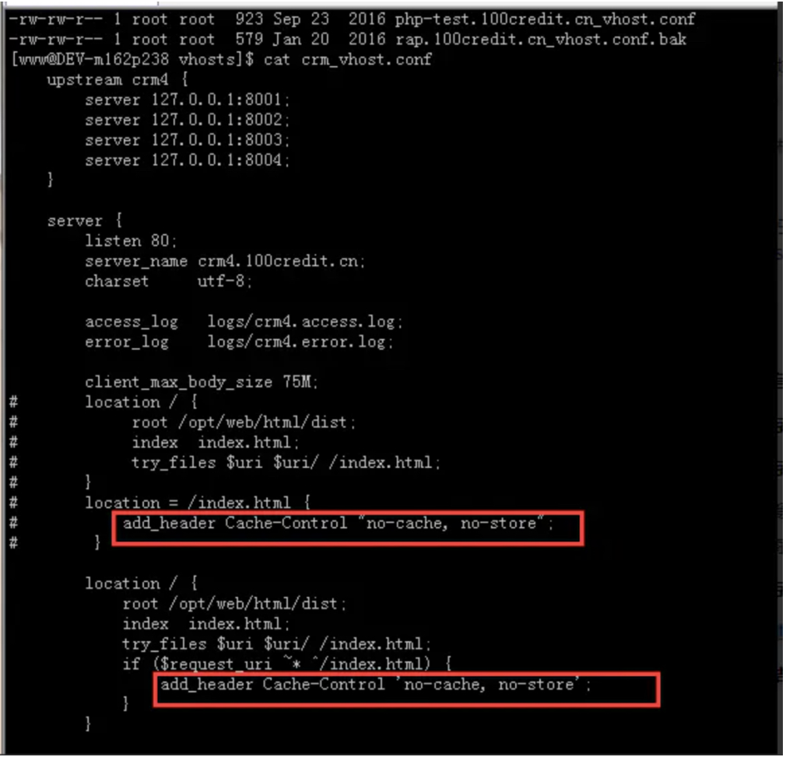
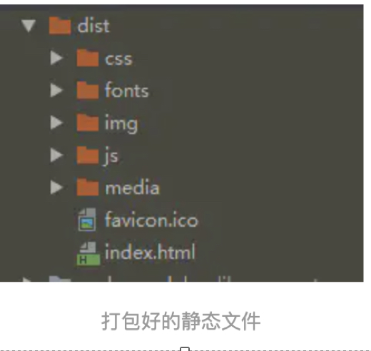

为什么要有etag？
你可能会觉得使用last-modified已经足以让浏览器知道本地的缓存副本是否足够新，为什么还需要etag呢？HTTP1.1中etag的出现（也就是说，etag是新增的，为了解决之前只有If-Modified的缺点）主要是为了解决几个last-modified比较难解决的问题：
1. 一些文件也许会周期性的更改，但是他的内容并不改变(仅仅改变的修改时间)，这个时候我们并不希望客户端认为这个文件被修改了，而重新get；
2. 某些文件修改非常频繁，比如在秒以下的时间内进行修改，(比方说1s内修改了N次)，if-modified-since能检查到的粒度是秒级的，这种修改无法判断(或者说UNIX记录MTIME只能精确到秒)；
3. 某些服务器不能精确的得到文件的最后修改时间。
怎么设置强缓存与协商缓存
1. 后端服务器如nodejs:
res.setHeader('max-age': '3600 public')
res.setHeader(etag: '5c20abbd-e2e8')
res.setHeader('last-modified': Mon, 24 Dec 2018 09:49:49 GMT)
1. nginx配置

偶尔自己折腾一番非前端的东西时，若心中有数，自然不会手忙脚乱。
怎么去用？
举个例子，像目前用vue-cli打包后生成的单页文件是有一个html，与及一堆js css img资源，怎么去设置这些文件呢，核心需求是
1. 要有缓存，毋庸置疑
2. 当发新包的时候，要避免加载老的缓存资源

我的做法是：
index.html文件采用协商缓存，理由就是要用户每次请求index.html不拿浏览器缓存，直接请求服务器，这样就保证资源更新了，用户能马上访问到新资源，如果服务端返回304，这时候再拿浏览器的缓存的index.html，切记不要设置强缓存！！！
其他资源采用强缓存 + 协商缓存,理由就不多说了。
