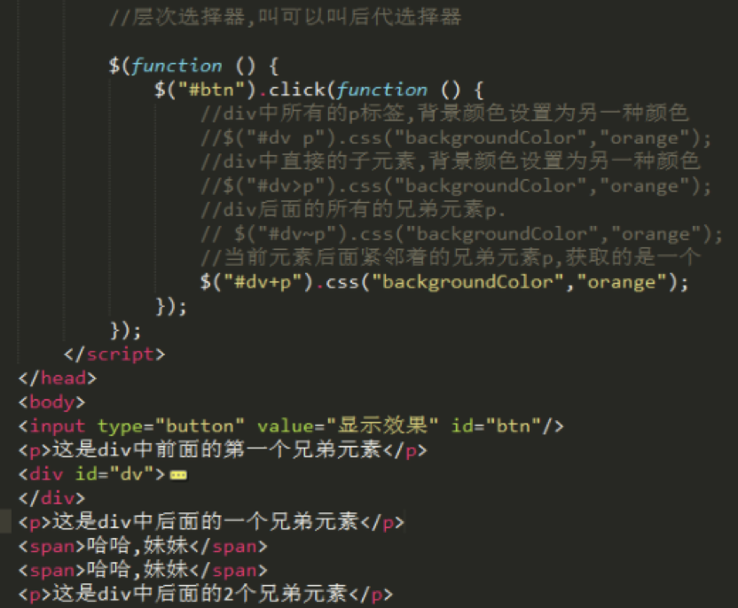
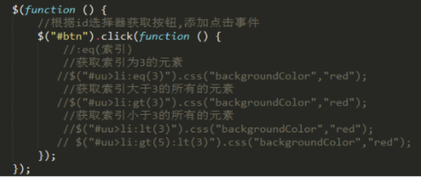
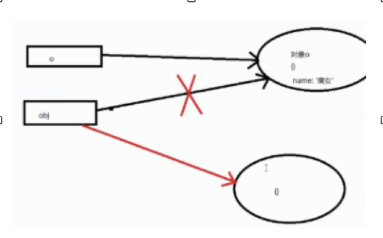

$(function(){     //相当于window.onload
  $('#btn').click(function(){
    $('div').css({'background-color','red'})    //可以不是驼峰命名法
  })
})

dom(document object model)中的顶级的对象document   
bom(browser object model)中的顶级的对象window
JQuery中的顶级对象:$---jQuery

jQuery中的选择器
$("#dv p").css("backgroundColor","orange");
$("#dv>p").css("backgroundColor","orange");

div后面的所有的兄弟元素p
     $("#dv~p").css("backgroundColor","orange");

当前元素后面紧邻着的兄弟元素p,获取的是一个
     $("#dv+p").css("backgroundColor","orange");

标签加类选择器
  $("li.cls").css("fontSize", "50px");

多条件选择器,条件中可以是任意的选择器:标签,类样式的名字
  $("span,li,div").css("backgroundColor","green");

奇数的选择器
$("#u1>li:odd").css("backgroundColor","red");

偶数的选择器
$("#u1>li:even").css("backgroundColor","blue");

children()和find()的区别
children 获取的是直接子元素，不能隔代获取
find     可以隔代获取

.show()就是显示出来
.hide()就是隐藏
.parent()方法是获取当前元素今天才看到的
.find(),方法中写一个参数.就是获取到的就是这个标签名所有的标签
.siblings()获取当前元素的所有的兄弟元素
如果在括号中写了标签的名字，那就是获取签

索引过滤器    
eq 中的值不是从1开始。而是从0开始。

$("#uu>li:gt(3)").css("backgroundColor","red");
$("#uu>li:lt(3)").css("backgroundColor","red");
$("#uu>li:eq(3)").css("backgroundColor","red");  

 $("#dv>ul>li:eq(2)").next().
 $("#dv>ul>li:eq(2)").nextAll().
 $("#dv>ul>li:eq(2)").prev().
 $("#dv>ul>li:eq(2)").prevAll().

 $("#se2>option:selected").appendTo($("#se1"));
  var allLength = $("#j_tb :checkbox").length;

也可以：
$('#center').children('li').hide().eq(index).show()

属性选择器
$("input[name='newsletter']").attr("checked", true);

jQuery和dom对象的互转
dom转jquery
    $(window) 
   $(this) 
   $(document.body)  没有$(body)这种写法

jQuery对象转DOM对象
    1: jQuery对象[0]
    2: jQuery对象.get(0)

jQuery中获取对象的方式
1.id选择器   $("#dv")   获取的对象是一个
2.类选择器   $(".dv")   获取的是多个
3.标签选择器 $("div")   获取的是多个

jQuery中的属性
.html()   .text()   .css() .val()  
$("p").text("我们都是p");    //隐式迭代

 $("#dv").css("backgroundColor","green");

元素类样式的操作
$("#dv").addClass("cls1");
$("#dv").removeClass("cls1 cls2");
$("#dv").hasClass("cls1")  
$('#dv').toggleClass("cls");   

动画的方法
1. 隐藏和显示
 $("#dv").show(500);//显示
 $("#dv").hide(500);//隐藏
 
 $("#dv").show(500,function () {     //可以加回掉函数
    alert("显示完毕了");
 });

2. 滑上和滑下
 $("#dv").slideDown(1000);//显示--滑出
 $("#dv").slideUp(1000);//隐藏--滑入
  $("#dv").slideToggle(1000)切换的滑入和滑出

.show()
.hide()
.slideUp()
.slideDown()
.slideToggle()
.fadeIn()
.fadeOut()
.fadeToggle()
.fadeTo(1000,0.5)可以设置透明度
如果是两个参数,第一个是时第二个是回调

小动画
   $("#btn").click(function () {
         $("#im").animate({"top":"500px","width":"30px","height":"30px"},1000,function () {
             $(animate({"left":"800px","top":"50px","width":"300px","height":"300px","opacity":0.4},3000);
         });
         // $("#im").hide(500);
         // $("#im").animate({"height":"200px"});
     });

元素的创建
1. $创建
$("#dv").append($("<a href='http://www.baidu.com'>百度</a>"));
$("<a href='http://www.baidu.com'>百度</a>").appendTo($("#dv"));

2. html 创建
每次只能创建一次 .html()方法就相当于把之前的内容清空，再重新渲染。而append是在原来的基础上添加
$("#btn").click(function () {
         var str=$("#dv").html("<a href='http://www.shuaicoolmei.com'>帅杨 +</a>");
         console.log(str);
       });

3. append 创建
       $("#btn").click(function () {
         var str=$("#dv").append("<a href='http://www.shuaicoolmei.com'>帅杨 +</a>");
         console.log(str);
       });

       实际上append后加不加$都一样  	$items.append(template('template',data));
       但apendto不行
    

干掉元素
$("#btn").click(function () {
     $("#dv").remove();//自杀,移除自己
     $("#dv").html("");//不干净
     $("#dv").empty();//清空
});

克隆
$("#btn").click(function () {
     $("#dv1>p").clone().appendTo($("#dv2"));        如果加参数true则事件会克隆
});

设置表单元素的value属性值
如果遇到select标签,不是修改value属性值而是让这个value属性值的元素选中了
$("#s1").val('');

jquery的 入口函数
$(function () {
  $("#btn").click(function () {});
});
window.onload = function () {
  console.log("超哥觉得自己帅");
};
页面中所有的内容全部加载完毕后触发(标签,文字,图片,外部引入的文件...)
 事件重新注册,覆盖了

 $(window).load(function () {
           console.log("页面记载完毕了1");
       });
 //jQuery中页面加载的事件可以是多个====页面中所有内容全部加载后才触发

 $(document).ready(function () {
           console.log("页面记载完毕了4");
       });
 //页面加载的事件======jQuery中插件中比较常用==页面中基本元素加载后就能触发

DOM对象转jquery对象     $(obj)
jquery对象转dom对象      $('btn')[0]

$('btn').click(function(){
$(this).val()
})
在以上，this是dom元素，必须要写成$(this)才是jquery元素，或许任何元素都是dom元素，如果没有转化的话。

语法:
        * id选择器:$("#id的值");               一个
        * 类选择器:$(".类样式的名字")    多个
        * 标签选择器:$("标签的名字")     多个
没有name选择器

$("p").text("这是一个p")    隐式迭代     就是不用for循环。

 $(".cl,.cls").css("fontSize", "50px");   就是并级选择器，交集选择器都可以

jquery中的常用方法   .html()    .text()     .val()            .css()

原来这是jquery中的选择器。

eq中的值是从0开始的  eq(0)是第一个li标签

说明了一点，jquery元素不能用dom的方法
同样，dom也不能用jquery方法，如果想用，必须转化

