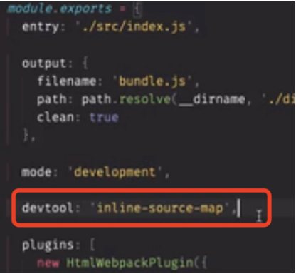
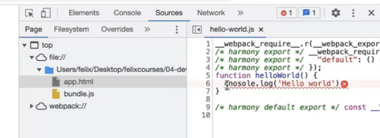

使用source map

webpack打包后，如果报错，在控制台点击报错位置，展示的是编译后的代码，可读性不高，这时候如果加上devtool: 'inline-souurce-map' 属性后，展示的就是报错的位置

使用webpack-dev-server 来实现自动刷新

它会自动帮助起一个服务事实监听变化，需要说明的是webpack-dev-server没有输出任何物理文件，他把打包后的bundle文件放到了内存里，从而提高加载效率
