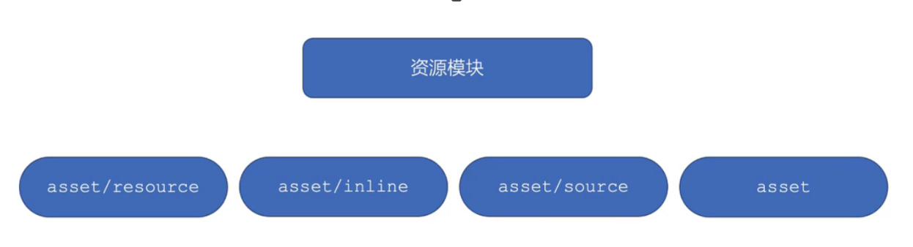
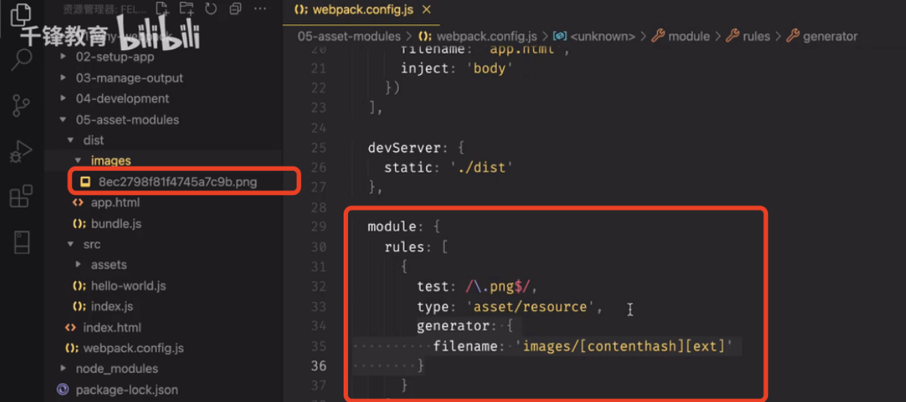
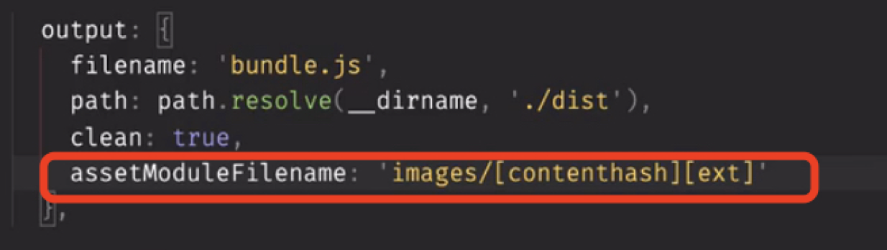
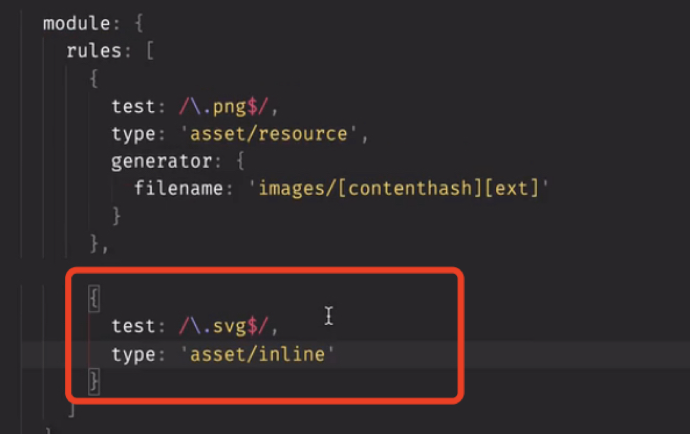
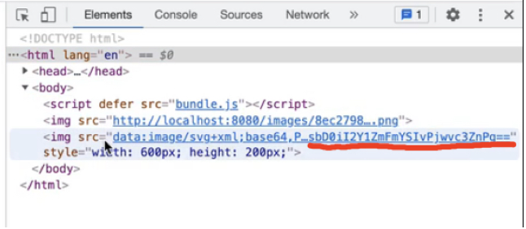
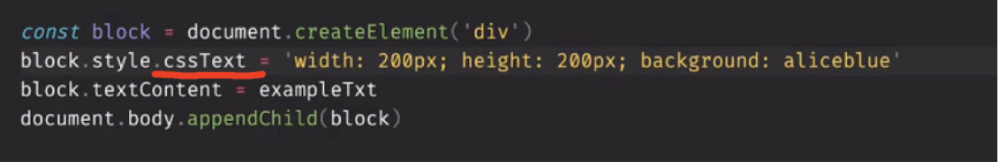
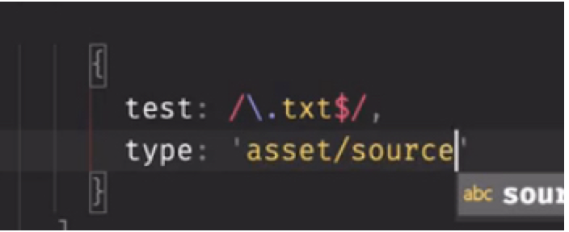
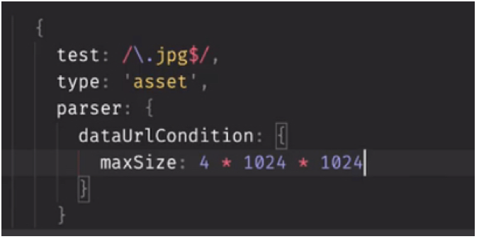

资源模块加载
在webpack出来之前，我们使用grunt或gulp的工具来处理资源，他们将src里的文件移动到dist或build目录中。
其实webpack最出色的功能之一就是除了引入js还可以使用内置的资源模块，我们叫asset modules来引入任何其他类型的资源，资源模块asset module是一种模块类型，它允许我们用webpack来打包其他的资源模块，比如像字体文件，图标 文件
资源模块类型我们成为asset module type，会通过4种新的类型模块来替换所有的loader，

1.asset/resource，它会发送一个单独的文件并导出url，
2. asset/inline, 它会导出一个资源的 Data URL
3.asset/source , 会导出资源的源代码
4.asset，它会在asset/resource和asset/inline直接做选择，注意没有asset/source

1.下边先讲解第一种类型 asset/resource 

加上$ 表示以png为扩展名的文件
动用该配置后，会将图片重命名后，放到dist目录，
2. asset/inline

这个会打包成base64的格式，相信你见过。
3.asset/source
用以导出文件的源代码，

可以通过css Text设置css样式

该类型一般用来配置txt文件，能将其中的所有文本导出。
4.asset
当一个资源大于8K时，webpack默认会走asset/resource模式，当然也可以修改这个值，如下图

