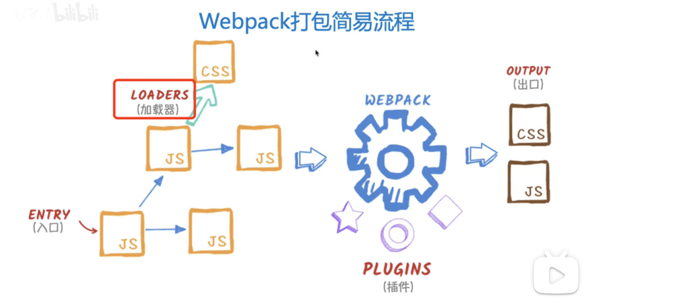
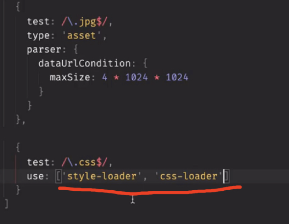
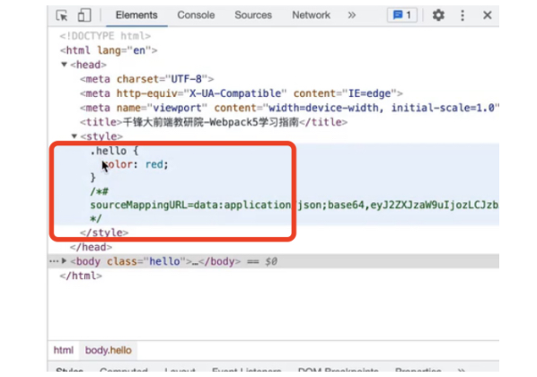
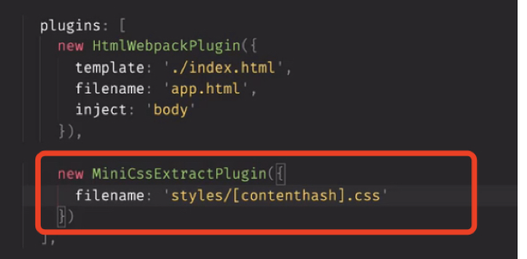
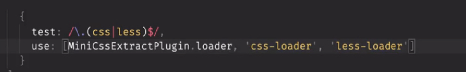
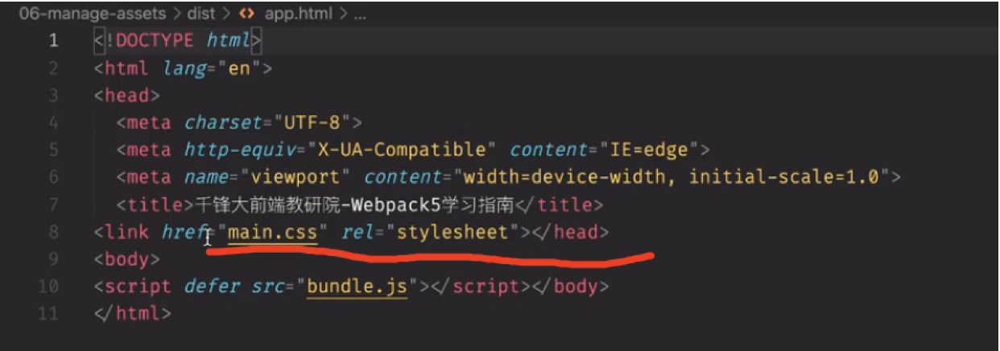
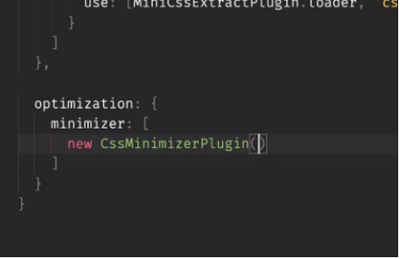
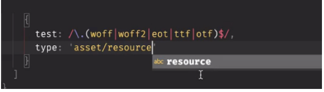
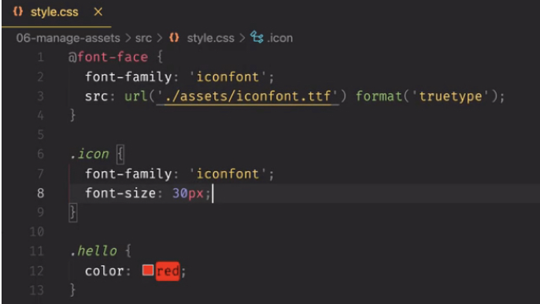

上一章我们讲了四种资源模块来引入外部资源，实际上webpack除了资源模块外，还可以通过loader来引入其他类型的文件

webpack只能理解js，json这样的文件，loader可以让webpack去解析其他类型的文件，比如在图中js加载css模块就是通过loader实现的，
加载css

加载css文件需要两个loader，其中css-loader用来识别css文件并打包，style-loader将css放置到页面上边否则只是打包好了没有在style标签中引入
顺序不能颠倒，从后往前执行，webpack支持loader的链式调用，每一个loader对源进行转换，将结果传递给下一个loader

style-loader的功劳
抽离和压缩css
上一部分讲了加载css，css都在style中，能否单独抽离出来呢
需要一个插件, npm i mini-css-extract-plugin -D 该插件基于webpack5

这样配置，之前的style-loader就不需要了，

编译后，多了一个link
如何压缩这个生成的css文件呢，需要一个新的插件 npm i css-minimizer-webpack-plugin -D

这个配置需要放到优化的对象里边，令外，mode要改为production
如何在css中加载images图像
有了上边的配置，什么都不用做
加载font字体

