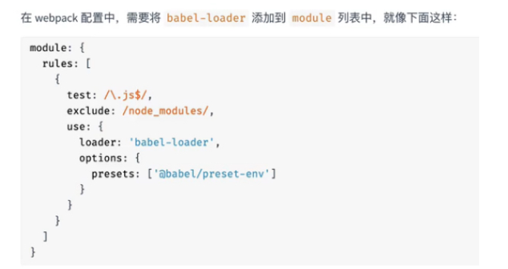
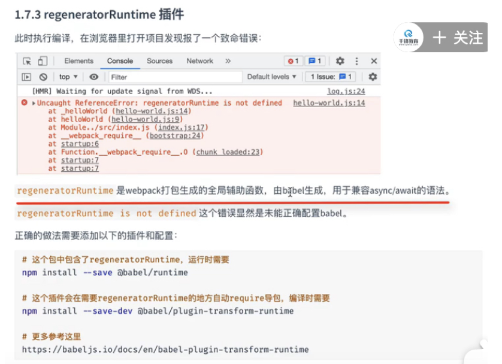
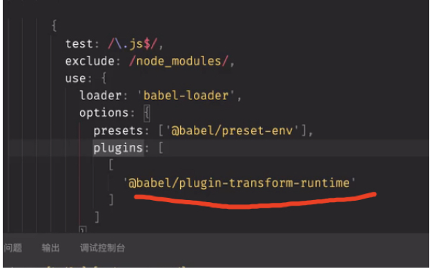

babel-loader可以将es5转为es5，方便不支持es6语法的浏览器解析
作者写了一个async await的es6语法，不用babel-loader，这样会将await async原封不动打包到bundle.js中，并且可以在谷歌浏览器中执行，但如果遇到低版本浏览器可能会出问题，
需要三个包
npm i babel-loader @babel/core @babel/preset-env
babel-loader 在webpack中应用babel解析es6的桥梁
@babel/core babel核心模块
@babel/preset-env babel预设，一组babel插件的集合

node_modules里的js不需要babel编译，所以要排除
regeneratorRuntime插件

还需要再安装两个包
npm i @babel/runtime -D
这个包包含了regeneratorRuntime运行时需要的内容
npm i @babel/plugin-transform-runtime -D
这个插件会在需要regeneratorRuntime的地方自动导包

