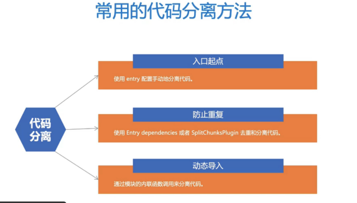
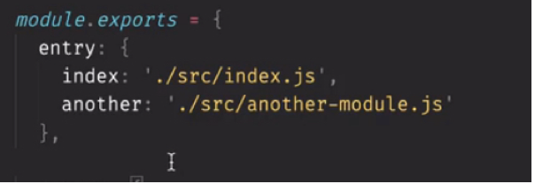
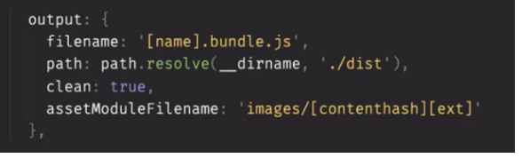
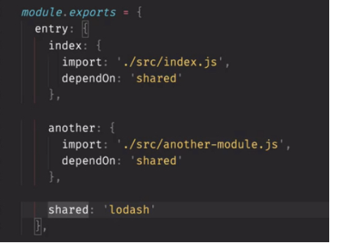
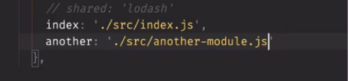
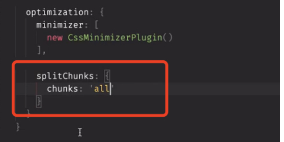
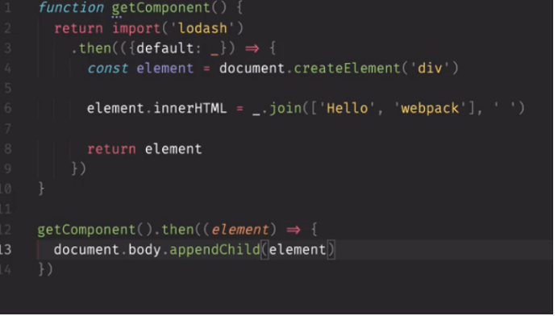
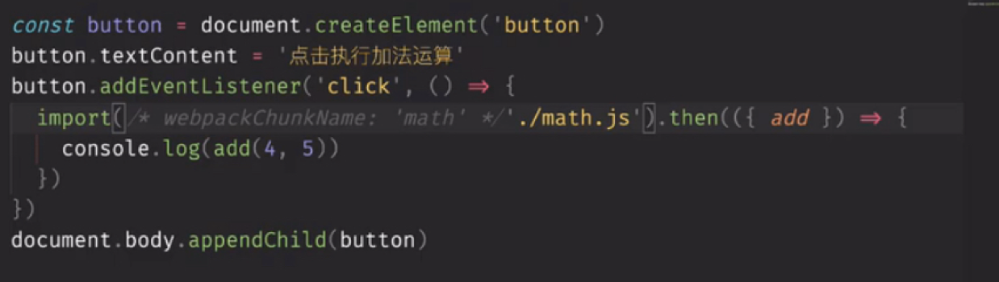
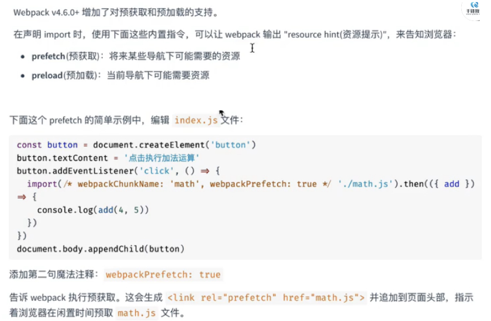

常用的代码分离方法
1. 使用entry手动的代码分离
这有个问题，如果是多个入口，那多个入口共享的文件会分别在每个 包里重复打包
2.使用entry dependencies 或者 splitChunkPlugin 去重和分离代码
为了防止重复可以在入口通过上述两个去重和分离代码
3. 通过模块内联函数import调用分离代码

1. 入口起点分离方法

两个文件里都引入了lodash，打包出来的bundle也都有lodash
2. 去重

这样配置会将lodash单独抽离出一个shared.bundle.js
除了上边,还可以通过splitChunkPlugin自动分离代码
引入

这样就会将公共的代码保存到一个文件里
动态导入
首先将上边所有的splitechunks都先注释掉
在entry中只引入一个文件 src/index.js

在index中动态引入lodash，这样会分开打包lodash
如果这时再在代码中静态引入lodash，就不会分开打包lodash了，
需要把splitChunks: {
  chunks: 'all'
}
这时候无论是动态导入还是静态导入，我们都能将公共代码抽离出来了，
1.8.4 懒加载
动态导入第一个用法可以实现懒加载

动态导入第二个用法，预获取/预加载模块

这种方式比刚才的懒加载还要优秀
preload预加载也是在按钮点击时获取，和懒加载类似，用处不大
