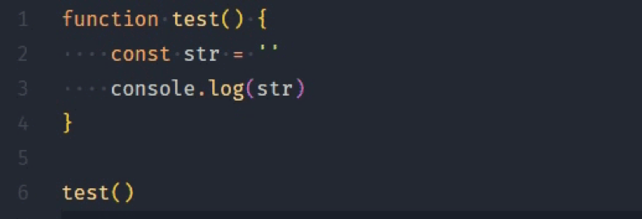
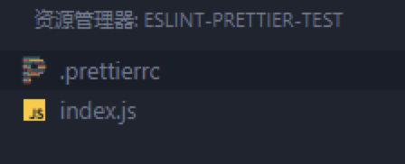
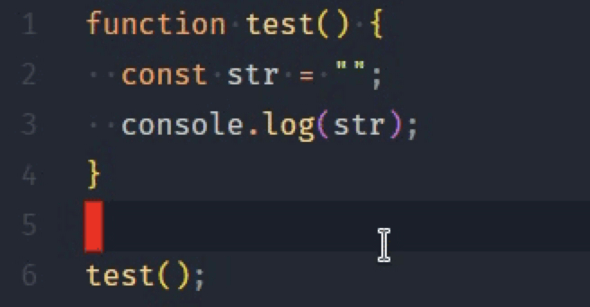
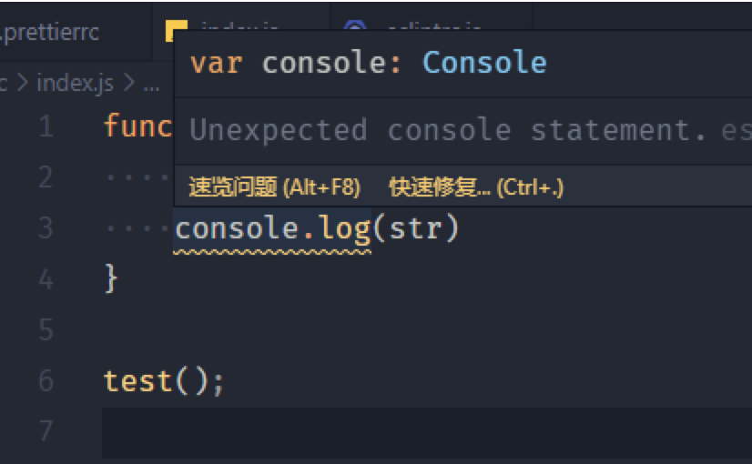
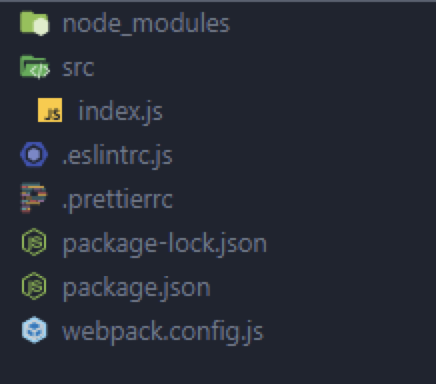
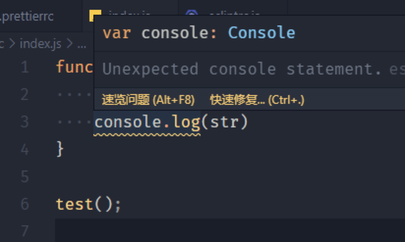
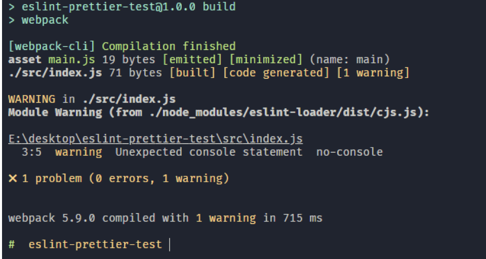
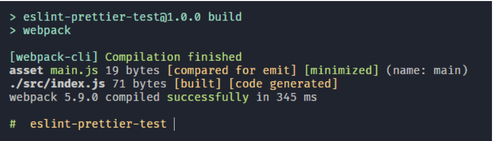

### 前置
本文将探究 VSCode Prettier 扩展 和 eslint 扩展在 VSCode 中的配置以及这两者对应的在项目中的配置文件的关系， VSCode ESLint 扩展配置与 eslint-loader 的相互配合，在项目中如何将 Prettier 和 ESLint 配合使用，中间还提及了在项目间共享 VSCode 配置。
本文建立在你对 VSCode 、ESLint、Prettier、Webpack 有简单了解的基础下进行。希望本文对你有帮助，以后搭建项目能够得心应手。如有错误，一定不吝赐教。
### 初始化测试项目
创建文件夹 eslint-prettier-test 和 eslint-prettier-test/index.js。
VSCode Prettier

安装 VSCode 扩展 Prettier


### 配置扩展 Prettier
通过 VSCode settings.json 设置 VSCode 默认格式化工具为 Prettier。 以 JavaScript 为例。
```js
"[javascript]": {
    "editor.defaultFormatter": "esbenp.prettier-vscode"
},
```
我们以在 JavaScript 语句末尾添加分号为例，打开 VSCode 配置文件 settings.json 配置 Prettier 扩展：
```js
{
  "prettier.semi": true
}
```
此时在 VSCode 中格式化代码会将 JavaScript 语句自动加上分号。


创建 .prettierrc
然后再我们的项目根目录下创建 .prettierrc 配置文件。

在 .prettierrc 中写入配置。
```js
{
  "semi": false
}
```
这个配置项即不为 JavaScript 语句添加分号，与上文 settings.json 中的配置相反。眼见为实，我们再次格式化 js 文件。

由于 gif 会循环播放，简单解释一下。当我按下 VSCode 格式化快捷键，分号消失了。

### 总结
项目根目录下的 .prettierrc 配置文件会影响 VSCode 的 prettier 扩展，且优先级高于在 VSCode settings.json 中的 prettier 扩展配置。
我们知道这一点可以做什么？当你装上 VSCode 的 Prettier 扩展后，你应该先将 VSCode 的默认格式化工具设为 Prettier 并在 VSCode 内部做好你期望的 Prettier 扩展配置。这对不使用 Prettier 的项目的配置有效。当你的项目中包含 .prettierrc 配置文件时，该 .prettierrc 生效，VSCode 中的 Prettier 扩展配置失效，互不冲突。
VSCode ESLint
ESLint 配置同理。但是要想获得 ESLint 提示，不仅需要在 VSCode 中安装 ESLint 扩展。

你还需要在项目根目录创建一个 .eslintrc.js 文件才能使 VSCode 抛出提示信息。当你删除 **.eslintrc.js **文件，提示将消失**。例如，我们在项目根目录下的 .eslintrc.js 写入如下配置。
```js
module.exports = {
  env: {
    es6: true,
  },
  rules: {
    'no-console': 'warn',
  },
}
```
允许 es6 语法
使用 console 抛出警告

vscode 根据规则在我们使用 console 时抛出了警告。

### .vscode
你可以在任意的项目根目录创建一个 .vscode/settings.json 文件，这个 json 文件可以配置 VSCode 中 settings.json 同样的配置。例如下面这样。
```js
{
  "editor.formatOnSave": true
}
```
这项配置使 VSCode 在保存时自动格式化代码。在 VSCode 内部的配置文件 settings.json，同样可以配置这条选项。.vscode/settings.json 会覆盖 VSCode 内部配置文件 settings.json 中的配置，这是合理的。
那么这么做的好处是什么呢？当一个项目需要多人协作时，可以通过配置项目根目录下的 .vscode/settings.json 达到共享配置的目的。
我们可以将 VSCode 扩展的配置放到 .vscode/settings.json 中与他人共享扩展配置吗？当然是可以的。不要忘了 .vscode/settings.json 可以配置 vscode 内部的 settings.json，VSCode 扩展的配置也写在 VSCode 内部的 settings.json 中。常常不必这么做。像 Prettier 和 ESLint 为我们提供了单独的配置文件放在项目根目录下，VSCode 能够自动读取其配置并生效（前提是 VSCode 安装了对应的扩展），这在上文已经验证了。
我们可以打开一个大型开源项目参考他们是如何做的。例如 跨端框架 Taro。

他们将 Prettier 和 ESLint 配置放到单独的配置文件中 （图中的 .prettierrc 和 .eslintrc.js)。打开 .vscode/setting.json 查看一下。
```js
{
  "eslint.validate": [
    "javascript",
    "javascriptreact",
    {
      "language": "typescript",
      "autoFix": true
    },
    {
      "language": "typescriptreact",
      "autoFix": true
    }
  ],
  "jest.autoEnable": false,
  "typescript.tsdk": "node_modules/typescript/lib"
}
```
不必将校验规则放到 .vscode/settings.json 中。配置中的 eslint.validate 规定 ESlint 扩展需要校验的语言类型，添加上对应的语言后 VSCode 才会在代码编辑器中正确的高亮错误的语法。如果你在 VSCode 中安装了 ESLint 扩展，默认配置中包含一些常用语言，一般无需再单独配置。
记住一点即可：.vscode/settings.json 仅作用于 VSCode 内部的 settings.json。

### eslint-loader
如果你使用 webpack 构建项目，应该会使用 eslint-loader。可以在 loader 中配置校验规则。这和上文所说的不是一会事，项目在本地跑起来时（通常在生产环境屏蔽 eslint-loader 的抛出信息）。当你的代码不符合校验规则时， eslint-loader 会在控制台抛出错误或者警告。
在本文开始已经建好的项目中安装 eslint-loader。如果使用 eslint-loader，还需要安装 eslint。
npm init -y && npm i webpack webpack-cli eslint eslint-loader -D
安装完毕，我们在 package.json 中看下当前项目的依赖。
```js
"devDependencies": {
  "eslint": "^7.14.0",
  "eslint-loader": "^4.0.2",
  "webpack": "^5.9.0",
  "webpack-cli": "^4.2.0"
}
```
使用 eslint-loader 还需要稍作配置。在项目根目录下新建 webpack.config.js。
```js
module.exports = {
  module: {
    rules: [
      {
        test: /\.js$/,
        exclude: /node_modules/,
        loader: 'eslint-loader',
        options: {
          // eslint options (if necessary)
        },
      },
    ],
  },
}
```
为了能使这个简单的例子跑起来，我们还需要将项目中的 index.js 文件放到 src 中，因为 wepack 默认入口文件在 src/index.js，这里为了方便不做多余的 webpack 配置，直接创建 src 文件夹并将 index.js 移入。

不要忘了，在上文 .eslintrc.js 已经配置了一条校验规则，它作用于 VSCode ESLint 扩展。此时 index.js 中的内容也没有改变，依然在抛出警告。

接下来我们在控制台运行命令 webpack。webpack 将会把 src/index.js 打包到 dist/main.js。

如你所愿，eslint-loader 在控制台为我们抛出了一条警告，即我们在 .eslintrc.js 中配置的使用 console 时抛出警告。所以， .eslintrc.js 不仅作用于 VSCode 中 eslint 扩展，还作用与 eslint-loader。
如果你仍有疑惑，接下来上文我们已经配置好的 wepack.config.js 中的 eslint-loader 注释掉。
```js
module.exports = {
  // module: {
  //     rules: [
  //         {
  //             test: /\.js$/,
  //             exclude: /node_modules/,
  //             loader: 'eslint-loader',
  //             options: {
  //                 // eslint options (if necessary)
  //             },
  //         },
  //     ],
  // },
}
```
再次运行 webpack，即使不看结果你应该知道了，打包过程 webpack 并不会给我们抛出任何错误。


### Prettier 配合 ESLint
通过上文已经知道，VSCode 配置包括 VSCode 扩展配置是可以在团队成员间共享的，安装 npm 包并不是因为因为仅使用 VSCode 无法实现 Prettier + ESLint 的效果，而是因为 npm 包用于配合构建工具在开发环境运行时以及生产构建时抛出错误或提示，比如 Webpack 中的 loader。
ESLint 主要用于语法检查，但也接管了部分代码格式化配置（并不是 ESLint 也用于格式化）。Prettier 永远只做格式化。这就存在一个问题，有些 ESLint 规则和 Prettier 规则之间存在冲突，解决这个问题的办法并不是简单的将冲突的配置同步，配置冲突往往是隐蔽的，你无法简单的通过眼睛识别所有冲突的配置，需要借助工具。Prettier 文档中说明了这一点：
Linters usually contain not only code quality rules, but also stylistic rules. Most stylistic rules are unnecessary when using Prettier, but worse – they might conflict with Prettier! Use Prettier for code formatting concerns, and linters for code-quality concerns ...
解决这个问题的办法是通过 eslint-config-prettier（npm 包）关闭与 Prettier 冲突或不必要的规则。stylelint 与 tslint 也有相同功能的包用于关闭与 Prettier 冲突或不必要的规则。（tslint 已死）
可以将 Prettier 作为 ESlint 的插件使用，“eslint-plugin-prettier”（npm 包）可以实现这一点。这些插件在 Prettier 刚推出时特别有用（常常推出一个新工具都会采用这种渐进式的方式独立起来，站在巨人的肩膀上，颇有农村包围城市的感觉）。通过在 Linter 中运行 Prettier，你不必配置任何规则（Prettier 号称固执己见的格式化工具，它已经集成开箱即用的规则），并且编辑器可以正确抛出信息，现在你仍然可以跑 prettier --check。
npm install --save-dev eslint-config-prettier
.eslintrc
{
  "extends": ["some-other-config-you-use", "prettier"]
}
但是，使用这类插件也是有缺点的：
• 编辑器中出现很多红色的斜线，这很烦人
• 比直接运行 Prettier 要慢
• 是一层间接性的东西，可能会被破坏，比如双方升级带来新的问题
在 eslint-plugin-prettier Github 仓库中有说明：
Runs Prettier as an ESLint rule and reports differences as individual ESLint issues. If your desired formatting does not match Prettier’s output, you should use a different tool such as prettier-eslint instead.
如果所需的格式与 Prettier 的输出不匹配，则应改用其他工具，如：prettier-eslint。
最后，有一些工具可以运行 prettier，然后立即对文件进行例如 eslint --fix 处理。
• prettier-eslint
• prettier-tslint
• prettier-stylelint
以 prettier-eslint 为例，使用 prettier 命令然后再通过 eslint --fix 命令对你的 JavaScript 进行格式化。
ESLint 可以根据你的 ESLint 配置自动格式化/修复你的大部分代码。 Prettier 是一个更强大的自动格式化器。Prettier 的一个优点是它的意见性很强。不幸的是，它不够有主见，而且/或者有些意见与我自己的意见不同。所以在 Prettier 格式化了代码之后，我就开始得到 linting 错误。
这通过 prettier 格式化你的代码，然后将其结果传递给 eslint --fix。这样你就可以得到 Prettier 卓越的格式化能力的好处，也可以从 ESLint 的配置能力中受益。
对于扩展名为 .css、.less、.scss 或 .json 等文件，只能运行 prettier，因为 ESLint 不能处理这些文件。
如果 Prettier 的输出的某些方面使 Prettier 对你来说完全无法使用，这些工具就很有用。那么你可以让 eslint --fix 为你修复它。缺点是，这些工具比直接运行 Prettier 要慢得多。
说了这么多，会发现 ESLint、Prettier、VSCode 这三者流畅配合不是一件容易的事，但是我们清楚了大多数情况下应该通过什么方式解决。如果向往足够简单，使用 eslint-config-prettier 就好。
总结
通过 loader 和 VSCode 扩展以及扩展的配置，打通了整个开发环节的语法校验以及格式化。
参考资料
• https://prettier.io/
• https://github.com/prettier/eslint-config-prettier
• https://github.com/prettier/prettier-eslint
• 
