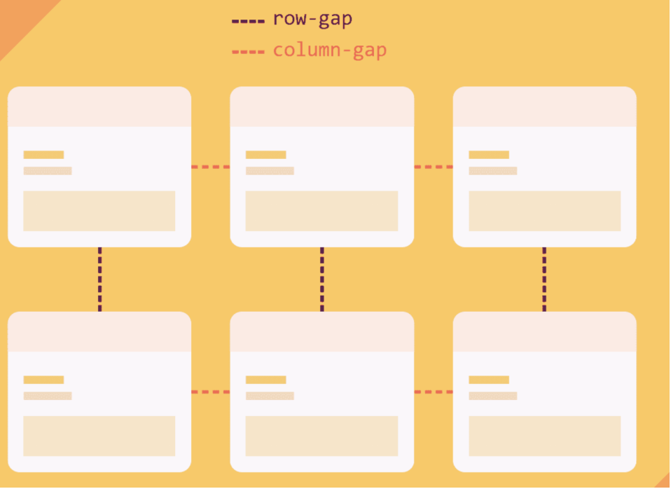

CSS中的gap属性是row-gap和column-gap的简写，它指定间距的大小，即grid、flex和multi-column布局中行和列之间的空间。



gap 接受一个或两个值：
单个值可同时设置row-gap和设置column-gap相同的值。
当使用两个值时，第一个设置row-gap，第二个设置column-gap。
```css
.container {
gap: 1rem;
/* 相当于:
* row-gap: 1rem;
* column-gap: 1rem
*/
gap: 10px 15%;
/* 相当于:
* row-gap: 10px;
* column-gap: 15%;
*/
}
```

结合使用calc()函数和gap
```css
.flex-layout {
  display: flex;
  gap: calc(5vh + 5px) calc(5vw + 5px);
}

.grid-layout {
  display: grid;
  grid-template-columns: repeat(3, 1fr);
  gap: calc(5vmin + 5px);
}
```

