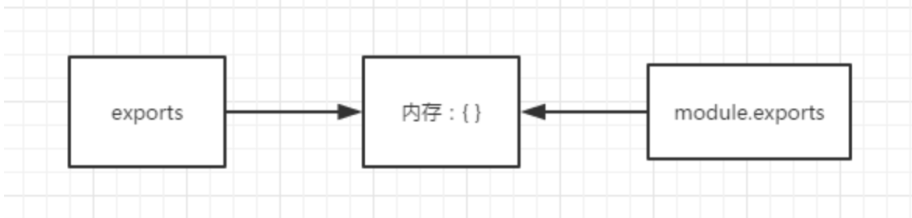

1. CommonJS
Node里面的模块系统遵循的是CommonJS规范。那问题又来了，什么是CommonJS规范呢？由于js以前比较混乱，各写各的代码，没有一个模块的概念，而这个规范出来其实就是对模块的一个定义。
CommonJS定义的模块分为:
模块标识(module)、模块定义(exports) 、模块引用(require)
1.1 exports 和 module.exports
在一个node执行一个文件时，会给这个文件内生成一个 exports和module对象，而module又有一个exports属性。他们之间的关系如下图，都指向一块{}内存区域。
exports = module.exports = {};

实际上，require导出的内容是module.exports的指向的内存块内容，并不是exports的。简而言之，区分他们之间的区别就是 exports 只是 module.exports的引用，辅助后者添加内容用的。
1.2 注意事项
在实际应用中，为了避免糊涂，尽量都用 module.exports 导出，然后用require导入。
2. ES6
ES6， 全称 ECMAScript 6.0 ，是 JavaScript 的下一个版本标准，2015.06 发版。ES6 主要是为了解决 ES5 的先天不足，比如 JavaScript 里并没有类的概念，但是目前浏览器的 JavaScript 是 ES5 版本，大多数高版本的浏览器也支持 ES6，不过只实现了 ES6 的部分特性和功能。

在 ES6 前， 实现模块化使用的是 RequireJS 或者 seaJS（分别是基于 AMD 规范的模块化库， 和基于 CMD 规范的模块化库）。ES6 引入了模块化，其设计思想是在编译时就能确定模块的依赖关系，以及输入和输出的变量。

ES6 的模块化分为导出（export） 与导入（import）两个模块。

2.1 ES6 的特点
ES6 的模块自动开启严格模式，不管你有没有在模块头部加上 use strict;
模块中可以导入和导出各种类型的变量，如函数，对象，字符串，数字，布尔值，类等。
每个模块都有自己的上下文，每一个模块内声明的变量都是局部变量，不会污染全局作用域。
每一个模块只加载一次（是单例的）， 若再去加载同目录下同文件，直接从内存中读取。
2.2 基本用法
模块导入导出各种类型的变量，如字符串，数值，函数，类。
导出的函数声明与类声明必须要有名称（export default 命令另外考虑）。
不仅能导出声明还能导出引用（例如函数）。
export 命令可以出现在模块的任何位置，但必需处于模块顶层。
import 命令会提升到整个模块的头部，首先执行。

