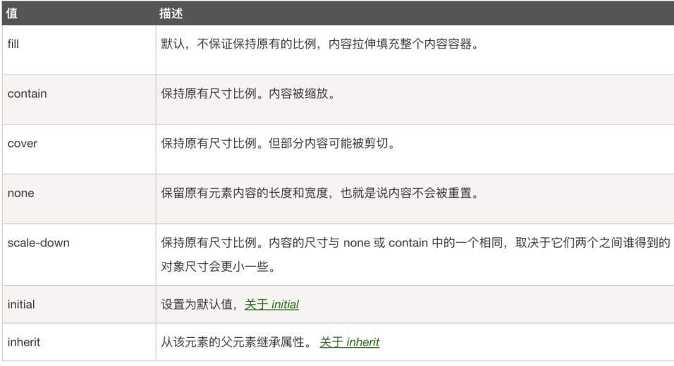
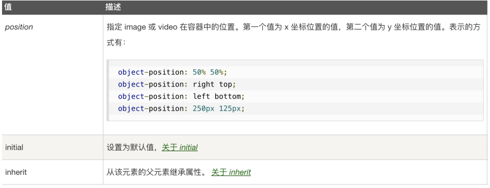

vh
相对于视口的高度。视口被均分为100单位的vh
 
1. h1 {
2. font-size: 8vh;
3. }
 
CSS中的vw,vh单位是什么？
• vw：浏览器可见视口【宽度】的百分比（1vw代表视窗【宽度】的1%）
• vh：浏览器可见视口【高度】的百分比（1vw代表视窗【高度】的1%）
• vmin：当前 vw 和 vh 较小的一个值。
• vmax：当前 vw 和 vh 中较大的一个值。
 
vw,vh与 % 的区别是什么？
1. % 是基于【父元素】的宽度/高度的百分比，vw，vh是根据视窗的宽度/高度的百分比。
2. 视口单位优势在于【vh】能够直接获取高度，而用 % 在没有设置 body 高度情况下，是无法正确获得可视区域的高度。

## object-fix属性
object-fit 属性指定元素的内容应该如何去适应指定容器的高度与宽度。
object-fit 一般用于 img 和 video 标签，一般可以对这些元素进行保留原始比例的剪切、缩放或者直接进行拉伸等。

默认值fill
object-fit: fill|contain|cover|scale-down|none|initial|inherit;

对图片进行剪切，保留原始比例：
img.a { width: 200px; height: 400px; object-fit: cover; }

## CSS object-position 属性

object-position 属性一般与 object-fit一起使用，用来设置元素的位置。
object-position 一般用于 img 和 video 标签。

默认值:	50% 50%
object-position: position|initial|inherit;

根据容器大小重置图片的大小，并设置图片的位置：
img.a { width: 200px; height: 400px; object-fit: none; object-position: 5px 10%; border: 5px solid red; }

