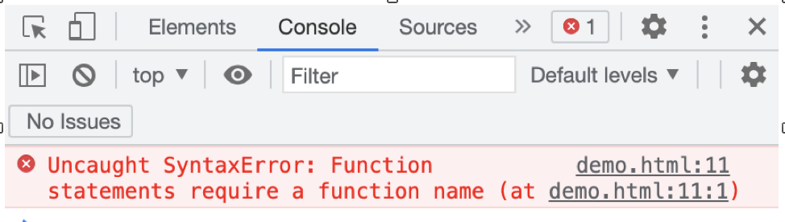
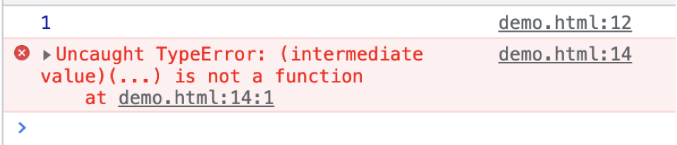

一、全局污染
```js
var name = "张三"
function getData() {}
function render() {}
```
以前经常这样写函数以及声明变量，但是会有个问题，项目通常都由很多模块（很多js）组成，那么声明的函数名称可能会与其他模块重复，就会有很多不确定的错误因素。所以我们要创建独立作用域。

二、立即执行函数
通常期望一个函数执行掉就销毁，我们尝试在函数声明后面加上执行符号，像这样：
```js
function test(){
    console.log(1);
}();
```
但是报错了，执行符号是必须跟在表达式后面的，声明式是不可以跟执行符号的。但是表达式可以：
```js
var test = function () {
    console.log(1);
}();
```
打印结果：1
因为这个匿名函数是立即执行的，所以这个声明 test 没有意义，调用的时候不用他，我们删掉它，但是又报错了。
```js
function () {
    console.log(1);
}();
```

那么思考，什么样的东西可以让他变成表达式呢？？？
表达式很多啊 a=0; !a; +a; a++; (a);
我们尝试：在函数前加一个 感叹号！
```js
!function () {
    console.log(1);
}();
```
是可以的，换成+; -;等都可以
所以：我们通常把他“括“起来
```js
(function () {
    console.log(1);
})();
```
在ECMAScript中称这样的函数为立即执行函数，也叫自执行函数，它又以下特点：
1.独立作用域
2.运行后即销毁
同时，他也在ES5中称之为 模块
一般我们在js中不爱去写 分号 （;）在后面。所以大多开发者有一个普遍的共识，就是在自执行函数前面加一个分号
```js
;(function () {
    console.log(1);
})()
```
如果我们不写分号的话，多个模块就会报错
```js
(function () {
    console.log(1);
})()
(function () {
    console.log(1);
})()
```

所以根据个人习惯 在前面或者后面加上分号（;）
对于一个自执行函数，他要有一个init 函数来管理这个模块的运行，像这样
```js
;(function () {
    var init = function () {

    }
    init()
})()
```
我们经常使用window上的document，想让document放到我们自己的独立作用域里面，可以将document传入进来，像这样：


