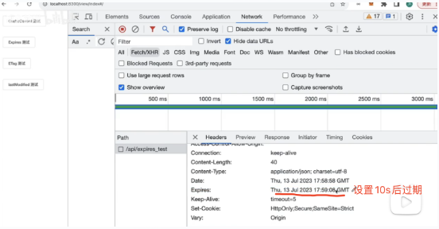
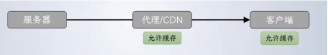
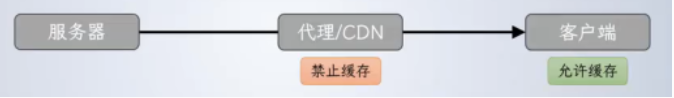
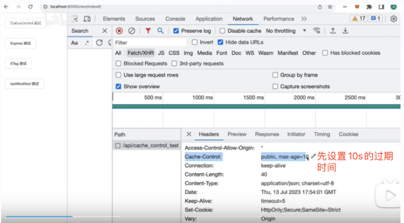
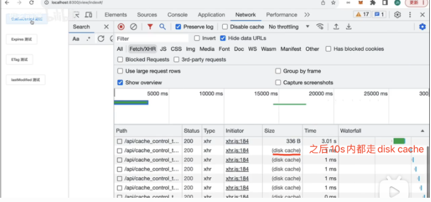

​
### 1.前端常见状态码总结

- 1xx(信息状态码):服务器收到请求，但还需要进一步处理，一般不会返回给客户端

- 2xx(成功):表示服务器成功处理请求  
`200:服务器成功处理了请求 `   
201:表示服务器创建了资源  
204:表示服务器成功处理请求，但没有返回内容

- 3xx(重定向状态码):客户端需要执行额外的才做才能完成请求  
`301: 请求资源已经永久移动到一个新的地址`  
302：和301类似，表示暂时移动到一个新的地址  
`304：表示客户端缓存的版本没有过期，可以继续使用缓存的版本`

- 4xx(客户端错误状态码):  
408:客户端发送的请求存在错误  
401:客户端需要进行认证  
403:客户端访问请求资源是有权限的,服务器拒绝请求  
`404:表示请求的资源不存在`

- 5xx(服务端错误)  
`500:服务器发生未知错误`  
502:服务器作为网关时，没有收到相应

### websocket和http的区别（id: 1741321318485）
‌总结：
1.http基于请求-响应模型，每次请求都需要建立一个新的连接，WebSocket建立一条持久的连接，实现双向通信
2.http适合传输静态资源，如HTML、CSS、JavaScript、图片等，WebSocket适用于在线聊天，实时游戏场景

明细：
‌HTTP‌：HTTP是一种无状态的协议，每次请求都需要建立一个新的连接。这种连接方式增加了时间延迟和资源负担。
‌WebSocket‌：WebSocket是一种全双工的协议，它在客户端和服务器之间建立一条持久的连接，实现双向通信。

‌数据传输‌
‌HTTP‌：HTTP协议是基于请求-响应模式的，客户端发送请求，服务器返回响应。这种模式适用于静态内容的传输。
‌WebSocket‌：WebSocket允许服务器主动向客户端推送数据，实现了服务器和客户端之间的实时双向通信。这种模式适用于需要实时交互的应用场景。

‌数据格式‌
‌HTTP‌：HTTP协议传输的数据通常是文本或二进制数据，格式较为简单。
‌WebSocket‌：WebSocket可以传输任意格式的数据，包括文本、二进制、JSON等，支持更复杂的数据交换。
‌端口‌

‌HTTP‌：HTTP协议使用的默认端口是80（HTTP）或443（HTTPS）。
‌WebSocket‌：WebSocket使用的默认端口也是80（WS）或443（WSS），但它在TCP连接上持续通信，减少了端口的频繁变化。
‌应用场景‌

‌HTTP‌：适用于客户端向服务器发送请求并获取响应的场景，如网页浏览、文件下载等。
‌WebSocket‌：适用于需要实时双向通信的场景，如在线聊天、实时数据更新、在线游戏等。

5. 相同点：

　　都是基于TCP协议

　　websocket是基于http的，他们的兼容性都很好

　　在连接的建立过程中，对错误的处理方式相同

　　都使用Request/Response模型进行连接的建立

　　都可以在网络中传输数据


### 2、输入url后发生了什么
- 用户输入url通过DNS解析为对应的IP地址
- TCP连接
- 发送http请求
- 返回http响应
- 浏览器解析渲染页面
- 断开TCP连接  
~~（1）将下载完成的内容交给Renderer进程管理；
（2）Renderer进程开始解析css rule tree和dom tree，这两个过程是并行的；
（3）当浏览器遇到link标签或者script、img标签，就会去下载这些内容，遇到需要缓存的时候就使用缓存，不适用缓存的重新下载资源；
（4）css rule tree和dom tree 生成完了之后，开始合成render tree，这个时候浏览器会进行layout,开始计算每个节点的位置，然后进行绘制；~~


### 3. http和https的区别，(id:1741321657000)
1. 用的端口也不一样，前者是80，后者是443。
2. https协议需要ca证书。
3. http是明文传输，而https是通过ssl协议对数据进行加密处理。

### 4、http 各版本的区别
- HTTP/0.9：功能简陋，只支持GET方法，只能发送HTML格式字符串。
- HTTP/1.0：支持多种数据格式，增加POST、HEAD等方法，增加头信息，每次只能发送一个请求（无持久连接）
- HTTP/1.1：默认持久连接、增加缓存处理、增加Host字段、支持断点传输分块传输等。
- HTTP/2.0：二进制分帧、多路复用、头部压缩、服务器推送

### 19.HTTP2和HTTP的区别
Http1.x会有队头阻塞的问题。浏览器限制了同一域名下的请求数量，当http的请求达到最大请求数量时，剩余的资源需要等待请求其他资源请求完成之后才能发起请求。

Http2中新增了两个新的概念，一个是帧，一个是流。帧代表最小的数据单位，帧会识别出该帧属于哪个流。流就是多个帧组成的数据流。http2采用二进制传输、多路复用（就是在tcp连接中可以存在多个流，也就是可以发送过个请求，这个技术解决了队头阻塞的问题。）、服务端可以在客户端发送请求之后，主动推送一些资源、header压缩。


### 5、http缓存
>注意：缓存策略是存在于get请求中，因为post是用来提交数据的，不存在缓存的必要

>浏览器缓存是否开启，取决于返回资源时响应头的设定，完全由服务器决定

- 强缓存(本地缓存)(有disk cache标识的)    
浏览器本地在有效时间内强制缓存，主要是依赖响应头上的expires(绝对时间)和cache-control（相对时间），expires是http1.0的，如果同时出现，cache-control优先

1. **Expires 指定了响应的过期时间，告诉浏览器在过期时间前可以直接从浏览器缓存获取资源。**  
例如指定资源在5分钟后过期：
Expires: Wed, 21 Oct 2019 07:28:00 GMT

10s内访问走disk catche

1. Cache-Control 表示缓存控制，可以指定缓存的行为，如是否缓存、缓存时间等。常用的取值有：
```
public 表示公共资源，中间商与客户端都可以缓存【不常见】
private 表示私有资源，中间商不允许缓存，客户端允许缓存【不常见】no-cache 相当于max-age=0，如果有Etag等标志，允许协商【常见】no-store 表示数据不允许被缓存，缓存功能彻底关闭【不常见】
max-age 指定缓存有效期【常见】
s-maxage 只在public模式下有效，用来设定中间服务器的缓存有效期【不常见】
immutable 缓存一日过期，不可协商【不常见】
must-revalidate 针对客户端有效，无论缓存是否过期，每次必须协商【不常见】
proxy-revalidate 针对代理服务器有效，无论缓存是否过期，每次必须协商【不常见】
```
public：表示该资源是共享的，中间服务器和浏览器都可以缓存。  
  
private：表示该资源是私有的，只允许客户端缓存，不能被CDN等缓存。  


max-age: 指定资源可以被缓存的最大时间，例如指定资源可以缓存10分钟：
Cache-Control: max-age=600




 在设置Expires和Cache-Control时，可以同时设置两个响应头，如：  
1.Expires: Wed, 21 Oct 2019 07:28:00 GMT  
2.Cache-Control: max-age=600, public  
这表示资源在过期时间前可以被所有用户缓存，并且可以被缓存10分钟。

- 弱缓存(协商缓存)是返回304的
和服务器沟通，服务器告诉浏览器是否使用缓存，

依靠的是响应头上的last-modified（最后更新时间）及etag(内容变更的标识)来确认文件是否有更新。etag的优先级更高，以确保用户获取到最新内容

1. ETag/If-None-Match使用  
在首次请求资源时，服务端会把结果签名缓存在服务端，并设置在响应头Etag中，业务侧则需要缓存etag和结果数据，并在下次请求时带在请求头If-None-Match字段中，服务的会对比etag和If-None-Match是否相等，如果相等就返回304，告诉浏览器直接使用本地缓存即可

1. last-modified/if-modified-since  
在首次请求资源时，服务端在响应头设置last-modified字段，业务侧则需要缓存last-modified和结果数据，并在下次请求时带在请求头if-modified-since字段中，服务的会对比if-modified-since是否大于等于last-modified，如果是就返回304，告诉浏览器直接使用本地缓存即可


    
协商缓存和强缓存使用场景：一般会使用协商缓存，服务器上的资源更新了浏览器就请求新的资源，没有更新就使用本地的缓存，以最大程度的减少因网络请求而产生的资源浪费。

- 第一种情况(通常不会)  
首次请求资源，响应头没有设定cache-control    
浏览器强缓存不开启。但数据在本地依然有备份。  
如果资源携带了Etag或  Last-Modified字段
浏览器再次请求时，会试图去协商  

- 第二种情况(通常不会)    
首次请求资源，响应头设定cache-control为no-cache    
浏览器强缓存不开启。但数据在本地依然有备份。  
如果资源携带了Etag或Last-Modified字段
浏览器再次请求时，会试图去协商

- 第三种情况
首次请求资源，响应头设定cache-control为max-age:500    
有效期内再次请求，与服务器不再有交互，直接使用本地缓存  
有效期过后，如果有Etag或Last-Modified字段
则试图协商


### 22.cookie、sessionStorage和localStorage有何区别？
从保存时间，大小，是否参与通信三方面来回答
- cookie
可设置失效时间，默认浏览器关闭后失效  
4K  
每次都会携带在http头中，保存数据过多会带来性能问题   
在后端设置，通过set-cookie设置也可在前端设置

- localStorage
永久保存  
仅在客户端保存，不参与通信  
5M
- seesionStorage
仅在当前会话下有效，关闭页面或浏览器后被清除（刷新后会清除吗，答：不会）
5M  
仅在客户端保存，不参与通信

>均只能存储字符串类型的对象。

### 6、get和post的区别

GET请求:
用于获取数据、参数在URL中、传递的数据量小，

POST请求:
向服务器提交数据、参数在请求体中、没有数据限制，


### 7、什么是跨域？
受到浏览器同源策略的限制，
当一个url的协议、域名、端口三者之间任意一个与当前url不同即为跨域
### 8、怎么解决跨域？
1. jsonp请求，但是只能处理get请求
利用script标签没有跨域限制，通过script标签的src属性，发送带有callback参数的get请求。
1. nginx反向代理
2. 跨域资源共享（CORS）
cors全称是跨域资源共享，cors需要浏览器和服务器同时支持，浏览器会将请求分为两大类，一类是简单请求，一类是复杂请求.

- 简单请求一般就是get，post，并且头部信息也不能带多余的参数，当浏览器发现是简单请求时，请求头会多一个字段origin，origin会指出当前请求属于哪个域，服务器会根据这个值决定是否允许跨域。
- 特殊请求，例如put，delete等，则会在发送请求之前先发送一个预检测请求，服务器收到预检测请求，如果允许跨域，客户端则能成功发送请求

CORS 是最标准化和安全的方式，但可能需要后端开发者的配合，通过设置Access-Control-Allow-Origin参数，允许跨域


### 9、axios有什么好处？
- 支持promise
- 可以取消请求和设置拦截器
- 支持csrf防御处理  
ps: 在请求头中设置token

### 10、你为axios做过哪些优化
- 请求拦截，做参数签名，响应拦截，对返回值做统一处理
- 设置动态域名
- 设置重试次数

### 11、介绍一下fetch，axios，ajax的区别
- Ajax是个技术统称，可以用XMLHttpRequest来实现，也可以用用Fetch来实现
- Axios是一个第三方库，可以安装使用，内部可用XMLHttpRequest和Fetch来实现
- Fetch是浏览器原生API，XMLHttpRequest的升级版本，Fetch语法更加简洁、支持Promise

### 12、HTTP请求报文
HTTP的请求报文包括：请求行(request line)、请求头部(header)、空行 和 请求数据(request data) 四个部分组成。
- 请求行包括： 请求方法，URL(包括参数信息)，协议版本这些信息
- 请求头部(Header)
- 空行(CR+LF)：请求报文用空行表示header和请求数据的分隔
- 请求数据：GET方法没有携带数据， POST方法会携带一个body
 
> 手写原生http请求的写法：
已整理


### 21.如何取消请求的发送
根据发送网络请求的api不同，取消方法不同
xhr、fetch、axios
如果使用XMLHttpRequset，则使用XMLHttpRequset.abort();
如果使用fetch或者axios则使用AbortController

### 什么是Websocket?它与HTTP有何区别?
websocket:是一种在客户端和服务器之间实现双向通信的网络协议，他允许服务器主动给客户端发送数据，不需要客户端发送请区别:
1. 链接状态
http是无状态协议，每次相应后会断开链接，服务器不能主动向客户端发送请求
websocket是在建立链接后保持长链接状态，支持双向通信

2.数据格式

3.数据传输效率
websocket是长链接，请求头较小，没有请求头的开销，在传送相同数据量上更加高效
4.支持性
websocket在现在浏览器上都是支持的

### ​什么是DNS解析?解析过程是怎样的?
DNS把域名转成IP地址的过程

解析过程:  
1.电脑的DNS缓存-》本地DNS服务器-》根域名服务器   


