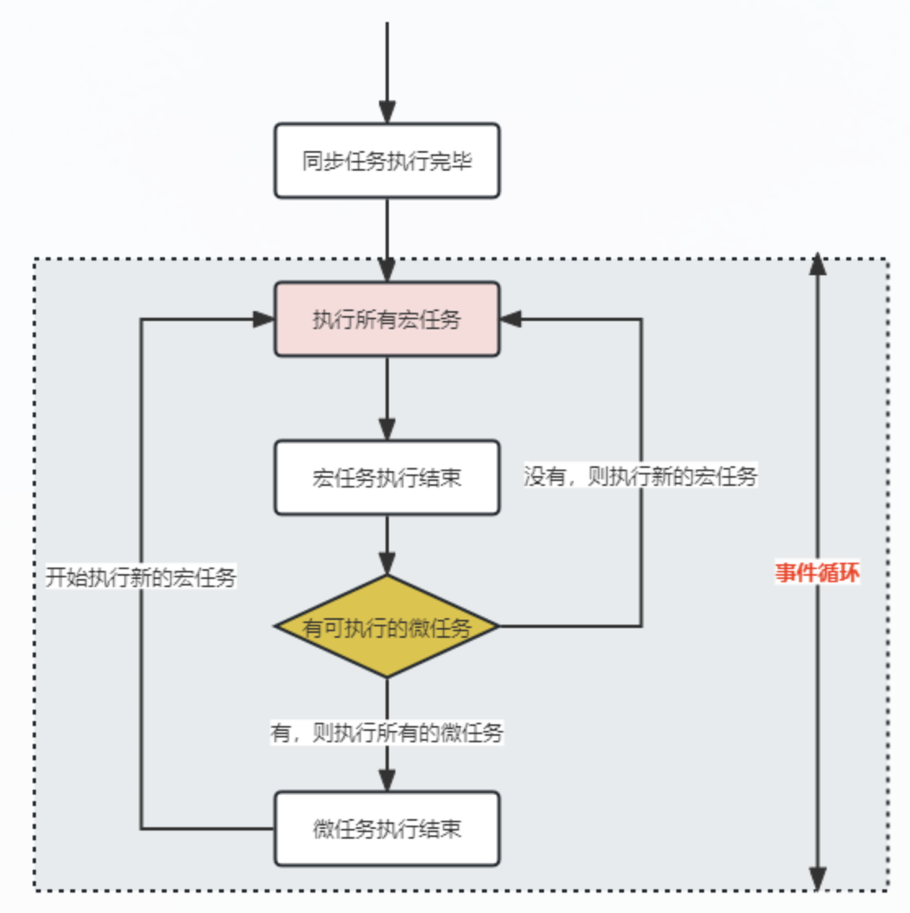
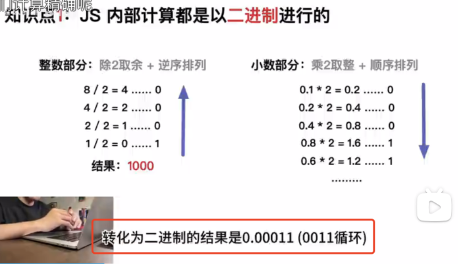

## 1.javascript基本数据类型？
- 基础类型：Number,String,Boolean,Undefined,Null,Symbol
- 引用类型：Object,Array,Function
- symbol生成的是一个全局唯一的值,Symbol(1) === Symbol(1)是为false的。

symbol主要用作什么，没说出来

## 2、介绍JS有哪些内置对象？
- 数据封装类对象：Object、Array、Number、Boolean、String。
- 其他对象：Function、Arguments、Math、Date、RegExp、Error。

## 3、浅谈javascript中变量和函数声明的提升？
1. 变量和函数声明的提升会被提升到最顶部去执行；
2. 函数的提升高于变量的提升；
3. 匿名函数不会被提升；


## 4、什么是闭包（一次答全，不要问一个答一个）
 ```
概念：
闭包通俗来讲，就是a函数里面还有b函数，而b函数可以访问a函数里面的变量。
作用：
闭包可以保护变量不被外界直接访问，增加了代码的安全性。防止全局污染

闭包的好处：能够实现封装和缓存；
闭包的坏处：
就是内存消耗，使用不当可能会造成内存溢出的问题。
在推出函数之前，`b函数赋值为null`(b函数置为null后，变量就触达不到了，就会被回收)，就可解决内存泄漏

用途：
- 设计模式中的单例模式
- for循环中的保留i的操作
- 防抖和节流
- 函数柯里化
- 立即执行函数表达式（IIFE）

 ```
 ```javascript
var Counter = (function () {
var count = 0;
function increment() {
  count++;
  console.log(count);
}
function decrement() {
  count--;
  console.log(count);
}
return {
  increment: increment, // 两个都要输出
  decrement: decrement,
};
})();

Counter.increment(); //输出 1
Counter.increment(); //输出 2
Counter.decrement(); //输出 1
 ```
## 37、说说内存泄漏？
概念一： 
内存泄漏指的是当一个不再需要的对象仍然被占用内存，且不能被垃圾回收机制回收的情况。

概念二：
所谓内存泄露是程序认为一个变量已经没用了，而垃圾回收机制认为它还在使用，从而导致这段内存无法释放

概念四：
 内存泄漏指我们无法在通过js访问某个对象，而垃圾回收机制却认为该对象还在被引用
**这句话是不对的，内存泄露也是可通过js访问到的，要不然没有清除一说。**


- 闭包没有释放；

- 场景一：意外的全局变量
  比如循环一万次给全局增加一万个属性
- 场景二：console.log
打印一个对象出来，因为这个对象持续在控制台显示，所以这个对象是释放不了的，这也说明为什么在生产环境尽量吧console.log去掉
```javascript
for (let i = 0; i < 10000; i++) {
  console.log({ a: 1 });
}
```
- 场景三：DOM泄露  
  dom清空时，还存在引用

- 场景四：闭包 (闭包真的算内存泄露吗，我很怀疑？，这里指的是闭包引用一个很大的对象，但你并没有及时释放)
```javascript

function fn() {
  return function () {
    return "hello";
  };
}

let obj = {};
function handleclick() {
  for (let i = 0; i < 10000; i++) {
    obj[`key_${i}`] = fn();
  }
  document.getElementById("result").innerHTML = "Done";
}
```
- 场景五：定时器未清除
这怎么算内存泄露呢，我一直在用啊，突然想到
如果你在卸载页面是没清除定时器，那实际上你访问不到了，但定时器还在运行


## 5、说说this对象的理解？
1. this总是指向直接调用者；
2. 如果有new关键字，则指向new出来的那个对象；
3. 在事件中，this指向触发这个事件的对象

## 6、new操作符具体做了干了什么？| new的时候都做了哪些操作
1. 创建一个新对象
2. 使新对象的__proto__指向原函数的prototype
3. this指向新的 obj ，并执行该函数
4. 判断执行函数的结果是不是对象类型，如果是则返回result，如果不是则返回之前的新对象

验证过程
```javascript
function Foo() {
  console.log('this指向=>', this)
  this.name = '张三'
  // 当返回结果是简单类型时，对结果无影响，当返回复杂类型，比如对象，结果就是返回值
  return true
}
const foo = new Foo()
console.log(foo)
console.log(Foo.prototype === foo.__proto__) // true
```

- 手写new
```javascript
    // 手写一个new
    function myNew(fn, ...args) {
      // 创建一个空对象
      let obj = {}
      // 使空对象的隐式原型指向原函数的显式原型
      obj.__proto__ = fn.prototype
      // this指向obj
      let result = fn.apply(obj, args)
      // 返回
      return result instanceof Object ? result : obj
    }

```

为什么箭头函数不能当做构造函数
1.因为this指向外层
2.箭头函数没有原型


## 7、说说堆和栈的区别？
- 栈内存：存储的都是局部变量，后进先出，栈内存的更新速度很快，因为局部变量的声明周期都很短。
- 堆内存：存储的都是数组和对象，堆里面的实体不会被释放，但是会被当成垃圾。

## 8、JS数组和对象的遍历方式，以及几种方式的比较。
- for循环——循环每进行一次，就要检查一下数组的长度，速度比较慢；
- for in 循环——需要分析出array的每一个属性，这个操作性能开销很大。
- forEach循环——不能遍历对象，不可以使用continue、break跳出循环，且使用return是跳出本次循环。

## 19 forin与forof的区别
for in 循环的是键， for of 循环的是值
```javascript
const arr = [1, 2, 3];
for (const value of arr) {
  console.log(value);
  // 1,2,3
}

for (const value in arr) {
  console.log(value);
  // 0,1,2
}
```


```javascript
const person = {
  name: 'John',
  age: 30,
  gender: 'male'
};
for (const key in person) {
  if (person.hasOwnProperty(key)) {
    console.log(key, person[key]);
  }
}
```

## 9.apply, call,bind
- 相似之处：
1. 都是用来改变函数的this对象的指向的。
- 区别
1. bind 是返回绑定this之后的函数，便于稍后调用；apply 、call 则是立即执行
2. bind直接传参，call直接传参，apply用数组包裹

call的用法
```javascript
var name = "时间跳跃";
var obj = {
  name: "听风是风",
};
function fn() {
  console.log(this.name);
}
fn(); //时间跳跃
fn.call(obj); //听风是风
```

> 手写call，apply，bind
已整理


## 10、防抖和节流（要能手写）
- 防抖（debounce）：多用在搜索框中，在停止输入后提交一次 ajax 请求

防抖就是一个事件完成后n毫秒之后再执行回调，如果这n毫秒内又重复一次事件，就重新计算时间

> 手写防抖
已整理


- 节流:
多用在 拖动滚动条（scroll）,resize，移动鼠标等频繁事件处理

函数执行一次后，在某个时间段内暂时失效，过段时间再重新激活，

使用闭包存储一个布尔类型的状态，每次执行该方法时，如果状态为false则不执行，如果状态为true，则会使状态先等于false，达到冷却的效果，再调用定时器，定时器完成过后，会将状态改为true。
> 手写节流
已整理


## 11、说说箭头函数与普通函数的区别？
其实最主要就亮点：
1.箭头函数的this指向上下文
2.箭头函数没有原型，不可以当作构造函数

3.箭头函数全都是匿名函数， 普通函数可以是匿名函数也可以是具名函数。
```javascript
// 具名函数
function func(){
  // code
}
// 匿名函数
let func=function(){
  // code
}

// 箭头函数全都是匿名函数
let func=()=>{
  // code
}
```

~~不可以使用arguments对象，该对象在函数体内不存在。如果要使用，可以用Rest参数代替；
不可以使用yield命令，因此箭头函数不能当作Generator函数。~~


## 13、实现继承的几种方法？
已整理，ID：1730351883844

## 14、对原生javascript的了解程度？
数据类信、运算、对象、Function、继承、闭包、作用域、原型链、事件、RegExp、JSON、Ajax、DOM、BOM、内存泄露、跨域、异步装载、模板引擎、前端MVC、路由、模块化、Canvas、ECMAScript。

## 15、谈一谈你对“函数式编程”的理解？

1.简单来说，函数式编程是一种基于函数编程规范。
2.函数式编程鼓励使用不可变数据和无副作用的函数。这意味着函数只依赖于它的输入，并且不会更改任何外部状态，使得更容易进行推理和测试
3.在JavaScript中，函数式编程可以使用高阶函数、闭包和递归等概念来实现。


函数式编程:通过函数之间传递状态,避免了全局状态的问题,不依赖当前函数之外的数据,也不改变当前函数之外的数据


```javascript
// 纯函数
// 什么是纯函数：纯函数是这样一种函数，即相同的输入，永远会得到相同的输出，而且没有任何可观察的副作用。
// 比如 slice 和 splice，这两个函数的作用并别无二致。但是我们说 slice 符合纯函数的定义是因为对相同的输入它保证能返回相同的输出。

// 而 splice 的调用却会产生可观察到的副作用，这个数组被永久地改变了。
var xs = [1,2,3,4,5];

// 纯的
xs.slice(0,3); // => [1,2,3]
xs.slice(0,3); // => [1,2,3]

// 不纯的
xs.splice(0,3); // => [1,2,3]
xs.splice(0,3); // => [4,5]
// 在函数式编程中，我们尽量杜绝 splice 这种会改变数据的函数。我们追求的是 slice 那种可靠的，每次都能返回同样结果的函数。
```

```javascript
// 再看另一个例子
// 不纯的
var num_1 = 1
var add1 = function (num) { return num + num_1 };

// 纯的
var add1 = function (num) { return num + 1 };

// 有哪些不纯的情况呢？

// 1. IO 操作，你不知道你读取的内容会是怎样；

// 2. 接口请求，你确定返回的内容是什么；

// 3. dom 操作，引起了副作用；

// 4. 甚至连 console.log 都是不纯的，因为它有副作用；等等。

// 对于不纯的函数我们尽量把它控制在可控范围内发生，这个会在文章后面提到。
```

## 函数柯里化
什么是柯里化（curry）？curry 的概念很简单，只传递给函数一部分参数来调用它，让它返回一个函数去处理剩下的参数

```javascript
var add = function (x, y) {  return x + y; }
add(1, 2)   // 3
add(10, 1)  // 11
add(10, 2)  // 12
add(10, 3)  // 13

// curry
var add = function(x) {
  return function(y) {
    return x + y;
  };
};

var increment = add(1);
var addTen = add(10);

increment(2); // 3
addTen(1); // 11
addTen(2); // 12
addTen(3); // 13
```
我们把 add 函数通过柯里化变成了接受部分参数并返回一个处理剩余函数且返回结果的函数。在实际环境中我们可能用到 ramda 这样的库来帮助我们实现柯里化。

```javascript
var R = require('ramda');
var add = function (x, y) { return x + y; }
var addTen = R.curry(add)(10)

addTen(1); // 11
addTen(2); // 12
```
柯里化是函数式编程的工具，他能实现预加载函数、分步取值、避免重复传参、锁定函数运行环境等等功能。


## 16、说说你对作用域链的理解？
1. 保证执行环境里变量和函数的访问是有序的，
2. 变量只能向上访问，变量访问到window对象即被终止，
3. 向下访问变量是不被允许的。

## 17、javascript原型、原型链是什么？有什么特点？
1. 当我们声明一个函数的时，就会产生一个原型对象，通过prototype访问，当new一个实例对象，该对象都会从原型对象中继承属性、方法，通过__proto__能访问到原型。
2. 当寻找该对象的属性时，先会查找对象本身是否存在该属性，如果不存在，就通过其proto属性逐级往上找,所以会形成一个链条，最顶点是null（记住了Object也有__proto__属性，是null），如果没有就返回null


## 20. map和set的区别
Set 和 Map 主要的应用场景在于 数据重组 和 数据储存。
Set 是一种叫做集合的数据结构，Map 是一种叫做字典的数据结构。

- 共同点：集合、字典 可以储存不重复的值
- 不同点：集合 是以 [value, value]的形式储存元素，字典 是以 [key, value] 的形式储存

- 集合（Set）：
Set 对象允许你储存任何类型的唯一值，无论是原始值或者是对象引用。
```javascript
const s = new Set()
[1, 2, 3, 4, 3, 2, 1].forEach(x => s.add(x))
for (let i of s) {
    console.log(i)  // 1 2 3 4
}
// 去重数组的重复对象
let arr = [1, 2, 3, 2, 1, 1]
[... new Set(arr)]  // [1, 2, 3] 记住了，new Set接收的参数是一个数组，而不是 ...arr
```


操作方法：
```
- add(value)：新增，相当于 array里的push。
- delete(value)：存在即删除集合中value。
- has(value)：判断集合中是否存在 value。
- clear()：清空集合。
便利方法：遍历方法（遍历顺序为插入顺序）
- keys()：返回一个包含集合中所有键的迭代器。
- values()：返回一个包含集合中所有值得迭代器。
- entries()：返回一个包含Set对象中所有元素得键值对迭代器。
- forEach(callbackFn, thisArg)：用于对集合成员执行callbackFn操作，如果提供了 thisArg 参数，回调中的this会是这个参数，没有返回值。
```

- 字典（Map）：
```javascript
var m = new Map([[1, 'Michael'], [2, 'Bob'], [3, 'Tracy']]); 
m.get(1); // 'Michael'

// 此处扩展字符不能去掉
const keysArray = [...map.keys()]; // [1, 2, 3]
const valuesArray = [...map.values()]; // ['Michael', 'Bob', 'Tracy']


const m = new Map()
const o = {p: 'haha'}
m.set(o, 'content')
m.get(o)  // content
m.has(o)  // true
m.delete(o) // true
m.has(o)  // false

// 判断 Map 是否有值
if (map.size === 0) {
  console.log('Map 为空');
} else {
  console.log('Map 有值');
}
```

```
操作方法：
- set(key, value)：向字典中添加新元素。
- get(key)：通过键查找特定的数值并返回。
- has(key)：判断字典中是否存在键key。
- delete(key)：通过键 key 从字典中移除对应的数据。
- clear()：将这个字典中的所有元素删除。
遍历方法：
- Keys()：将字典中包含的所有键名以迭代器形式返回。
- values()：将字典中包含的所有数值以迭代器形式返回。
- entries()：返回所有成员的迭代器。
- forEach()：遍历字典的所有成员。

```

## map和对象有什么区别
 1. map是一个集合类型，可储存多重数据类型 (直接回答最根本的，而不是一大堆无关紧要的)

~~1. 普通对象使用字面量进行初始化,而 Map 需要 Map() 构造函数进行初始化~~
~~2. 普通对象支持 JSON 序列化，但 Map 默认无法获取正确数据。~~
~~3. Map 对象在涉及频繁添加和删除键值对的场景中表现更好，而普通对象没有优化。~~
~~4. 普通对象能直接添加，map需要借助响应的 get，set方法~~

## 21. window.onload 和 $(document).ready 有何不同？
- window.onload除了要等待 DOM 被创建还要等到包括大型图片在内的所有外部资源都完全加载,执行时有延迟。
- $(document).ready 等到DOM结构绘制完成就可以执行，不必等到所有元素加载完成 ，从而执行起来更快。
- 使用 $(document).ready() 可以在网页里多次使用，
- $(document).ready()比用 window.onload 事件要更好些。

## 22、说几条写javascript的基本规范？
1. 不要在同一行声明多个变量；
2. 使用=== !==来判断true、false;
3. if语句必须使用大括号；


## 23、eval是做什么的？
eval可以把字符串解析成JS代码并运行；
避免使用eval,不安全，非常消耗性能；
把JSON字符串传换成JSON对象时可以使用eval。

## 24、null和underfined的区别？
null表示定义了一个对象，值为“空值”；
underfined表示这个不存在这个值。

## 25、[1,2,3].map(parseInt)的输出结果是什么？
[1,NaN,NaN],因为parseInt需要两个参数(val,radix)。

## 26、use strict的理解和作用？
use strict是ES5新增的一种严格运行模式。可以使得JS代码在严格模式下运行，使得编码更加规范更加严谨，消除了一些怪异行为。

## 27、说说严格模式的限制？
(1)变量必须先声明后再使用；
(2)函数的参数不能出现同名属性，否则报错；
(3)禁止this指向全局对象。

## 28、说说对JSON的理解？
- JSON是一种轻量级的数据交换格式；
- 数据格式简单，易于读写，占用带宽小；
- JSON字符串可以和JSON对象互转；

## 29、说说JS延迟加载的方式有哪些？
defer和async，动态创建DOM(用得最多),按需加载。
- defer 属性：将 defer 属性设置为 true，浏览器会在 HTML 解析完成后再加载脚本，并且在 DOMContentLoaded 事件触发前执行脚本，从而避免了阻塞页面渲染。但是如果页面中有多个 defer 脚本，它们的执行顺序是不能保证的；
```html
<!DOCTYPE html>
<html>
<head>
    <script src="test1.js" defer="defer"></script>
    <script src="test2.js" defer="defer"></script>
</head>
<body>
<!--这里放内容-->
</body>
</html>
```

- async 属性：将 async 属性设置为 true，浏览器会异步加载脚本，并在加载完毕后立即执行脚本，不会阻塞页面渲染。但是和 defer 一样，多个 async 脚本的执行顺序也是无法保证的；
```html
<!DOCTYPE html>
<html>
    <head>
        <script src="test1.js" async></script>
        <script src="test2.js" async></script>
    </head>
<body>
<!--这里放内容-->
</body>
</html>
```

- 动态插入 DOM：通过 JavaScript 创建 script 元素并插入到 DOM 中，可以在需要时才加载脚本，从而避免页面阻塞。例如：
```javascript
//这些代码应被放置在</ body>标签前(接近HTML文件底部)
<script type="text/javascript">
    function downloadJSAtOnload() {
        varelement = document .createElement("script");
        element.src = "defer.js";
        document.body.appendChild(element);
    }
    if (window. addEventListener)
        window.addEventListener("load" ,downloadJSAtOnload, false);
    else if (window.attachEvent)
        window.attachEvent("onload", downloadJSAtOnload) ;
    else
        window. onload =downloadJSAtOnload;
</script>
```

- 按需加载：使用按需加载的方式，当需要用到某个功能时再加载相应的脚本文件。这种方式需要开发者手动管理模块之间的依赖关系，通常使用模块化工具如 webpack 等来进行管理。
- 让JS最后加载
把js外部引入的文件放到页面底部，来让js最后引入，从而加快页面加载速度

## 31、如何通过JS判断一个数组| 如何判断数据类型？

### typeof
缺点：  
 只能判断简单类型，不能判断复杂类型
 typeof null 为object，历史遗留的bug
 new Boolean()、new Number()、new String() 用typeof检测为object


Array，Object，null，Date，RegExp，Error这几个类型都被typeof判断为object，所以不能使用typeof了。

Number，String，Boolean，Function，undefined，如果想判断这几种类型，那就可以使用typeof。


- instanceof
用于检测构造函数的 prototype 属性是否出现在某个实例对象的原型链上。


Number，String，Boolean没有检测出他们的类型，但是如果使用下面的写法则可以检测出来：
```javascript
console.log(arr instanceof Array ); // true
console.log(date instanceof Date ); // true
console.log(fn instanceof Function ); // true


console.log(arr instanceof Object ); // true 
// 当然，以上这几个instanceof Object都是true，所以这里不要用Object
```

还需要注意null和undefined都返回了false，这是因为它们的类型就是自己本身，并不是Object创建出来它们，所以返回了false。

- 使用toString()检测对象类型
```javascript
var toString = Object.prototype.toString;

toString.call(123); //"[object Number]"
toString.call('abcdef'); //"[object String]"
toString.call(true); //"[object Boolean]"
toString.call([1, 2, 3, 4]); //"[object Array]"
toString.call({name:'wenzi', age:25}); //"[object Object]"
toString.call(function(){ console.log('this is function'); }); //"[object Function]"
toString.call(undefined); //"[object Undefined]"
toString.call(null); //"[object Null]"
toString.call(new Date()); //"[object Date]"
toString.call(/^[a-zA-Z]{5,20}$/); //"[object RegExp]"
toString.call(new Error()); //"[object Error]"
```

这样可以看到使用Object.prototype.toString.call()的方式来判断一个变量的类型是最准确的方法。

封装一个获取变量准确类型的函数
```javascript
function gettype(obj) {
  var type = typeof obj;

  if (type !== 'object') {
    return type;
  }
  //如果不是object类型的数据，直接用typeof就能判断出来

  //如果是object类型数据，准确判断类型必须使用Object.prototype.toString.call(obj)的方式才能判断
  return Object.prototype.toString.call(obj).replace(/^\[object (\S+)\]$/, '$1');
}
```
- 使用ES5新增的方法isArray()

## 11.undefine和Null的区别？
null表示没有对象，即此处不应该有值。转换成数值的时候为0
undefined表示缺少值，就是此处应该有一个值，但是还未被定义。转换为数值的时候为NaN

## 32、说说let、var、const的理解？
const和let会形成块级作用域，不支持变量名提升，const一般用于声明常量，let用于声明变量


## 35、javascript数组去重的方法汇总？
1. 使用indexOf（）或 includes 去重，首先创建一个空数组，然后原数组循环遍历，然后判断如果当前的这个值在创建的新数组里面没有，也就是等于-1，那么就添加，如果有，则不添加。
```javascript
let res = []
for (let i = 0; i < arr.length; i++) {
    if (res.indexOf(arr[i]) === -1) {
        res.push(arr[i])
    }
}
```


2. 使用Set去重
const arr = [1,2,2,3,4,5,3]
console.log(new Set(arr))

3. 利用对象的属性不能相同的特点进行去重；


## 36、javaScript变量提升？
在生成执行环境时，会有两个阶段。

第一个阶段是创建阶段，JS解释器会找出需要提升的变量和函数，并且会给他们提前在内存中开辟好空间，函数的话会将整个函数存入内存中，变量只声明并且赋值为underfined，

第二个阶段，也就是代码执行阶段，我们可以直接提前使用。


## 39、javascript数组排序的几种方式？
- 冒泡排序
假设数组中有n个数，比较相邻两个数的大小，若前者大于后者，则两数交换位置。这样，第一轮结束的时候，就可以选出最大的一个数放在最后面，那么，经过n-1轮之后，所有的数就完成了排序。
```javascript
// 编写方法，实现冒泡
var arr = [29,45,51,68,72,97];
//外层循环，控制趟数，每一次找到一个最大值
for (var i = 0; i < arr.length - 1; i++) {
    // 内层循环,控制比较的次数，并且判断两个数的大小
    for (var j = 0; j < arr.length - 1 - i; j++) {
        // 白话解释：如果前面的数大，放到后面(当然是从小到大的冒泡排序)
        if (arr[j] > arr[j + 1]) {
            var temp = arr[j];
            arr[j] = arr[j + 1];
            arr[j + 1] = temp;
        }
    }
}
console.log(arr);//[2, 4, 5, 12, 31, 32, 45, 52, 78, 89]

```

- 快排排序
一个数组里面寻找中间的值作为基准，然后创建两个空数组，循环原数组，将数组的每个值跟基准比较，比基准小的存在一个数组，比基准大的存在一个数组，然后递归执行以上操作，最后将两个数组合并。

## 45、javascript深浅拷贝？
它们最根本的区别在于是否真正获取了一个对象的复制实体，而不是引用
- 浅拷贝现在可以使用Object.assign快速实现
- 实现深拷贝
1. JSON.parse(JSON.stringify())
2. 使用 lodash 的 cloneDeep 方法
3. 自定义递归深拷贝函数

> 手写浅拷贝深拷贝⭐⭐⭐⭐⭐
已整理

## Object.assign
Object.assign() 方法用于将所有可枚举属性的值从一个或多个源对象复制到目标对象。它将返回目标对象。
如果单层数据，属于深拷贝，如果多层，属于浅拷贝

```js
Object.assign(target,...sources)
// target—>目标对象
// source—>源对象
// 返回值：target，即目标对象
```

```js
var target = { name: "张三", age: 18 };
var source = { money: "10000" };
var result = Object.assign(target, source);
console.log(result); // {name: '张三', age: 18, money: '10000'}
console.log(target); // {name: '张三', age: 18, money: '10000'}
console.log(source); // {money: '10000'}
```


## 46、es6新增了哪些方法
1. let和const变量、class
2. promise，async/await
3. 箭头函数
4. 扩展运算符、解构赋值、模板字符串
```javascript
let arr=[...arr1,...arr2]
let {str1, str2} = {str1: 111, str2: 2222};
```

1. 模块化，通过import export来操作。
2. es7：includes
3. es8: Object.values() 、Object.entries() 、String.padding 、

## 47、谈谈ES6中的class
首先class是用来创建类的，在传统的js中，没有类的概念。class的作用让原型对象的写法更加清晰
- 我们在类里面写方法时直接定义在原型对象上面
- constructor就相当于构造函数，接受参数，Object.prototype.constructor==Object
- 类必须使用new调用

## CommonJs 与 ES6 的区别

CommonJS 模块输出的是一个值的拷贝，ES6 模块输出的是值的引用
CommonjS 模块是运行时加载，ES6 模块是编译时加载。

> 因为 CommonJS 加载的是一个对象(即module.exports属性)，该对象只有在脚本运行完才会生成。而ES6模块不是对象，它的对外接口只是一种静态定义，在代码静态解析阶段就会生成。

> 冷知识：浏览器可以用commonjs吗？
> 不可以，commonjs是node的模块规范，为什么前端可以写require呢，因为有webpack编译，webpack是基于node的。

## 48、对模块化的理解： （水滴）
 ~~ES6之前已经出现了js块加载的方案，最主要的是CommonJS和AMD规范。
2.不同点：AMD规范则是非同步加载模块，允许指定回调函数。CommonJS规范加载模块是同步的，也就是说，只有加载完成，才能执行后面的操作。
commonJS主要应用于服务器，实现同步加载，如nodejs。AMD规范应用于浏览器，如requirejs，为异步加载。
ES6在语言规格的层面上，实现了模块功能，而且实现得相当简单，完全可以取代现有的CommonJS和AMD规范，成为浏览器和服务器通用的模块解决方案。~~

ES6的模块化分为导出（export）与导入（import）两个功能。如果希望外部能读取模块当中的内容，就必须使用export暴露出去，然后在另外一个文件中用Import引入该模块，一个模块如果只有一个默认导出的话，就使用export default，引入的时候也可使用as进行重命名。
1. 解决代码臃肿的问题，增加代码可读性，便于维护，
2. 便于代码复用
3. 模块化能按需加载

## 49、require和import的区别
- 区别1：调用时机
require：运行时加载，所以其实是可以放在任何地方的
import：编译时加载（效率更高），所以必须放在文件的开头

- 区别2：使用时
  - require 需要使用 module.exports = fs 或者exports.fs = xxx
  - import 用 export default 或 export const xx

  模块的本质  
  require：模块就是对象，输入时必须查找对象属性
  import：ES6 模块不是对象，而是通过 export 命令显式指定输出的代码，再通过 import 命令输入（这也导致了没法引用 ES6 模块本身，因为它不是对象）。由于 ES6 模块是编译时加载，使得静态分析成为可能。有了它，就能进一步拓宽 JavaScript 的语法，比如引入宏（macro）和类型检验（type system）这些只能靠静态分析实现的功能。

  ```javascript
  // CommonJS模块
  let { exists, readFile } = require("fs");
  // 等同于
  let fs = require("fs");
  let exists = fs.exists;
  let readfile = fs.readfile;
  ```
  上面CommonJs模块中，实质上整体加载了fs对象（fs模块），然后再从fs对象上读取方法

  ```javascript
  // ES6模块
  import { exists, readFile } from 'fs';
  ```
  上面ES6模块，实质上从fs模块加载2个对应的方法，其他方法不加载

- 区别3：解构赋值
  - require 是赋值的过程
  - import 是解构的过程


- 区别4：严格模式
CommonJs模块和ES6模块的区别：
1. CommonJs模块默认采用非严格模式
2. ES6 的模块自动采用严格模式，不管你有没有在模块头部加上 “use strict”;
3. CommonJS 模块输出的是一个值的拷贝，ES6 模块输出的是值的引用，

## exports和module.exports有什么区别？⭐⭐⭐
两者都是commonjs的导出方式
- 导出方式不一样
  - exports.xxx='xxx'
  - module.export = {}
- exports是module.exports的引用，两个指向的是用一个地址，而require能看到的只有module.exports


## 4.浏览器的多进程和javaScript的单线程
- 一个进程是由一个或者多个线程组成的。打开一个tab页，其实就是创建了一个进程，一个进程可以有多个线程，比如JS引擎线程、GUI渲染线程、HTTP请求线程。
- JS作为浏览器脚本语言，JS的主要用途是与用户互动，以及操作DOM。这决定了只能是单线程，假如JS有两个线程，一个线程在某个DOM节点上添加内容，另一个线程删除了这个节点，这时候浏览器就不知道应该以哪个为准。


## 51、js执行机制
一、事件循环（Event Loop）基础  
~~首先JS是单线程的，一般的代码都会按顺序执行，如果遇到异步代码，会将异步代码放到另一个线程，这个线程我们叫工作线程，主线程继续执行剩余的代码，当工作线程异步代码执行完成过后，比如setTimeout时间到了或者axios得到了数据，该线程就会将回调函数放到消息队列里面去，当主线程代码执行完过后，会检查任务队列是否有任务要执行，如果有，则会执行，如果没有，则会一直循环等待任务到来。~~

1. 首先JS是单线程的，一般的代码都会按顺序执行
2. 如果遇到异步代码，会将异步代码放到任务队列中
3. 当同步代码执行完后，就会执行所有的宏任务，宏任务执行完成后，会判断是否有可执行的微任务；如果有，则执行微任务，完成后，执行宏任务；如果没有，则执行新的宏任务，形成事件循环。  
​


三、宏任务与微任务  
宏任务例如，setTimeout，setInterval,requestAnimationFrame，(整个script，重要），ajax  
微任务例如 promise.then,process.nextTick、Object.observe、MutationObserver
> 注意：Promise是同步任务

执行一个宏任务，执行过程中如果遇到微任务，就会将微任务添加到微任务的队列，宏任务执行完毕过后，会立即按顺序执行微任务，当这个宏任务执行完毕后，开始进行渲染，渲染完毕后，开始下一个宏任务。    
任务执行过程：宏任务->微任务->GUI渲染->宏任务->微任务->GUI渲染->xxx
 ```javascript
new Promise(（resolve）=> {
    console.log(1);
    resolve();
}).then(()=> {
    console.log(2)
})
cosole.log(3)
// 1 3 2
 ```
 ```javascript
setTimeout(()=> console.log(4))  // 进入下一次事件循环
async function test(){
  console.log(1)
  await Promise.resolve()
  console.log(2)
}
test()
console.log(3)
// 1 3 2 4
 ```


## 54、事件捕获和事件冒泡哪个先触发
DOM事件流（event flow ）存在三个阶段：事件捕获阶段、处于目标阶段、事件冒泡阶段。
 ```javascript
document.getElementById(元素id).addEventListener("click", function(){
    console.log("目标元素被点击了");
}, false);
// 第三个参数表示监听器是否在捕获阶段执行，‌true=>事件在捕获阶段处理；‌false=>事件在冒泡阶段执行，‌默认false。
 ```

1. 事件委托  
事件委托也称为事件代理。就是利用事件冒泡，把子元素的事件都绑定到父元素上。如果子元素阻止了事件冒泡，那么委托就无法实现。
优点：
- 替代循环绑定事件的操作，减少内存消耗，提高性能。
缺点：
- 事件委托基于冒泡，对于不冒泡的事件不支持。
- 层级过多，冒泡过程中，可能会被某层阻止掉。

## addEventListener第三个参数是啥,还可以为其它值吗
- 当参数为布尔值时，表示监听器是否在捕获阶段执行，‌true=>事件在捕获阶段处理；‌false=>事件在冒泡阶段执行，‌默认false。‌

 当参数为对象时，‌该对象可以包含三个属性：‌
capture：‌布尔值，‌表示监听器是否在捕获阶段执行。‌
once：‌布尔值，‌表示监听器是否仅执行一次。‌
passive：‌布尔值，‌表示监听器是否不会调用preventDefault()。‌
 ```javascript
document.addEventListener('click', () => {
    // do something
    ...
}, false)
 ```

## 57、async和await的原理和使用
在异步代码的函数上加上async，在异步代码前加上await，这样会将异步代码变为同步，
好处是解决promise.then回调地狱的问题。

## 58、Promise是什么？
1. promise是一个对象，内部有三个状态，resolved,rejected,pending。
2. 当我们new一个promise对象的时候，会传入一个回调函数，这回调函数有resolve和reject两个方法。想改变状态只能调用resolve()或者reject()这两个方法，
3. 通过.then方法来获取数据，then方法可以接受两个参数，一个成功的回调，一个失败的回调。但是我们获取数据一般是通过async/await来获取数据。这样可以避免回调地狱。

## 59、reduce方法
reduce() 方法接收一个函数作为累加器，数组中的每个值（从左到右）开始缩减，最终计算为一个值。
reduce() 可以作为一个高阶函数
array.reduce(function(prev, cur, index, arr), init)
- prev （上一次调用回调返回的值，或者是提供的初始值（initialValue））
- cur （数组中当前被处理的元素）
- index （当前元素在数组中的索引)
- arr （调用的数组）
- init （传递给函数的初始值）  

带初始值
 ```javascript
var arr = [1,2,3,4]
var sum = arr.reduce((pre, item) => {
    return pre + item
}, 10)
console.log(sum) // 20

// reduce求数组最大值
var arr = [1, 2, 3, 4];
arr.reduce((prev, cur) => {
    return Math.max(prev,cur);
});
//4
```


## 60、高阶函数有哪些
高阶函数指 若a函数，接收一个函数为参数，那么a就可以称之为高阶函数  
常见的高阶函数有：Promise、setTimeout、map、filter、reduce，sort等等

## 61、常用操作字符串方法
- split(sep，limit)：将字符串分割为字符数组，limit为从头开始执行分割的最大数量
- slice(start,end)：返回字符索引在start和end（不含）之间的子串
- substr(start，length)：从字符索引start的位置开始，返回长度为length的子串
- substring(from,to)：返回字符索引在from和to（不含）之间的子串
- charAt(index):返回指定索引处的字符串
- charCodeAt(index):返回指定索引处的字符的Unicode的值
- lastIndexOf(str):返回str在父串中最后一次出现的位置，若没有则返回-1
- indexOf(str):返回str在父串中第一次出现的位置，若没有则返回-1

## 62、常用操作数组方法
- push()，向数组的末尾添加元素，得到数组长度
- pop()，删除数组中最后一个元素，得到删除的元素
- unshift()，向数组开头添加元素，得到数组长度
- shift()，删除数组第一个元素，得到删除的元素

- sort()，对数组元素进行排序，并返回这个数组，sort的比较函数有两个参数，返回a-b则使升序，返回b-a则是降序
- slice(start,end)：返回数组下标在start和end（不含）之间的值，不改变原数组
- splice(开始索引,长度)：从开始的位置截取数组元素.截取指定长度的个数,返回的是截取后的新的数组
- indexOf() 查找数组是否存在某个元素，返回下标
- lastIndexOf() 查找指定元素在数组中的最后一个位置
- includes() 查找数组是否包含某个元素 返回布尔
- filter（function） 过滤原始数组，返回新数组
- every(函数)方法,判断数组中的每个元素是否符合函数中的判断,如果每个元素都满足条件则返回true,否则返回false
- some 有一个返回true，循环终止，返回true。
- map(函数),让数组中的每个元素都执行一次函数,把得到的返回值组成一个新的数组
- join(字符串);把数组中的每个元素之间用指定的字符串进行连接.返回一个新的字符串
- find() 查找目标元素，找到就返回该元素，找不到返回undefined。


## 为什么 0.1 + 0.2不等于0.3,如何解决这个问题
因为js是用二进制处理数据，小数不同于整数，会出现小数部分永远不为0的情况，那存储是就会有数据丢失



1. JS用二进制处理数据，用IEEE 754双精度浮点数标准存储Number类型。
2. 浮点数是使用64位固定长度来表示的，其中的1位表示符号位，11位用来表示指数位，剩下的52位尾数位，由于只有52位表示尾数位。
3. 而0.1转为二进制是一个无限循环数0.0001100110011001100......(1100循环),  
由于只能存储52位尾数位，所以会出现精度缺失

4. 过程中有两次精度丢失，一次在存储，一次在相加。

## 如何解决
先给他们放大倍数，随后在除以相应倍数
```javascript
const a = 0.1;
const b = 0.2;

console.log(a + b === 0.3)   // false
console.log((a * 1000 + b * 1000) / 1000 === 0.3)  // true
```


## 那为什么0.2+0.3=0.5呢?
0.2 和0.3分别转换为二进制进行计算：在内存中，它们的尾数位都是等于52位的，而他们相加必定大于52位，而他们相加又恰巧前52位尾数都是0，截取后恰好是0.1000000000000000000000000000000000000000000000000000也就是0.5

## 那既然0.1不是0.1了，为什么在console.log(0.1)的时候还是0.1呢?
在console.log的时候会二进制转换为十进制，十进制再会转为字符串的形式，在转换的过程中发生了取近似值，所以打印出来的是一个近似值的字符串


## js的设计模式有哪些
 有七种设计模式，
常见的有： 1、工厂模式，2.单例模式 3.观察者模式 4.发布订阅模式
不常见的：构造函数模式、迭代器模式、代理模式

 观察者模式和发布订阅默认的区别，观察者模式会相互依赖

- 单例模式
保证一个类仅有一个实例，并提供一个访问它的全局访问点。
不管创建多少个对象都只有一个实例
```javascript
var Single = (function () {
  var instance = null
  function Single(name) {
    this.name = name
  }
  return function (name) {
    if (!instance) {
      instance = new Single(name)
    }
    return instance
  }
})()

var oA = new Single('hi')
var oB = new Single('hello')
console.log(oA);
console.log(oB);
console.log(oB === oA);
```

- 工厂模式
工厂模式是用来创建对象的一种最常用的设计模式。我们不暴露创建对象的具体逻辑，而是将将逻辑封装在一个函数中，那么这个函数就可以被视为一个工厂

代替new创建一个对象，且这个对象想工厂制作一样，批量制作属性相同的实例对象（指向不同）
```javascript
function Animal(o) {
  var instance = new Object()
  instance.name = o.name
  instance.age = o.age
  instance.getAnimal = function () {
    return "name:" + instance.name + " age:" + instance.age
  }
  return instance
}

var cat = Animal({name:"cat", age:3})
console.log(cat);

```


- 发布订阅者模式

最简单的发布订阅者模式
```javascript
function Subscribe() {
  this.listenerArr = []; // 用来存订阅者
  this.addListener = (listener) => {
    this.listenerArr.push(listener);
  };
  this.notify = (fn) => {
    this.listenerArr.forEach((listener) => {
      fn(listener);
    });
  };
}
let s1 = new Subscribe(); // 创建一个实例
s1.addListener("小明"); // 小明订阅了
s1.addListener("小红"); // 小红订阅了
s1.notify((name) => {
  //让他们都去吃饭
  console.log(`${name}去吃饭`);
});
s1.notify((name) => {
  console.log(`${name}去散步`); //让他们都去散步
});
```

有点难度的
```javascript
    class Watcher {
      // name模拟使用属性的地方
      constructor(name, cb) {
        this.name = name
        this.cb = cb
      }
      update() {//更新
        console.log(this.name + "更新了");
        this.cb() //做出更新回调
      }
    }

    class Dep {//依赖收集器
      constructor() {
        this.subs = []
      }
      addSubs(watcher) {
        this.subs.push(watcher)
      }
      notify() {//通知每一个观察者做出更新
        this.subs.forEach(w => {
          w.update()
        });
      }
    }

    // 假如现在用到age的有三个地方
    var w1 = new Watcher("我{{age}}了", () => { console.log("更新age"); })
    var w2 = new Watcher("v-model:age", () => { console.log("更新age"); })
    var w3 = new Watcher("I am {{age}} years old", () => { console.log("更新age"); })

    var dep = new Dep()
    dep.addSubs(w1)
    dep.addSubs(w2)
    dep.addSubs(w3)

    // 在Object.defineProperty 中的 set中运行
    dep.notify()

```
还没看懂的
实现了对象间多对多的依赖关系，通过事件中心管理多个事件。目标对象并不直接通知观察者，而是通过事件中心来派发通知。
```javascript
// 事件中心
let pubSub = {
  list: {}, // {onwork:[fn1,fn2],offwork:[fn1,fn2],launch: [fn1,fn2]}
  subscribe: function (key, fn) {
    //订阅
    if (!this.list[key]) {
      this.list[key] = [];
    }
    this.list[key].push(fn);
  },
  publish: function (key, ...arg) {
    // 发布
    for (let fn of this.list[key]) {
      fn.call(this, ...arg);
    }
  },
  unSubscribe: function (key, fn) {
    // 取消订阅
    let fnList = this.list[key];
    if (!fnList) return false;
    if (!fn) {
      //不传入指定取消的订阅方法,则清空所有key下的订阅
      fnList && (fnList.length = 0);
    } else {
      fnList.forEach((item, index) => {
        if ((item = s = fn)) {
          fnList.splice(index, 1);
        }
      });
    }
  },
};

// 订阅
pubSub.subscribe("onwork", (time) => {
  console.log(`上班了:${time}`);
});
pubSub.subscribe("offwork", (time) => {
  console.log(`下班了:${time}`);
});
pubSub.subscribe("launch", (time) => {
  console.log(`吃饭了:${time}`);
});
//发布
pubSub.publish("offwork", "18:00:00");
pubSub.publish("launch", "12:00:00");
// 取消订阅
pubSub.unSubscribe("onwork");
```

6、观察者模式
定义了对象间一对多的依赖关系，当目标对象的状态发生改变时，所有依赖它的对象都会得到通知。
```javascript
// 目标者类
class Subject {
  constructor() {
    this.observers = []; // 观察者列表
  }
  // 添加
  add(observer) {
    this.observers.push(observer);
  }
  // 删除
  remove(observer) {
    let idx = this.observers.findIndex((item) => item === observer);
    idx > -1 && this.observers.splice(idx, 1);
  }
  // 通知
  notify() {
    for (let observer of this.observers) {
      observer.update();
    }
  }
}

// 观察者类
class Observer {
  constructor(name) {
    this.name = name;
  }
  // 目标对象更新时触发的回调
  update() {
    console.log(`目标者通知我更新了，我是:${this.name}`);
  }
}
// 实例化目标者
let subject = new Subject();
// 实例化两个观察者
let obs1 = new Observer("前端开发者");
let obs2 = new Observer("后端开发者");

// 向目标者添加观察者
subject.add(obs1);
subject.add(obs2);
```

## 27.如何将类数组转换成数组？
 
```javascript
// 方法一：Array.from
let list = Array.from(hdList);
// 方法二：
let list = Array.prototype.slice.call(hdList);
// 方法二：
Array.prototype.concat.apply([], hdList);
// 方法四：
let list = [...hdList];
```


## do while和while的区别
 do...while 循环能够保证至少执行一次循环，而 while 循环不一定
 
 ```javascript
let n = 0;
while (n <= 5) {
  n++;
  console.log(n);
}
// 1 2 3 4 5 6
```

```js
do {
  n++;
  console.log(n);
} while (n <= 5);
// 1 2 3 4 5 6
```


### Promise.all / Promise.race / Promise.allSettled / Promise.any 的区别
id: 1730275598158
- Promise.all
Promise.all()方法用于将多个 Promise 实例，包装成一个新的 Promise 实例。
```js
const p = Promise.all([p1, p2, p3]);
```
p的状态由p1,p2,p3 决定，分成两种情况。
（1）只有p1、p2、p3的状态都变成fulfilled，p的状态才会变成fulfilled，此时p1、p2、p3的返回值组成一个数组，传递给p的回调函数。
（2）只要p1、p2、p3之中有一个被rejected，p的状态就变成rejected，此时第一个被reject的实例的返回值，会传递给p的回调函数。
```js
let p1 = new Promise((resolve, reject) => {
    setTimeout(() => {
        resolve("p1--all---执行了")
    }, 1000);
}).then((res) => {
    console.log(res);
})
let p2 = new Promise((resolve, reject) => {
    setTimeout(() => {
        resolve("p2--all---执行了")
    }, 1000);
}).then((res) => {
    console.log(res);
})
let p3 = new Promise((resolve, reject) => {
    setTimeout(() => {
        //resolve("p3--all---执行了")
        reject()
    }, 1000);
}).then((res) => {
    console.log(res);
})
Promise.all([p1, p2, p3]).then((res) => {
    console.log("%cPromise.all执行成功了", "color: green;font-size:22px", res)
})
.catch((error) => {
console.log("%cPromise.all执行失败了", "color: red;font-size:22px",error)
})
```

2.Promise.race
只要p1、p2、p3之中有一个实例率先改变状态，p的状态就跟着改变。那个率先改变的 Promise 实例的返回值，就传递给p的回调函数。


3.Promise.allSettled
Promise.allSettled() 方法返回一个在所有给定的 promise 都已经 fulfilled 或 rejected 后的 promise ，并带有一个对象数组，每个对象表示对应的 promise 结果。也就是失败和成功的都返回

4.Promise.any
只要参数实例有一个变成fulfilled状态，包装实例就会变成fulfilled状态；如果所有参数实例都变成rejected状态，包装实例就会变成rejected状态。 


