​
 ## 1、webpack中plugin和laoder的区别，它们的执行时机，以及常用的plugin和loader

- webpack只能解析js文件，如果想打包其他文件的话，就会用到loader，比如打包图片、css模块、js模块时
比如：  
```
image-loader：加载并且压缩图片文件
babel-loader：把 ES6 转换成 ES5
css-loader：加载 CSS，支持模块化、压缩、文件导入等特性
eslint-loader：通过 ESLint 检查 JavaScript 代码

- plugin其实主要是监听一些webpack生命周期事件的，然后做优化

html-webpack-plugin
mini-css-extract-plugin
terser-webpack-plugin  文件压缩
vconsole-webpack-plugin
assets-retry-webpack-plugin
```


 ## 如何在webpack中做些优化
 Webpack优化可以分为三部分：优化构建速度、优化开发体验、优化输出质量三部分。主要看图，另外做写补充

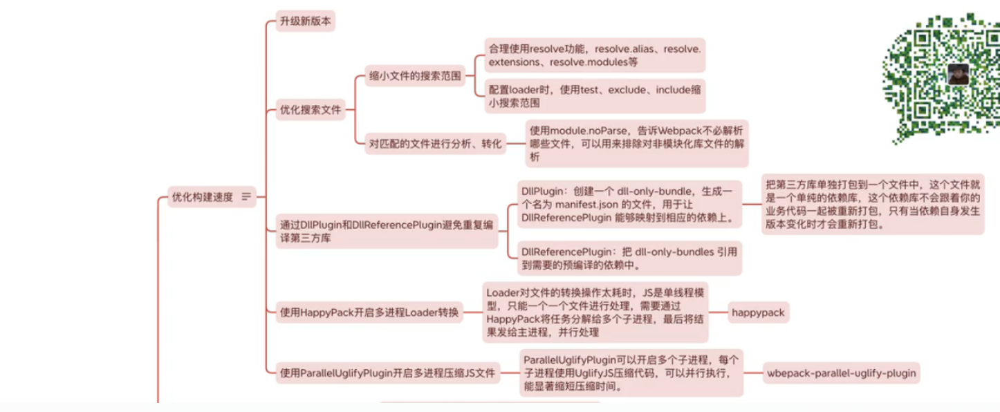
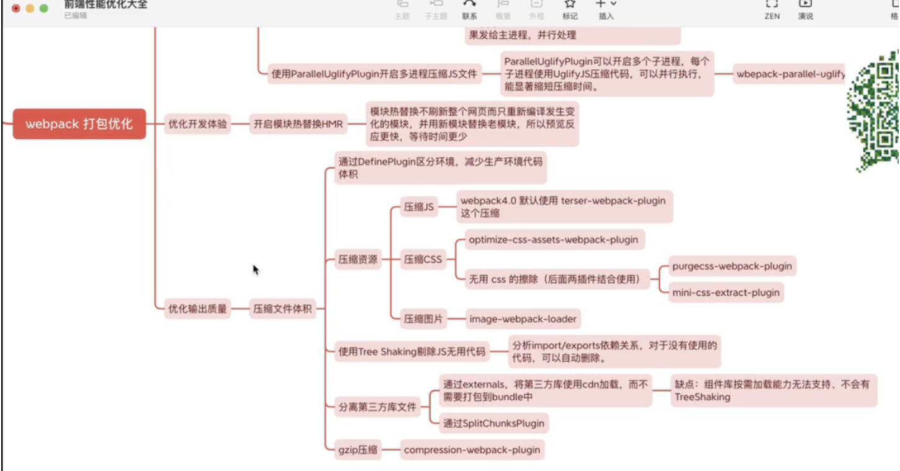

 ### 优化构建速度

2.通过include缩小文件搜索范围
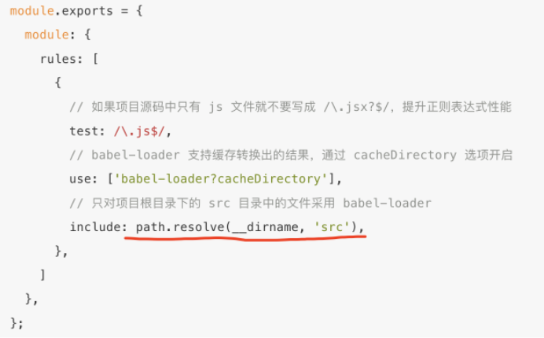  
3.优化 resolve.modules 配置，指明存放第三方模块的绝对路径，以减少寻找，
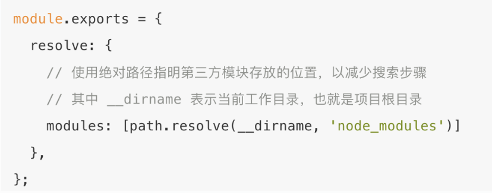  

```javascript
resolve: {
    alias: {
        '@': resolve('src'),
        '#': resolve('src/views/playback/components/yunChuangClip/videoEditor'),
    },
},
```

1.可以用noparse，告诉webpack哪些文件是不需要解析的
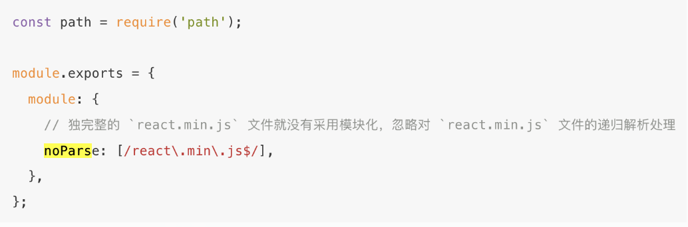

2.避免重复去编译第三方库，因为一个项目中第三方库是非常多的，像echats，elementui，我们把他单独打包到一个文件中，不会随着我们业务改变而重新打包，这样就能提高构建速度

3.在webpack压缩打包时，如果有多个js需要压缩，可以开启多个子进程，比如用thread-loader来开启多个子进程  
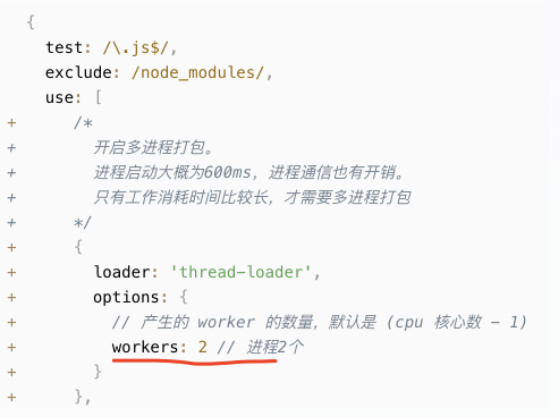


 ### 优化输出质量
1.提取公共代码 commonsChunkPlugin
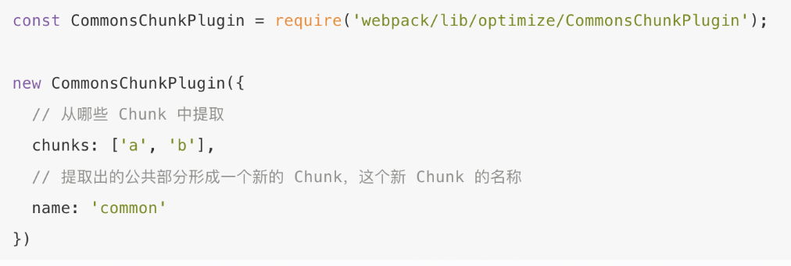
2.按需打包 webpackChunkName
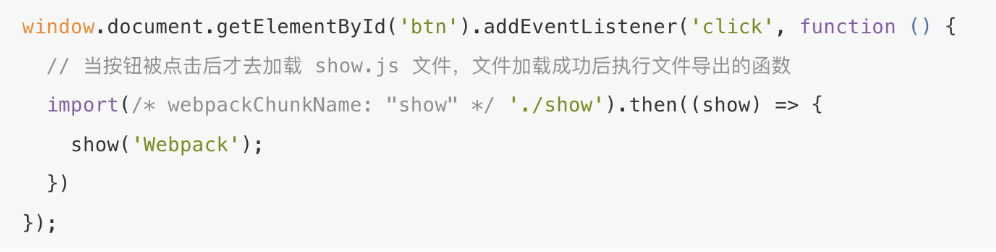

为了正确的输出在 /* webpackChunkName: "show" */ 中配置的 ChunkName，还需要配置下 Webpack，配置如下：
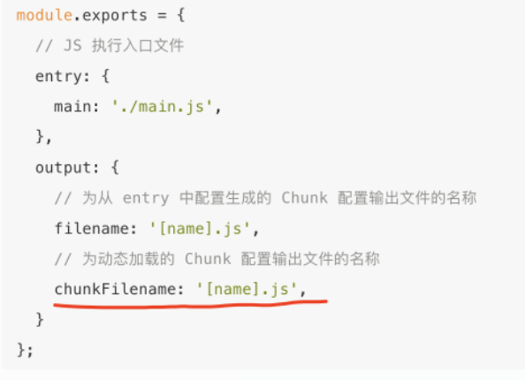

3.分离CSS    
安装插件：npm install extract-text-webpack-plugin --save
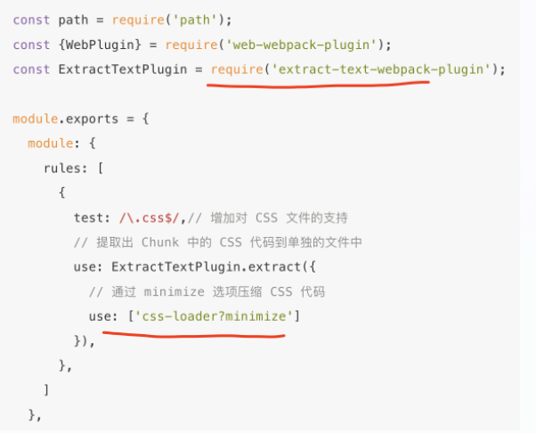

4.使用webpack.optimize.UglifyJsPlugin插件压缩混淆js代码
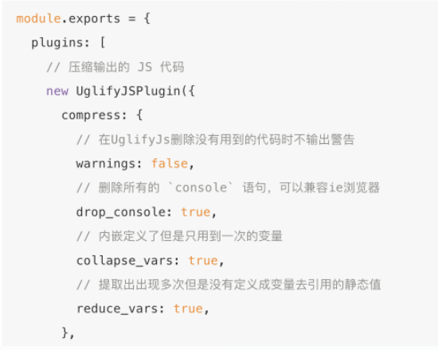

5.开启tree-shaking 删除没有使用的代码，默认mode = production ，生产环境默认开启tree-shaking功能。

6、按需加载
```javascript
routes: [
    {
      path: "/about",
      name: "about",
      component: () => import(/* webpackChunkName: "about" */ "./views/About.vue")
    }
  ]
```


5、babel编译原理？
badylon将ES6/ES7转换成 AST;
babel-traverse对AST进行遍历转译，得到新的AST;
新AST通过babel-generator转换成ES5。

 ## webpack和vite的区别
构建速度
Webpack: Webpack的构建速度相对较慢，尤其在大型项目中，因为它需要分析整个依赖图，进行多次文件扫描和转译。
Vite: Vite以开发模式下的极速构建著称。它利用ES模块的特性，只构建正在编辑的文件，而不是整个项目。这使得它在开发环境下几乎是即时的。
开发模式
Webpack: Webpack通常使用热模块替换（HMR）来实现快速开发模式，但配置相对复杂。
Vite: Vite的开发模式非常轻量且快速，支持HMR，但无需额外配置，因为它默认支持。
⭐配置复杂度⭐
Webpack: Webpack的配置相对复杂，特别是在处理不同类型的资源和加载器时。
Vite: Vite鼓励零配置，使得项目起步非常简单，但同时也支持自定义配置，使其适用于复杂项目。
⭐插件生态⭐
Webpack: Webpack拥有庞大的插件生态系统，适用于各种不同的需求。
Vite: Vite也有相当数量的插件，但相对较小，因为它的开发模式和构建方式减少了对一些传统插件的需求。
⭐编译方式⭐
Webpack: Webpack使用了多种加载器和插件来处理不同类型的资源，如JavaScript、CSS、图片等。
Vite: Vite利用ES模块原生支持，使用原生浏览器导入来处理模块，不需要大规模的编译和打包。
⭐应用场景⭐
Webpack: 适用于复杂的大型项目，特别是需要大量自定义配置和复杂构建管道的项目。
Vite: 更适用于小到中型项目，或者需要快速开发原型和小型应用的场景。
⭐打包原理⭐
Webpack: Webpack的打包原理是将所有资源打包成一个或多个bundle文件，通常是一个JavaScript文件。
Vite: Vite的打包原理是保持开发时的模块化结构，使用浏览器原生的导入机制，在生产环境中进行代码分割和优化


 ## AST（抽象语法树）的概念及其在前端开发中的应用场景
 概念：代码通过编译器转换成一颗树型结构，标识程序的语法结构，相比于源码本身，ast更加容易处理和分析，在前端开发中，可以利用ast实现jsx代码转换
 由于浏览器不能识别jsx，需要先将jsx转换为ast，我们可以方便的遍历整个ast，并修改添加和删除节点。然后再重新生成js代码

 在进行性能优化时，使用ast优化插件做静态检查和打包压缩等操作。


​