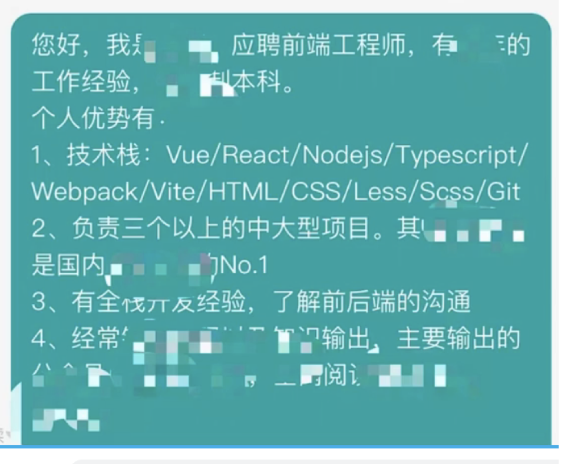

作为一个面试者和招聘者

1.不要太依赖简历模板
不要直接抄，
我作为一个招聘者看了五六十份简历，我发现很多简历基本都是流水线的简历类型，这让我感觉你们都太依赖简历模板了

2.简历要有自己的亮点
看了那么多简历都是流水线试的，没有过多的亮点，所以大家在找工作的这段时间要多发掘自己以前项目的一些亮点，也可以发掘私底下学习过的一些亮点

3.提升自我，不断完善简历
在面试中不断学习，不断把新学到的东西充实到简历中，不断完善简历

4.投简历要自信
招聘软件 完善个人信息 写好快捷打招呼用语

