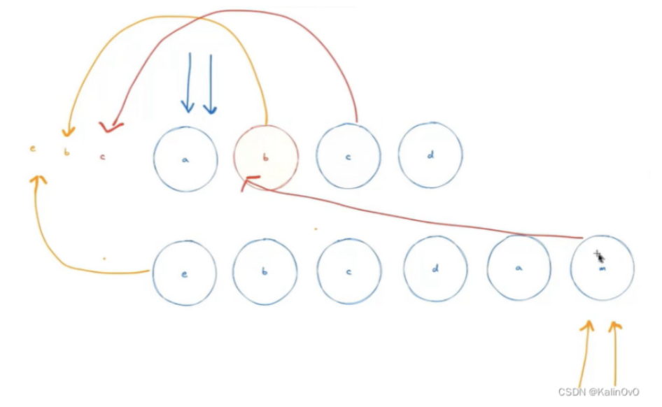

对于这样的diff操作，首先对于e节点进行双端比对，结果是匹配不到，新建e节点到头部；然后指针后移到b，继续进行双端比对，比对不到，然后拿着b节点去找，找到有相同的b节点，然后将b节点移动到前面；然后指针继续后移，c节点进行双端比对，同b节点......

但是，对于旧列表 bcd 节点，新列表中也是 bcd 节点，我们其实完全不用去移动 bcd 节点的，我们只需要将a节点移动到后面来就可以了~

所以再vue2中的diff算法，它会去找这个节点，如果可以复用，那么就会产生移动。所以缺点就在于vue2的diff算法它没有去关注哪些节点不用去移动，这样就会产生额外的移动操作。

vue3中就采用了最长递增子序列的思想，尽可能少移动节点，减少无意义的移动！

而且vue2diff算法采用的是递归比对（浪费性能），能否只比较动态的节点，非动态的节点就不比较了，vue3在模板编译的时候会标记，哪些是动态节点，只比较动态节点！