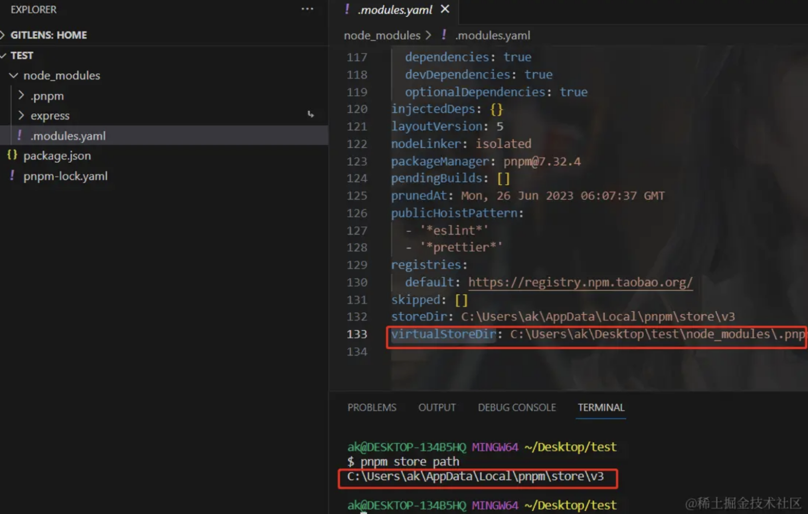
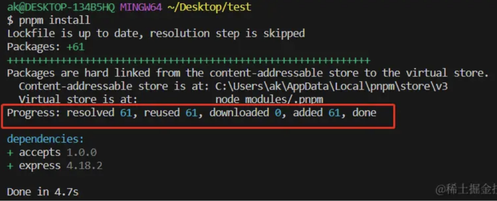
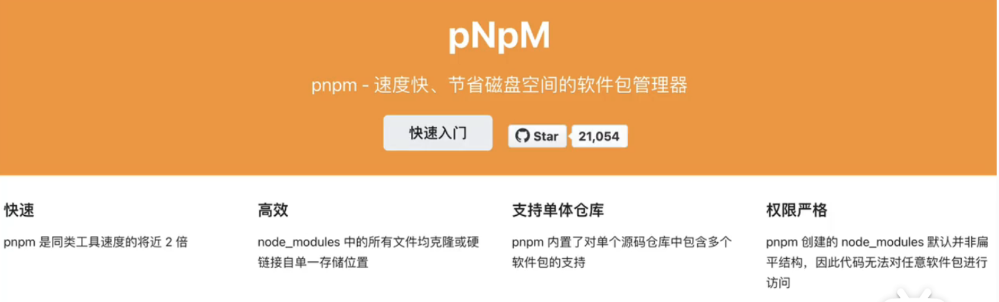
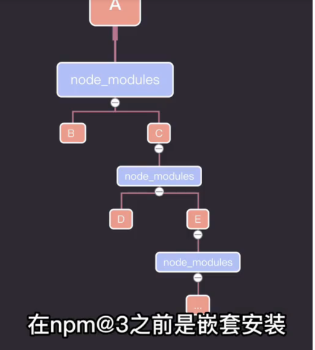
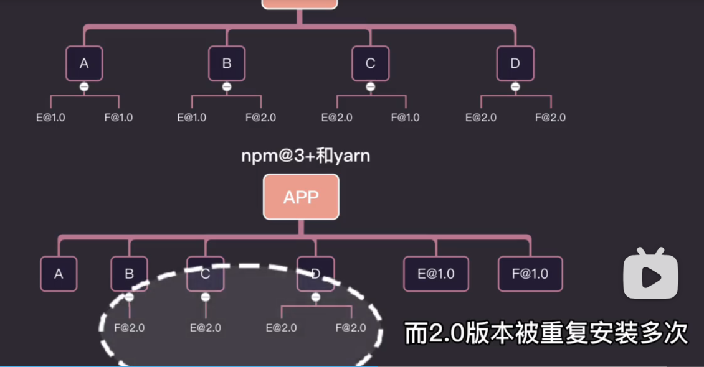

 ### npm2的缺点：
1.嵌套过深
2.一个包可能导致多次安装，无法复用的问题

 ### npm3的缺点：
1.扁平化后，会导致幽灵依赖
2.也存在一个包可能导致多次安装无法复用的问题
3.扁平化依赖树的算法非常复杂

 ### pnpm的优势
1.解决了幽灵依赖问题
2.速度: pnpm执行的速度更快、3倍的速度
3.体积: 将包存储在本地磁盘上，在我们创建的项目里使用硬链接的方式，从global store直接链接依赖。（这也是速度快的原因、对于npm和yarn如果有100个项目使用lodash就会有100份lodash拷贝项目目录里）

实际的依赖存储路径可以通过命令pnpm store path或者查看.modules.yaml文件。 也可以通过pnpm store来修改你需要存储
依赖的目录地址

执行pnpm install，因为之前装过对应的模块，直接从磁盘里面获取

pnpm 通过软连接和硬链接解决了上述问题

有了npm和yarn，为什么还要用pnpm呢，这与npm的安装方式有关

在npm2是嵌套安装，这有两个问题
1.依赖树太深，导致目录路径过长
2.当一个包在不通的依赖中都需要时，会导致多次安装

为了解决这些问题，npm3和yarn使用了扁平化解构，node_modules变成所有包放在同一层级
但也有两个问题
1.幽灵依赖，指某个包没有在package.json中被依赖，用户却能引用到
2.即便扁平化后，也会有多次安装的问题

