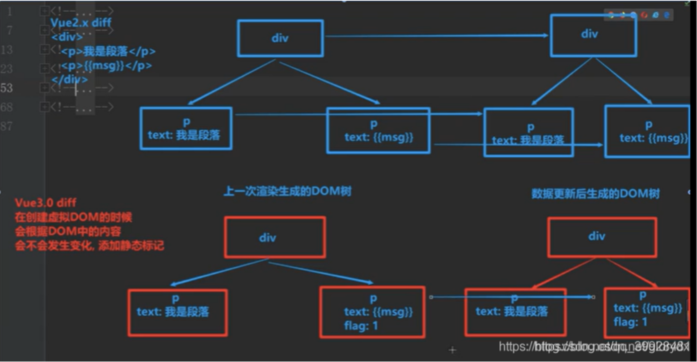
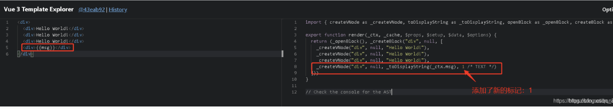
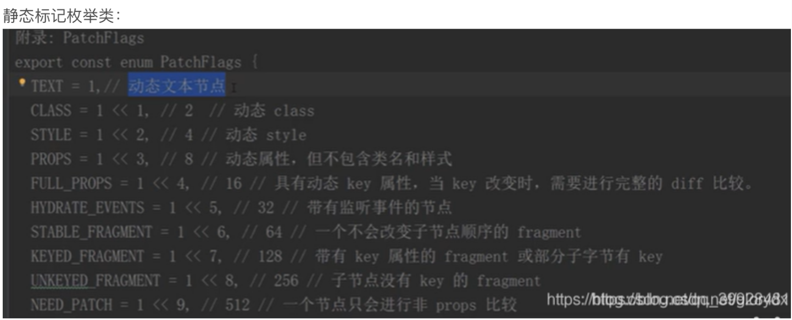
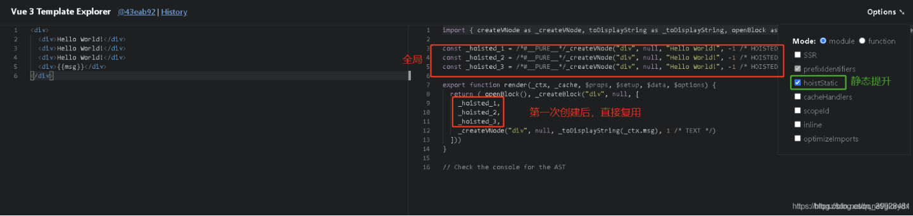
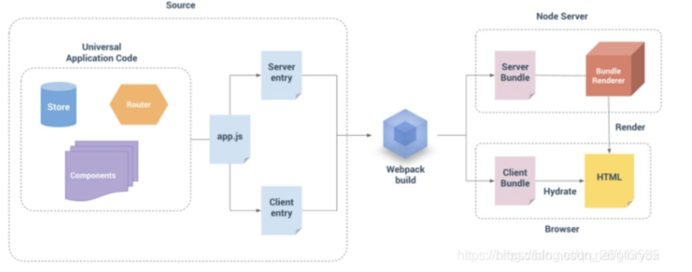

 ## 一、Proxy 
Proxy 响应式 比 defineProperty 快 
——————
Vue3引入了新的编译器，采用了基于Proxy的响应式系统，这使得Vue3能够更好地跟踪数据的变化，并且在更新DOM时更加高效
对整个对象的劫持

 ## 二、PatchFlag（静态标记）
1.编译模版时，动态节点做标记
2.标记分为不同类型，如TEXT PROPS
3.diff算法时，可以区分静态节点，以及不同类型的动态节点

-----
vue2中的虚拟dom是全量对比（不管是动态还是静态的，浪费时间在静态节点的对比上）
vue3只会对比带有patch flag的节点。可通过flag信息得知当前节点要对比的具体内容



   


 编译模板时，动态节点做标记
    使用位运算来检查更新


 ## 三、hoistStatic
静态提升
vue2.0无论元素是否参与更新，每次都会重新创建，然后再渲染
vue3.0对于不参与更新的元素，会做静态提升，只会被新创建一次，在渲染时直接复用即可


 ## 四、事件侦听器缓存
默认情况下，onClick会被视为动态绑定，所以每次都会去追踪它的变化。但是因为事件绑定的函数是同一个函数（同一个方法），所以没有追踪变化，直接缓存起来复用即可。
```javascript
//事件监听缓存未开启之前
<button @click="onClick">按钮</button>
//开启事件监听缓存之前（把静态提升关闭了也是这样）
export function render(_ctx, _cache, $props, $setup, $data, $options) {
  return (_openBlock(), _createBlock("div", null, [
    _createVNode("button", { onClick: _ctx.onClick }, "按钮", 8 /* PROPS */, ["onClick"])
  ]))
}
//开启事件监听缓存之后（把options选择为cacheHandlers）
export function render(_ctx, _cache, $props, $setup, $data, $options) {
  return (_openBlock(), _createBlock("div", null, [
    _createVNode("button", {
      onClick: _cache[1] || (_cache[1] = (...args) => (_ctx.onClick(...args)))
    }, "按钮")
  ]))
}
```


验证：
【注意】转换之后的代码，大家可能还看不懂，但是不要紧。因为只需要观察有没有静态标记即可，因为在Vue3的diff算法中，只有有静态标记的才会进行比较，才会进行追踪。

 ## 五、SSR优化
1.静态节点直接输出，绕过了vdom
2.动态节点，还是动态渲染
___————
ssr优化
传统的SPA单一页面响应，即客户端渲染的模式

Vue.js构建的应用程序，默认情况下是有一个html模板页，然后通过webpack打包生成一堆js、css等等资源文件。然后塞到index.html中

用户输入url访问页面 -> 先得到一个html模板页 -> 然后通过异步请求服务端数据 -> 得到服务端的数据 -> 渲染成局部页面 -> 用户

这样一来，必然延长了首屏加载的时间

SSR（服务端渲染）可以将同一个组件渲染为服务器端的 HTML 字符串，将它们直接发送到浏览器，最后将这些静态标记"激活"为客户端上完全可交互的应用程序。

简单点说：就是将页面在服务端渲染完成后在客户端直接显示。无需等待所有的 JavaScript 都完成下载并执行，才显示服务器渲染的标记，所以你的用户将会更快速地看到完整渲染的页面。
ssr原理图



六、tree-shaking
1.编译时，根据不同的情况，引入不同的API
——————
模板中需要的内容才会import进来
