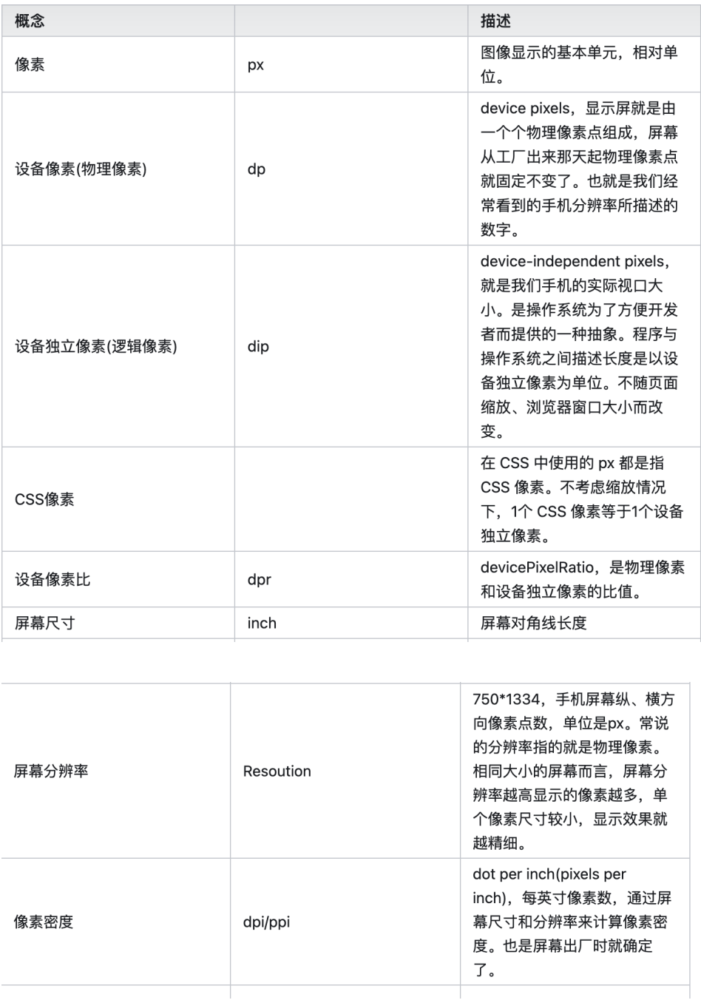

我们在工作当中,设计师时常会说，边框像素不对，要求1像素但是实际是2像素，但是们代码中写的像素就是1px，

为了便于更好的理解本文，下面对像素相关概念进行梳理。

## 为什么使用 1px 会出现问题

在iphone3中，屏幕像素的密度比较低，分辨率是320*640
在iphone3上，1px=1物理像素

iphone4推出了Retina屏，将分辨率提高了一倍，变成
640*960，但屏幕的尺寸没有变化
这是1px = 2个物理像素

自从 2010 年 iPhone4 推出了 Retina 屏开始，移动设备屏幕的像素密度越来越高，于是便有了 2 倍屏、3 倍屏的概念。简单来说，就是手机屏幕尺寸没有发生变化，但屏幕的分辨率却提高了一倍，即同样大小的屏幕上，像素多了一倍。
那么我们获取到的 CSS 像素就不是真实的物理像素点了，于是便有了设备像素比的概念（ devicePixelRatio 简称 dpr）。它用来描述屏幕物理像素与逻辑像素的比值。

 ### CSS 中的 1px 并不等于设备的 1px
对于前端来说，在高清屏出现之前，前端代码的 1px 即等于手机物理像素点的 1px。但有了 dpr 的概念之后，由于前端代码中的使用的是 CSS 像素，手机会根据 dpr 换算成实际的物理像素大小来渲染页面。比如 iPhone6 的设备像素比 dpr = 2 ，相当于一个 CSS 像素等于两个物理像素，即 1px 由 2个物理像素点组成。
那么问题来了，以 iPhone6 为例，其 dpr = 2、屏幕尺寸(CSS 像素) 为 375x667，一般设计稿提供 2 倍图尺寸为 750x1334 。那么设计稿中的 1px，对应屏幕尺寸其实应该写成 0.5px。再由 dpr 计算公式可知，0.5 * 2 = 1px 物理像素。
此时你应该已经发现了，设计稿要实现 1px 细线、1px 边框，为什么前端实现总是偏粗的？那是因为如果你在代码中直接写成 1px，再通过 dpr 计算之后其实是 2px 物理像素，并不符合设计稿的要求。

其实设计稿本质上要实现的是 CSS 像素的 ！
那么当 dpr=2 时，代码中直接写成 0.5px 就解决问题了吗？

### 那么如何实现 1px 的效果？
在进行一番调研之后，发现目前的实现方案都离不开以下三种。
1. 使用伪元素 + CSS3``缩放的方式
2. 使用 动态 viewport + rem 布局 的方式（即 Flexible 实现方案）
3. 新方案：使用 vw 单位适配方案（将来推荐的一种方案，但目前项目中没有实际应用，故本文不做讨论）
