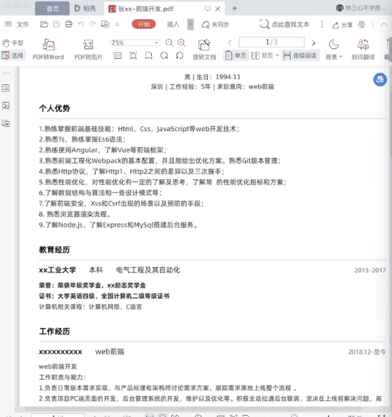

### typescript对你的影响?
- 类型限制
- 团队开发
- 接口字段ts文件

### HTTP2比HTTP1新在那里
- 二进制分帧  
  协议解析采用了二进制的方式
- 多路复用
链接一次tcp可以发送多次请求，不会说连了就断
- 头部压缩
请求头信息不是比较多嘛，可以做到头部压缩的能力

 ### 前端安全的措施?
- XSS
对于前端页面展示的信息都要经过过滤和编译，比如<或script

- csrf防御
采用双token，cookie中加token，请求头中加token，因为攻击者获取不到请求头的token，所以服务端验证请求头token和cookietoken是否一致
从而达到csrf防御

- httponly
只能由服务器去更改cookie，浏览器是不能更改里边的内容的

 ### 项目优化指标如何衡量?
- 我们会上报页面首屏加载时间到一个平台，如果不达标，我们会在浏览器
Lighthouse（灯塔）中去分析，比如说网络请求还是渲染导致的

 ### 首屏时间的计算?
 没了解过

 ### nexttick为啥能拿到最新DOM?

 ### nexttick为什么是微任务，为什么优先?

 ### 前端工程化上如何去优化项目?
 - webpack如何优化
   - 压缩、sourceMap
   - splitchunk分割
   - 懒加载
   - external
  没用过？，很重要稍后看下，比如我想用某个包，不想安装他，就用这个字段，给这个包一个别名

 ### webpack三种hash值的区别

 ### monorepo有没有接触过

 ### qiankun的应用场景?为什么要用qiankun
 不同技术栈的共存，有angular技术栈

 ### 说一下qiankun的沙箱sandbox,用处是什么
 css沙箱，能做到样式不冲突
 怎么做到的？

 ### qiankun的原理，怎么做到共存的，为什么不直接用iframe
iframe点浏览器的前进回退是没有用的

 ### 重构
 1.梳理业务，删除无用代码
 2.多抽离写公共的页面
 

