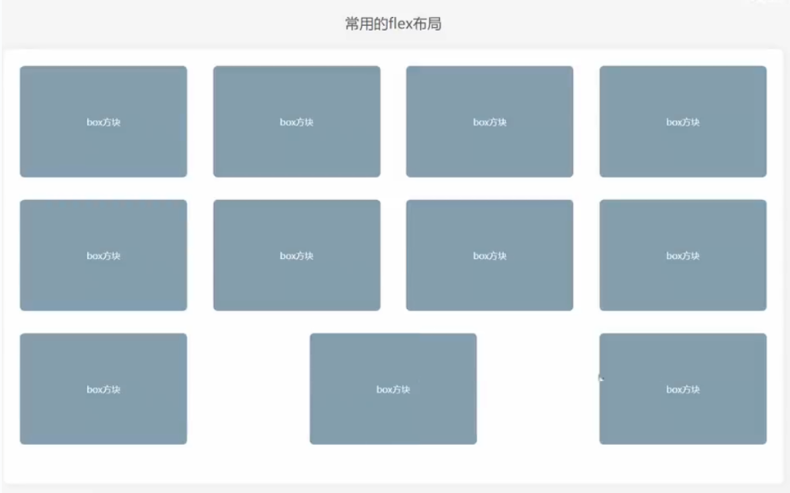
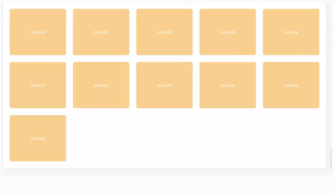
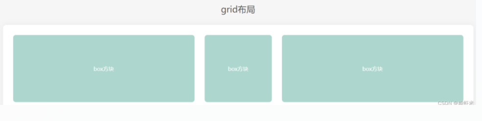
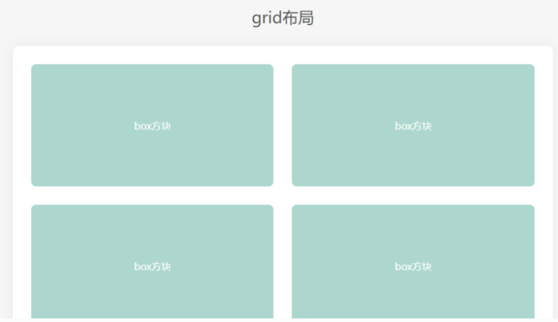
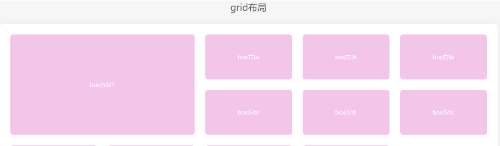

 ### 使用flex布局的痛点
如果使用justify-content: space-between;让子元素两端对齐，自动分配中间间距，假设一行4个，如果每一行都是4的倍数那没任何问题，但如果最后一行是2、3个的时候就会出现下面的状况：

```css
/* flex布局 两端对齐 */
display: flex;
flex-wrap: wrap;
justify-content: space-between;
```




同样的布局，将flex改为grid
```css
/* grid布局 两端对齐,最后一行左对齐*/
display: grid;
grid-template-columns: 1fr 1fr 1fr 1fr;
gap: 30px;  
```
 
解释一下上面的代码：
display：grid 是转为网格布局，这个是必须的
grid-template-columns：1fr | px 这是将网格分为几列，1fr是自适配单位，可以当成栅格
gap:30px 这是网格四周的间隔
>注意：这三个属性是给父容器添加的，子元素，可以不用设置宽度，也不用设置margin间距即可完成如下布局。

最常用的写法，实现等分布局
```css
/* grid布局 两端对齐,最后一行左对齐*/
display: grid;
grid-template-columns: repeat(5, 1fr);
gap: 30px;  
```




 ### 深入了解一下grid-template-columns属性
grid-template-columns: 1fr;（独占一行）
grid-template-columns: 1fr 1fr;（一行分为两列）
grid-template-columns: 1fr 200px 1fr;（中间固定200px，两边自动平均分配）



 ### grid-template-columns: repeat(auto-fill, minmax(255px, 1fr)); 
这种写法可以用来做响应式布局，auto-fill主轴上指定的宽度或者重复次数是最大可能的正整数，minmax最小值255px、最大值1fr代表剩余空间的比例。


注意：实现这种响应式布局，一定要注意父容器不能使用固定宽度，可以将父容器改为如：80%，这样就能根据屏幕的宽度，自动展示一行展示几个了。

 ### grid-row和grid-column可以控制某个元素占领几份
```css
.layout .box1{
  grid-row: 1/3;
  grid-column: 1/3;
}
```
以grid-row行为例，从第几列开始 / 第几列+想占几个；



 ### 上下左右居中对齐
和flex一样，也可以设置这两个属性居中对齐
```css
align-items: center;
justify-content: center;
```
