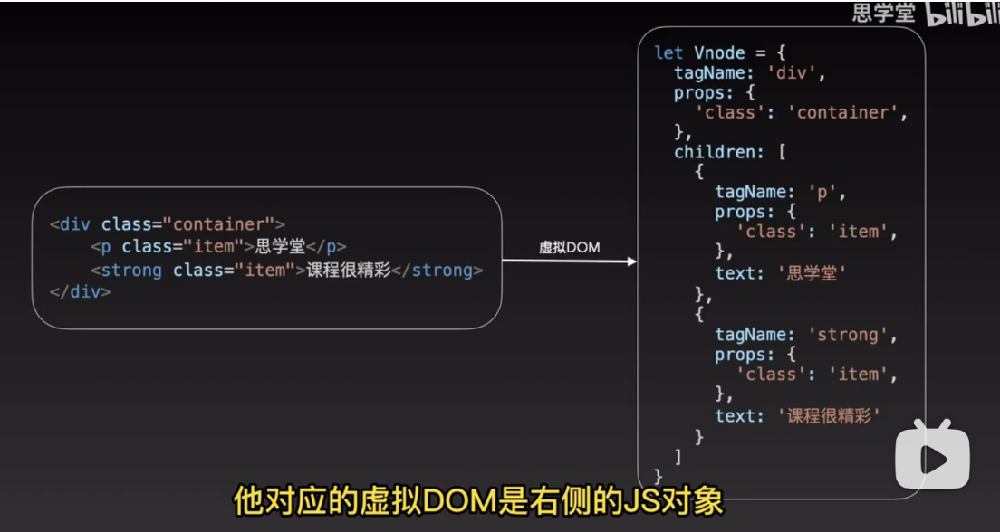
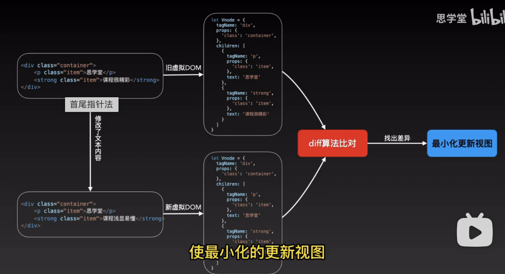
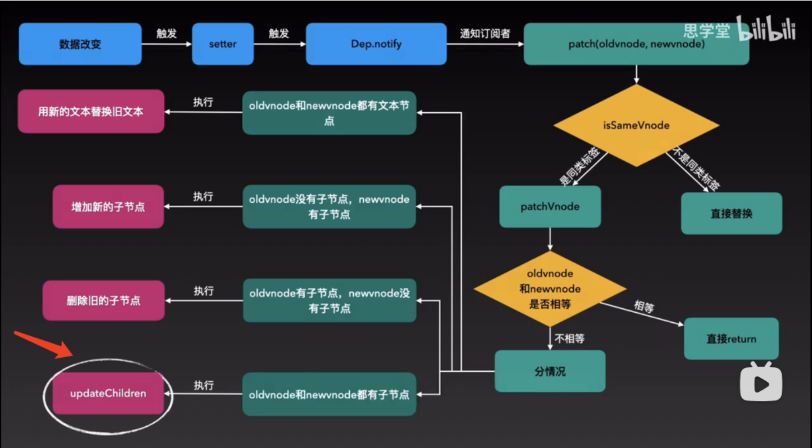
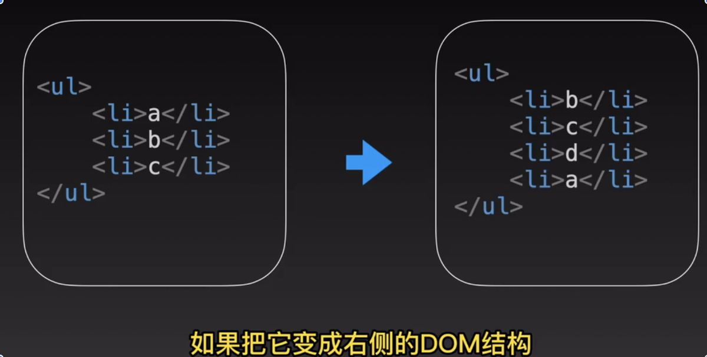
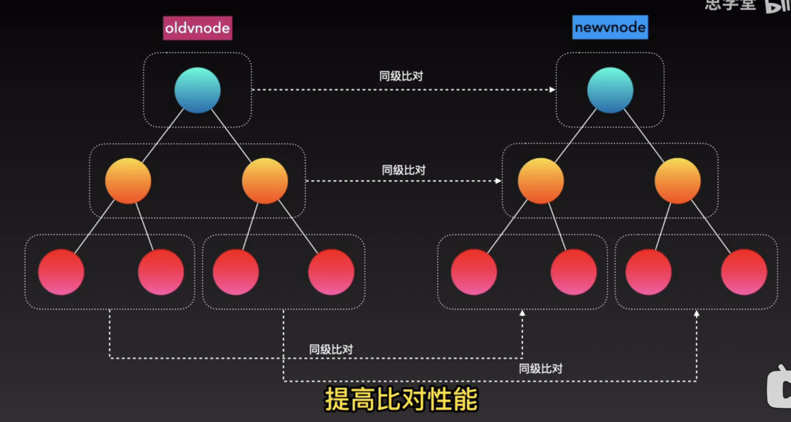
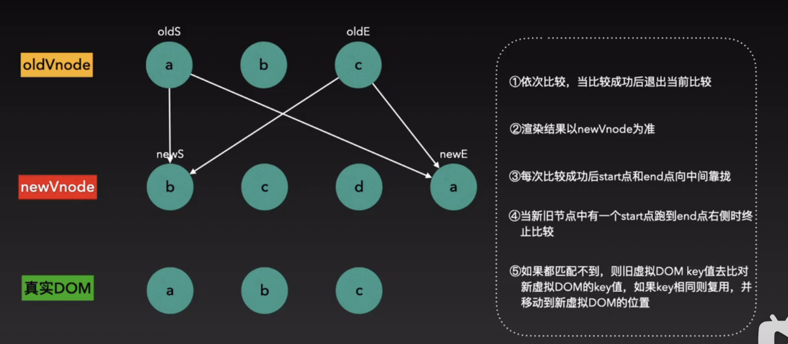
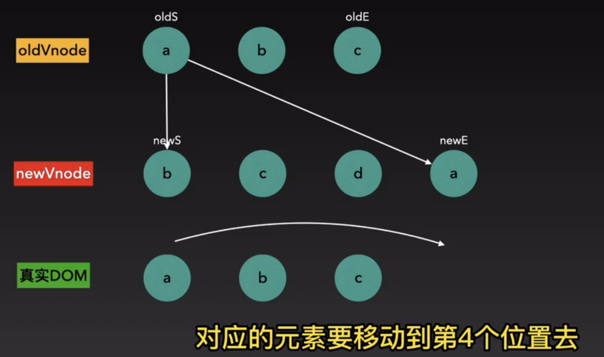
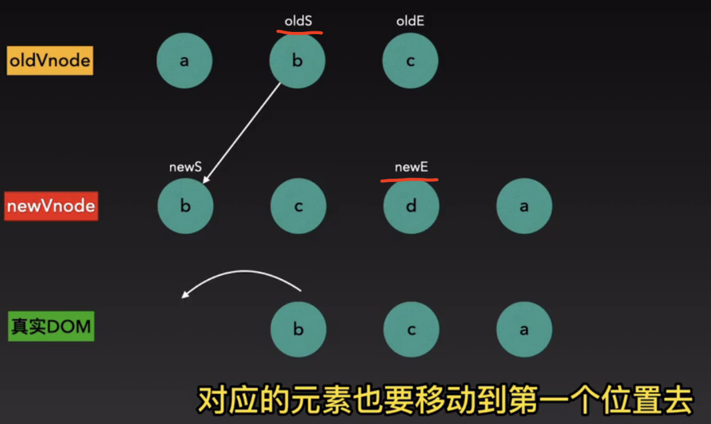
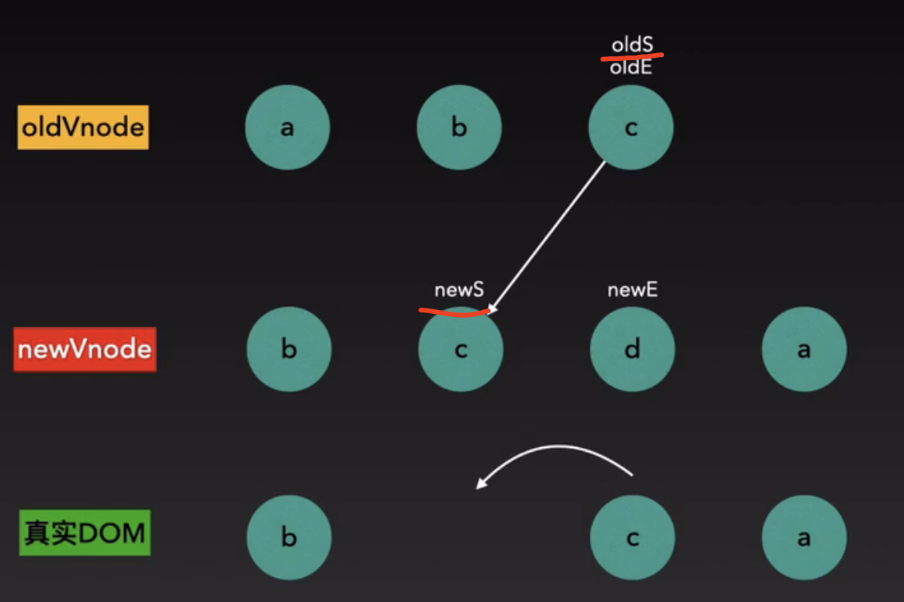
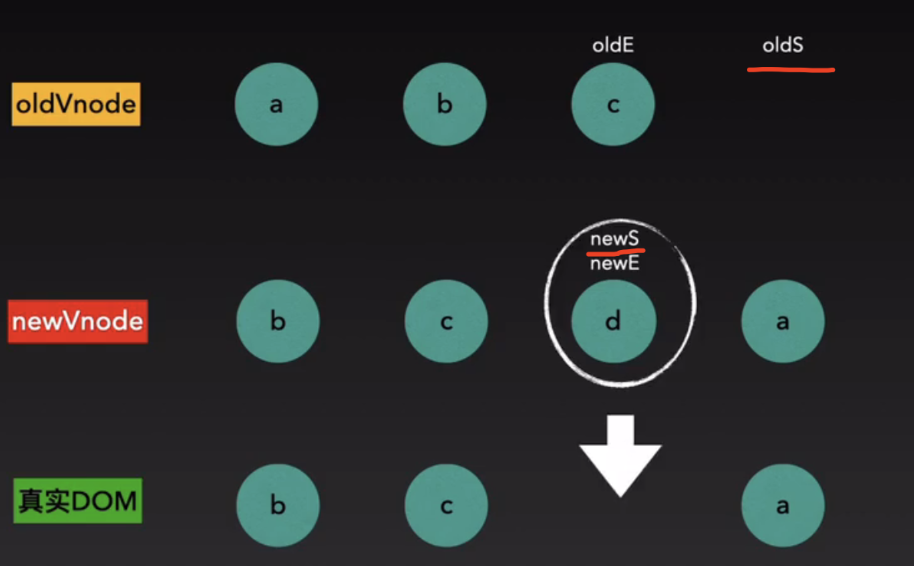

 ### 什么是虚拟dom
虚拟dom是表示真实dom的js对象
左边是真实dom，右边是虚拟dom，里边包含的字段有标签名，标签属性，子标签的名称，属性，和文本节点

 ### 什么是diff算法
diff算法是找出新旧两个虚拟dom对象的差异，最小更新视图

diff算法先经过一堆简单比较，如果都不行，最后走updateChildren方法

 ### updateChildren

如上图，如何最小化的更新视图

这是一个新旧dom，在内部规定了，只在同级做比对，这样可以减少比对次数，最大化提高性能，而且在同级比对时，采用首尾指针法

 ### 首尾指针法
不管是新旧节点，都有收尾两个元素，对应的是start和end

~~首先旧start和新start做比对，如果没成功则旧start和新end做比对，如果依旧没成功~~
~~则旧end和新start做比对，如果没成功，则旧end和新end做比对，~~
对比过程是头头，尾尾，头尾，尾头
这里有疑问，如果都没成功怎么办？

 ### 第一次比对：

经过两次比较，找到了将a移动到最后一个

 ### 第二次比对
因为上次比对成功了，所以oldS向右侧移动，newE向左侧移动，
然后oldS和newS对比成功，移动b到新节点的位置

 ### 第三次比对
因为上一轮比对成功，oldS和newS都向右移动，
然后oldS和newS对比成功，移动c到新节点的位置

 ### 第四次
因为上一轮比对成功，oldS和newS都向右移动，这时，oldS到oldE后边了，对比结束
这时我们看到新虚拟节点中有多余的元素，把多余元素直接添加到真实dom中就可以了

