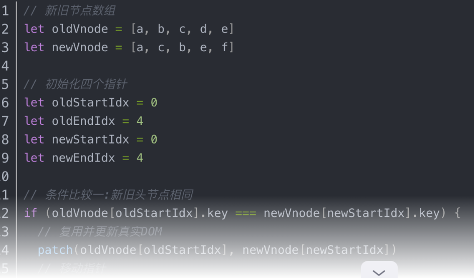
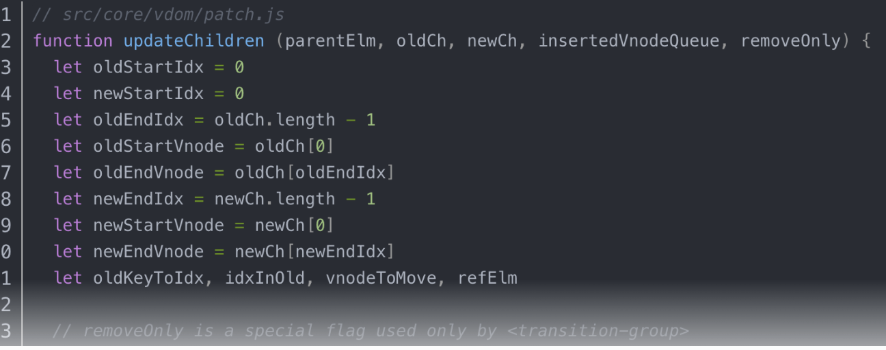

 ## 前言
Vue2 双端指针法是一种 diff 算法，用来比较两棵虚拟 DOM 树的差异，并根据差异更新视图

 ## 基本思路：
双端指针法基于以下两个假设：
相同的节点具有相同的key值
两个节点数组的头尾节点更有可能相同
即从两个数组的头尾分别进行对比，如果找到相同的节点，就复用并更新真实DOM，然后移动指针继续比较，直到两个数组中有一个的指针相遇，说明已经处理完了所有相同的节点。

接下来，根据剩余的节点进行不同的操作：
- 如果旧节点数组还有剩余，说明这些节点是多余的，需要删除
- 如果新节点数组还有剩余，说明这些节点是新增的，需要插入
- 如果两个数组都没有剩余，说明已经完成了diff过程
下面是一个简单的代码示例，用于说明vue2的diff算法的具体过程：

即：  
从新旧节点数组的首尾开始比较，如果首尾节点相同，就直接复用，然后首尾移动指针继续比较下一个节点。
如果首尾节点不同，就尝试从新节点的首部和旧节点的尾部进行比较，或者从新节点的尾部和旧节点的首部进行比较，如果匹配成功，就进行节点移动，然后移动指针继续比较下一个节点。
如果以上都不匹配（上示例代码中的4种情况），就用新节点的首部作为 key，去旧节点中寻找相同的 key，如果找到了，就进行节点移动，然后移动指针继续比较下一个节点。
如果以上都没有找到匹配的节点，就认为新节点是新增的节点，直接插入到旧节点的前面，然后移动指针继续比较下一个节点。
当新旧节点的首尾指针相遇时，结束比较，如果还有剩余的节点，就根据情况进行新增或删除。

Vue2 双端指针法的源码实现主要在 
src/core/vdom/patch.js 文件中的 
updateChildren 函数中，其中核心代码片段：

