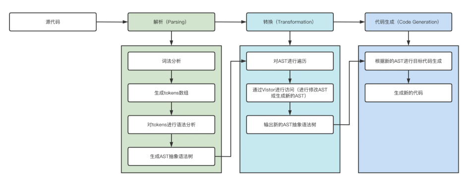

一、前言
在本文中我们将会深挖 AST（抽象语法树） 以及基于 AST 衍生出来的一系列实际应用。读完本章你会收获什么：
  • AST（抽象语法树） 到底是什么？
  • AST基础：从零到一手撸一个功能完备的编译器
  • AST基础：Babel 的设计理念
  • AST的应用：手写console插件，再也不怕打开控制台满屏的console了😭😭😭
  • AST的应用： ES6 是如何转成 ES5 的？
  • AST的应用：30行代码依靠 AST 实现代码压缩
  • AST的应用：40行代码知晓 ESLint 的工作原理
  • AST的应用：手写 按需加载插件 ，同事看了都说666
  • AST的应用：手写 Typescript 代码检测插件（fork-ts-checker-webpack-plugin），原来 TS语法检测如此简单
  • 其他延伸：结合 AST 手写监控系统中的日志上传插件
  • 其他延伸：教你玩转AST，最佳实践

三、手写编译器
该小节分为两个部分：设计篇和原理篇。
设计篇侧重整体设计，原理篇则是手撕代码，侧重编码实现，在阅读过程中建议将重心放在设计篇，学习思想最重要。
3.1、设计篇
3.1.1、整体流程
一个完整的编译器整体执行过程可以分为三个步骤：
  1. Parsing(解析过程)：这个过程要经词法分析、语法分析、构建AST（抽象语法树）一系列操作；
  2. Transformation（转化过程）：这个过程就是将上一步解析后的内容，按照编译器指定的规则进行处理，形成一个新的表现形式；
  3. Code Generation（代码生成）：将上一步处理好的内容转化为新的代码；
如图所示，不喜欢看字的就看图：

接下来，我们先看一个小Demo，将 lisp 的函数调用编译成类似 C 的函数，如果你不熟悉也没关系，看完下面的代码相信大家能够快速的理解：
