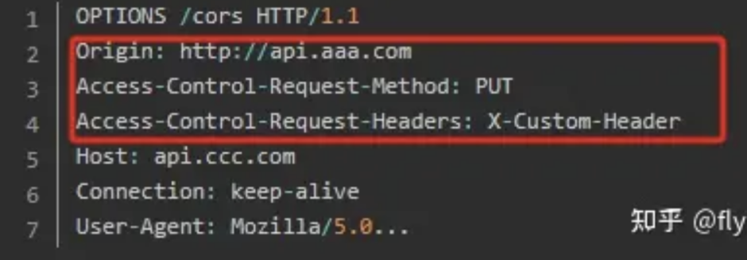
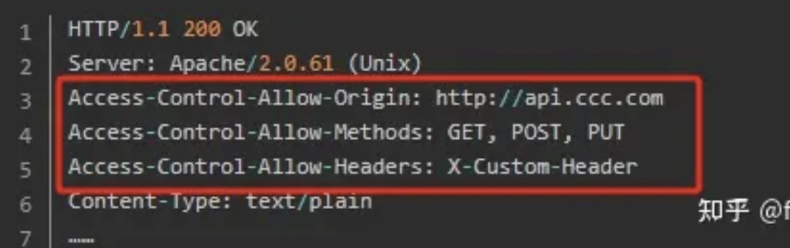
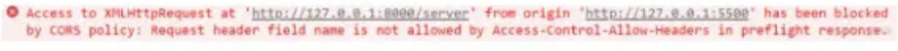
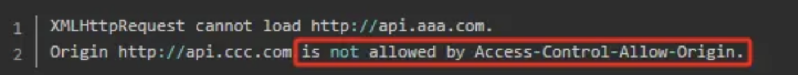
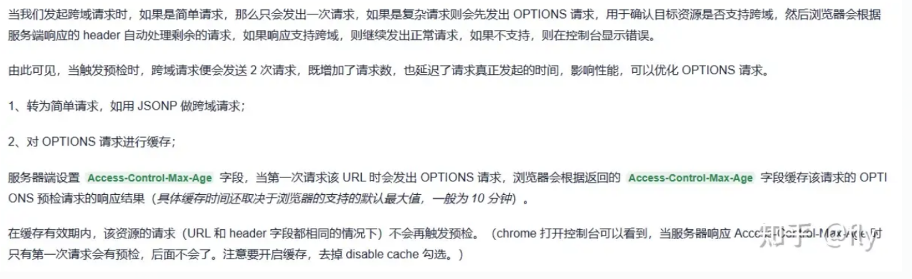

只要不满足简单请求的要求都属于复杂请求。比如请求头中包含自定义请求字段、请求方法是delete或put、content-type的类型是applycation/json等等

在复杂请求正式通信之前，浏览器会自动增加一次HTTP查询请求，称为preflight，即"预检"请求

浏览器先询问服务器，当前网页所在的域名是否在服务器的许可名单之中，以及可以使用哪些HTTP动词和头信息字段。只有得到肯定答复，浏览器才会发出正式的XMLHttpRequest请求，否则就报错

> 注意:很多人以为同源策略是浏览器不让请求发出去、或者后端拒绝返回数据。实际情况是，请求能正常发出，后端接口正常响应，只是数据到了浏览器后被丢弃了(或被拦截了)

 ### 2.2.5 预检请求的请求头与响应头
1.预检请求的请求头

- 请求方式是OPTIONS，表示这个请求是用来询问的
- 请求头信息必须要包含的3个参数
  - (1) Origin：
  - (2) Access-Control-Request-Method :列出浏览器的CORS请求会用到哪些HTTP方法
  - (3) Access-Control-Request-Headers：该字段是一个逗号分隔的字符串，指定浏览器CORS请求会额外发送的头信息字段

如果预检请求通过，服务器就会做出响应。预检请求的响应头信息就会增加3个参数

- 响应头信息必须包含的3个参数（Origin、Access-Control-Request-Method和Access-Control-Request-Headers）
  - Access-Control-Allow-Origin：允许跨域请求的域名，如果是包含所有就返回*
  - Access-Control-Allow-Methods：表示服务器允许客户端使用什么方法发送请求
  - Access-Control-Allow-Headers：表示服务器允许客户端携带的自定义头部字段
  - Access-Control-Max-Age：（不是必须的），此参数表明预检请求的结果可以被缓存多久。在此时间段内不会重复发送，否则超过时间再次发送

1.预检请求如果失败，则会报跨域错误
- 比如出现了不允许的请求头字段：

比如出现了不允许的源：

 ### 2.2.6 预检请求优化

