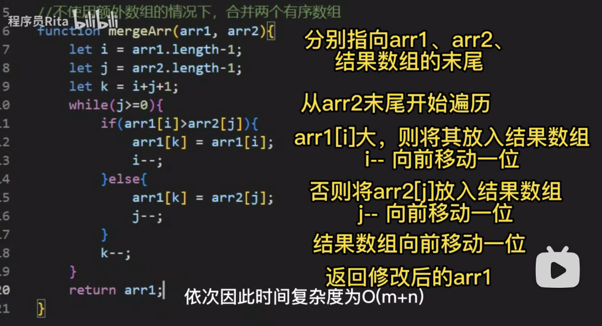

```javascript
var arr1 = [1,3,5]
var arr2 = [2,4,6]
function mergeArr(arr1, arr2) {
  let i = arr1.length - 1
  let j = arr2.length - 1
  let k = i + j + 1;
  while(j >= 0) {
    console.log('arr1', i, arr1[i])
    console.log('arr2', j, arr2[j])
    if (arr1[i] > arr2[j]) {
      arr1[k] = arr1[i]
      i--;
    } else {
      arr1[k] = arr2[j]
      j--
    }
    k--;
  }
  return arr1;
}
console.log(mergeArr(arr1, arr2))

```